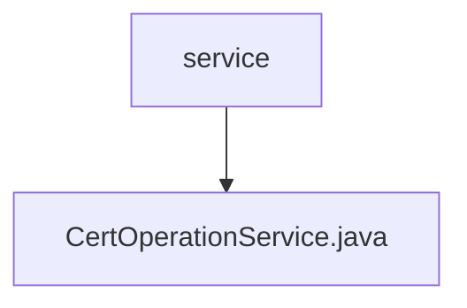

# Basic Information

|      |      |
|------|------|
| Name | service |
| Language | .java |
| Code Path | WeFe/manager/manager-service/src/main/java/com/webank/cert/mgr/service |
| Package Name | docs.manager.manager-service.src.main.java.com.webank.cert.mgr.service |
| Brief Description | The CertOperationService provides certificate management functionalities, including updating certificate status, querying certificates, exporting certificates, initializing root certificates, issuing certificates, and more. It supports both RSA and ECDSA algorithms and utilizes the BouncyCastle security library. |

# Description

The CertOperationService is a certificate operation service class that provides certificate management and operational functionalities. Key features include updating certificate status, exporting certificates, querying certificate information, initializing root certificates, creating issuer authority certificates, and user certificates. The service class relies on CertService and CertDao for certificate processing and database operations. During initialization, it checks and adds the BouncyCastle security provider. Core methods involve updating certificate status based on serial numbers or user IDs, exporting certificates to files, querying certificate and private key information, and paginated queries for certificate requests and private key lists. The certificate issuance process includes generating key pairs, saving private keys, creating certificate requests, issuing certificates, and storing certificate details. It supports the issuance of root certificates, CA certificates, and user certificates, with configurable attributes such as validity periods and key usage. Exception handling covers scenarios like non-existent certificates, missing private keys, and failed certificate validity checks.

### Package Internal Structure View

This flowchart illustrates the service layer structure in the manager-service project. The root node is the service directory, which contains a specific implementation file CertOperationService.java. This structure aligns with the typical Java service layer design pattern, where service interfaces and implementations are organized at the same level.

# File List

| Name   | Type  | Description |
|-------|------|-------------|
| [CertOperationService.java](CertOperationService.md) | file | The CertOperationService provides certificate management functionalities, including updating certificate status, querying certificates, exporting certificates, initializing root certificates, issuing certificates, and more. It supports both RSA and ECDSA algorithms and utilizes the BouncyCastle security library. |

