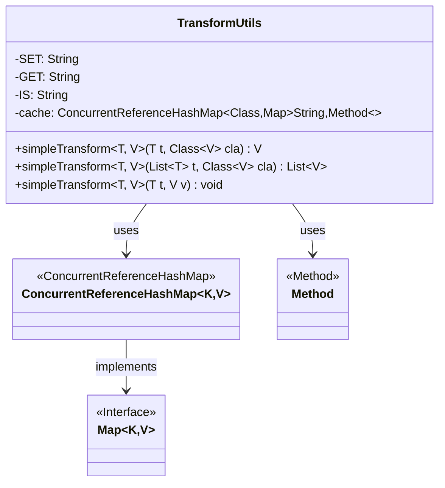
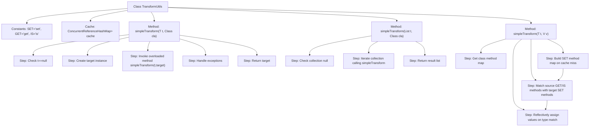

# Basic Information

|      |      |
|------|------|
| Name | TransformUtils |
| Language | .java |
| Code Path | WeFe/manager/manager-service/src/main/java/com/webank/cert/mgr/utils/TransformUtils.java |
| Package Name | com.webank.cert.mgr.utils |
| Dependencies | ['org.springframework.util.CollectionUtils', 'org.springframework.util.ConcurrentReferenceHashMap', 'java.lang.reflect.InvocationTargetException', 'java.lang.reflect.Method', 'java.util.ArrayList', 'java.util.HashMap', 'java.util.List', 'java.util.Map'] |
| Brief Description | The TransformUtils class provides object transformation capabilities, supporting both single object and list transformations, utilizing reflection and caching to optimize performance. |

# Description

TransformUtils is a utility class that provides object transformation functionality. It contains three static constants—SET, GET, and IS—for method name matching. It uses ConcurrentReferenceHashMap to cache class method information for improved performance.  

The class primarily offers three methods:  
- `simpleTransform(T, Class)` converts a single object into an instance of the target type.  
- `simpleTransform(List, Class)` performs batch conversion of list objects.  
- `simpleTransform(T, V)` copies property values from the source object to the target object.  

It retrieves getter/setter methods via reflection, checks parameter type compatibility, and then executes property copying. Any exceptions encountered are uniformly thrown as RuntimeException.

# Class Summary

| Name   | Type  | Description |
|-------|------|-------------|
| TransformUtils | class | The TransformUtils class provides object conversion functionality, supporting both single object and list conversion, with performance enhanced through reflection caching methods. |

## Class TransformUtils

|      |      |
|------|------|
| Access Modifier | public |
| Type | class |
| Name | TransformUtils |
| Description | The TransformUtils class provides object conversion functionality, supporting both single object and list conversion, with performance enhanced through reflection caching methods. |

### UML Class Diagram

This code demonstrates an object transformation utility class TransformUtils, which implements property value copying between objects through reflection mechanism. Core functionalities include: single object transformation (simpleTransform), batch list transformation (simpleTransform), and direct assignment transformation (simpleTransform). The class uses ConcurrentReferenceHashMap to cache setter methods of target classes, achieving property copying by matching source object's getter/is methods with target object's setter methods. This utility class supports generics, is thread-safe, and handles edge cases like null values, making it suitable for data transformation scenarios between different classes with identical property names.

### Internal Method Call Graph

This flowchart illustrates the core logic structure of the TransformUtils utility class. The class implements object property transformation through reflection, containing three overloaded methods: single object conversion, collection conversion, and direct assignment conversion. The core process includes caching SET method mappings, matching GET/IS methods, type validation, and reflective invocation, with performance optimized via ConcurrentReferenceHashMap. Exception handling runs throughout the process to ensure type safety.

### Field List

| Name  | Type  | Description |
|-------|-------|------|
| IS = "is" | String | Define a private static constant string IS with the value "is". |
| GET = "get" | String | Define a private static constant GET with the value "get". |
| cache = new ConcurrentReferenceHashMap<>() | ConcurrentReferenceHashMap<Class,Map<String, Method>> | Private static concurrent reference hash table with Class type as key and Map<String, Method> as value, used for caching method information. |
| SET = "set" | String | Define a private static constant string SET with the value "set". |

### Method List

| Name  | Type  | Description |
|-------|-------|------|
| simpleTransform | V | This is a generic method that converts object t into an instance of target type V. If t is null, it returns null; otherwise, it creates a new instance of V and calls simpleTransform to convert the data, throwing a runtime exception in case of errors. |
| simpleTransform | List<V> | This is a Java generic method that converts list elements into a new list of the specified type. If the input is empty, it returns an empty list; otherwise, it iterates through the elements, converts each one, and collects the results. |
| simpleTransform | void | The static method `simpleTransform` maps the property values of object `t` to object `v` through reflection. It caches the setter methods of `v`, invokes them after matching the method names and parameter types of the getter/is methods of `t`, and throws a `RuntimeException` in case of exceptions. |

