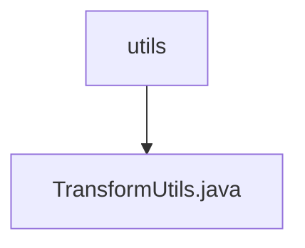

# Basic Information

|      |      |
|------|------|
| Name | utils |
| Language | .java |
| Code Path | WeFe/manager/manager-service/src/main/java/com/webank/cert/mgr/utils |
| Package Name | docs.manager.manager-service.src.main.java.com.webank.cert.mgr.utils |
| Brief Description | The TransformUtils class provides object transformation capabilities, supporting both single object and list transformations, utilizing reflection and caching to optimize performance. |

# Description

TransformUtils is a utility class that provides object transformation functionality. It contains three static constants SET, GET, and IS for method name matching. It uses ConcurrentReferenceHashMap to cache class method information for improved performance. The class mainly offers three methods: simpleTransform(T, Class) converts a single object to a target type instance; simpleTransform(List, Class) performs batch conversion of list objects; simpleTransform(T, V) copies property values from a source object to a target object. It retrieves getter/setter methods via reflection and executes property copying after verifying parameter type matching. All exceptions are uniformly thrown as RuntimeException.

### Package Internal Structure View

This flowchart illustrates the directory structure under the utils folder in the manager-service module of the WeFe project, which includes a utility class file named TransformUtils.java. The parent directory, utils, is shown with TransformUtils.java as its child node, clearly presenting a simple single-level file containment relationship.

# File List

| Name   | Type  | Description |
|-------|------|-------------|
| [TransformUtils.java](TransformUtils.md) | file | The TransformUtils class provides object conversion functionality, supporting both single-object and list conversions, utilizing reflection and caching to optimize performance. |

