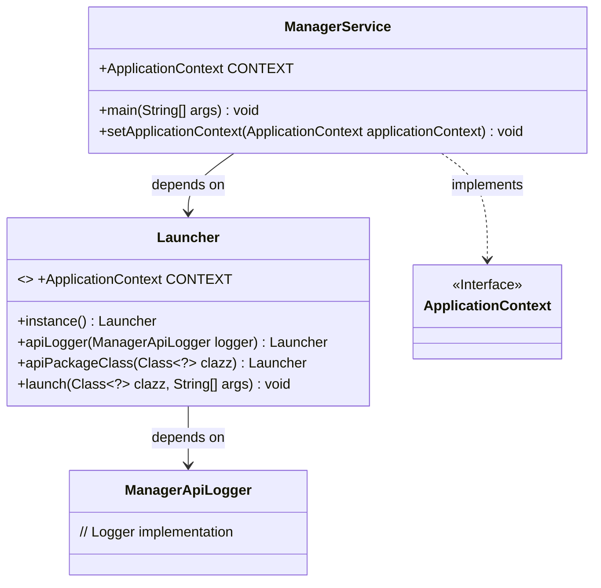
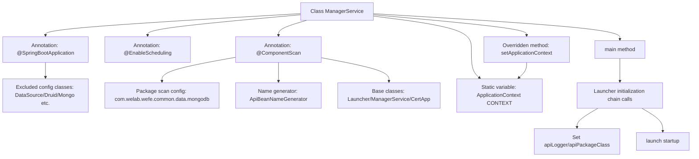

# Basic Information

|      |      |
|------|------|
| Name | ManagerService |
| Language | .java |
| Code Path | WeFe/manager/manager-service/src/main/java/com/welab/wefe/manager/service/ManagerService.java |
| Package Name | com.welab.wefe.manager.service |
| Dependencies | ['com.alibaba.druid.spring.boot.autoconfigure.DruidDataSourceAutoConfigure', 'com.webank.cert.mgr.CertApp', 'com.welab.wefe.common.web.Launcher', 'com.welab.wefe.common.web.config.ApiBeanNameGenerator', 'com.welab.wefe.manager.service.operation.ManagerApiLogger', 'org.springframework.beans.BeansException', 'org.springframework.boot.autoconfigure.SpringBootApplication', 'org.springframework.boot.autoconfigure.data.mongo.MongoDataAutoConfiguration', 'org.springframework.boot.autoconfigure.jdbc.DataSourceAutoConfiguration', 'org.springframework.boot.autoconfigure.mongo.MongoAutoConfiguration', 'org.springframework.boot.autoconfigure.transaction.TransactionAutoConfiguration', 'org.springframework.context.ApplicationContext', 'org.springframework.context.ApplicationContextAware', 'org.springframework.context.annotation.ComponentScan', 'org.springframework.scheduling.annotation.EnableScheduling'] |
| Brief Description | A SpringBoot application excludes data source and Mongo auto-configuration, enables scheduled tasks, customizes component scanning paths, and implements the ApplicationContextAware interface to save the context. The main method launches the application via Launcher. |

# Description

This is a Spring Boot application startup class ManagerService, which uses @SpringBootApplication to exclude auto-configuration for data sources, MongoDB, and transactions. It enables scheduled tasks via @EnableScheduling and specifies base scan packages and classes through @ComponentScan. The class implements the ApplicationContextAware interface to obtain the Spring context, and launches the application via Launcher in the main method with API logging and package path configurations. The commented-out code shows reserved locations for session token validation and permission control logic.

# Class Summary

| Name   | Type  | Description |
|-------|------|-------------|
| ManagerService | class | A SpringBoot application excludes data source and Mongo auto-configuration, enables scheduled tasks, customizes component scanning paths, and implements the ApplicationContextAware interface to save the context. The main method is launched via Launcher, with API logging and package paths configured. |

## Class ManagerService

|      |      |
|------|------|
| Access Modifier | @SpringBootApplication(exclude = {;        DataSourceAutoConfiguration.class,;        DruidDataSourceAutoConfigure.class,;        MongoAutoConfiguration.class,;        MongoDataAutoConfiguration.class,;        TransactionAutoConfiguration.class;});@EnableScheduling;@ComponentScan(;        basePackages = {"com.welab.wefe.common.data.mongodb"},;        nameGenerator = ApiBeanNameGenerator.class,;        basePackageClasses = {;                Launcher.class,;                ManagerService.class,;                CertApp.class;        };);public |
| Type | class |
| Name | ManagerService |
| Description | A SpringBoot application excludes data source and Mongo auto-configuration, enables scheduled tasks, customizes component scanning paths, and implements the ApplicationContextAware interface to save the context. The main method is launched via Launcher, with API logging and package paths configured. |

### UML Class Diagram

This code illustrates the main service class `ManagerService` of a Spring Boot application, which excludes multiple auto-configuration classes via `@SpringBootApplication` and enables scheduled tasks and component scanning. `ManagerService` implements the `ApplicationContextAware` interface to obtain the Spring context and launches the application through the `Launcher` class. The class diagram clearly depicts the relationships between `ManagerService`, `Launcher`, `ApplicationContext`, and `ManagerApiLogger`, where `Launcher` is responsible for application initialization and startup processes.

### Internal Method Call Graph

This flowchart illustrates the core structure of the ManagerService class, highlighting the SpringBoot application's configuration exclusions, component scanning rules, and startup process. The chain calls of Launcher complete API logger configuration and context injection, ultimately achieving dual context storage through the setApplicationContext method. The separation between annotation configuration and runtime logic is clear, demonstrating a typical initialization pattern of SpringBoot applications.

### Field List

| Name  | Type  | Description |
|-------|-------|------|
| CONTEXT = null | ApplicationContext | Static global application context variable with an initial value of empty. |

### Method List

| Name  | Type  | Description |
|-------|-------|------|
| main | void | The Java main method initializes a Launcher instance, configures logging and service classes, and starts the ManagerService. |
| setApplicationContext | void | This method assigns the incoming Spring application context to the static variable CONTEXT of both the current class and the Launcher class. |

