# Basic Information

|      |      |
|------|------|
| Name | api |
| Language | .java |
| Code Path | WeFe/manager/manager-service/src/main/java/com/welab/wefe/manager/service/api |
| Package Name | docs.manager.manager-service.src.main.java.com.welab.wefe.manager.service.api |
| Brief Description | The certificate management module provides full lifecycle management functions for certificates, including querying, downloading, updating status, and trust store maintenance. It supports three major scenarios: initialization, querying, and status management, relying on components such as CertOperationService. |

# Description

## Overview  
The core responsibility of this module group is to provide multi-dimensional resource management capabilities within the consortium blockchain ecosystem, including full lifecycle management of certificates, data resources, nodes, labels, and member authentication. The interface specifications uniformly inherit from the AbstractApi base class, adopting a RESTful design style, with inputs and outputs being specific DTOs (e.g., CertVO, MemberQueryOutput). Data persistence and synchronization are achieved through MongoDB and smart contract services. Key data structures include view objects (e.g., UnionNodeQueryOutput), input parameters (e.g., RealnameAuthAgreementTemplateEnableInput), and enumeration types (e.g., DataResourceType). External dependencies primarily consist of MongoDB drivers, Spring Data, ContractService series, and various MongoRepo components, such as synchronizing certificate status to the blockchain via CertOperationService. Implementation examples are abundant, such as DownloadFileApi enabling file downloads through GridFS, and RealNameAuthAuditApi invoking audit services to handle real-name authentication.

## Core Business Scenarios  
The module group supports a complete business闭环 for consortium management, resembling a distributed configuration center model. Key scenarios include: certificate management (initialization/query/trust store maintenance), data resource operations (pagination query/label statistics/status切换), node management (CRUD/enablement control), real-name authentication processes (template upload/version control), and member services (status updates/authentication review). The interaction模式 follows a three-phase "parameter validation → service invocation → result transformation" approach. For example, UpdateApi类 interfaces typically validate inputs before invoking contract services. Typical applications include administrators maintaining node lists via UnionNode series APIs, and users generating tag clouds via DataSetTagsApi. API types comprehensively cover query类 (e.g., QueryAllApi), operation类 (e.g., DeleteApi), and file类 (e.g., DownloadApi). Integration examples demonstrate multi-component collaboration, such as联动 between MongoDB queries and blockchain status updates.

### Package Internal Structure View

```mermaid
graph TD
    api --> cert
    api --> account
    api --> authtype
    api --> dataresource
    api --> common
    api --> dataset
    api --> union
    api --> defaulttag
    api --> agreement
    api --> member
    
    cert --> QueryCertApi.java
    cert --> DetailCsrApi.java
    cert --> DownloadApi.java
    cert --> TrustCertsUpdateApi.java
    cert --> DetailKeyApi.java
    cert --> QueryCsrApi.java
    cert --> UpdateCertStatusApi.java
    cert --> InitApi.java
    cert --> QueryKeyApi.java
    cert --> DetailCertApi.java
    cert --> QueryTrustCertApi.java
    
    account --> SsoLoginApi.java
    
    authtype --> UpdateApi.java
    authtype --> DeleteApi.java
    authtype --> AddApi.java
    authtype --> QueryAllApi.java
    
    dataresource --> QueryApi.java
    dataresource --> DetailApi.java
    dataresource --> DataResourceTagsApi.java
    dataresource --> EnableApi.java
    
    common --> DownloadFileApi.java
    
    dataset --> UpdateExtJsonApi.java
    dataset --> QueryApi.java
    dataset --> DetailApi.java
    dataset --> DataSetTagsApi.java
    
    union --> UpdateApi.java
    union --> DeleteApi.java
    union --> QueryAllApi.java
    union --> EnableApi.java
    
    defaulttag --> QueryApi.java
    defaulttag --> UpdateApi.java
    defaulttag --> DeleteApi.java
    defaulttag --> AddApi.java
    
    agreement --> UploadRealnameAuthAgreementTemplateApi.java
    agreement --> QueryApi.java
    agreement --> EnableApi.java
    
    member --> QueryApi.java
    member --> UpdateApi.java
    member --> RealNameAuthAuditApi.java
    member --> RealNameAuthInfoQueryApi.java
```

This flowchart illustrates the hierarchical structure of API interfaces in the WeFe management service. The root node is the api directory, which branches into 10 submodules (such as cert, account, etc.). Each submodule contains several specific API implementation classes (e.g., QueryCertApi.java, SsoLoginApi.java, etc.). It fully presents the dependency relationships among 45 path nodes, clearly reflecting the modular design philosophy.

# File List

| Name   | Type  | Description |
|-------|------|-------------|
| [agreement](agreement/_module.md) | package | The UploadApi class handles the upload of real-name authentication agreements, including file validation, storage, version management, and synchronization with the consortium blockchain. The QueryApi class retrieves protocol template data and returns a JSON list. The EnableApi class manages template activation status, supporting the deactivation of old templates and activation of new ones, with a built-in retry mechanism. |
| [member](member/_module.md) | package | The QueryApi handles member pagination queries, the UpdateApi updates member information, the RealNameAuthAuditApi processes real-name authentication reviews, and the RealNameAuthInfoQueryApi retrieves real-name authentication information. All inherit from AbstractApi and include database operations and exception handling. |
| [defaulttag](defaulttag/_module.md) | package | The QueryApi class is used to query default tag data, with the path data_resource/default_tag/query. It inherits from AbstractApi, queries via MongoDB, and transforms the results. The UpdateApi class handles tag update requests, with the path data_resource/default_tag/update, and performs updates after verifying tag existence. The DeleteApi class processes tag deletion requests by invoking a service to remove the specified tag. The AddApi class manages tag addition requests, creating new tags after checking for their existence. |
| [union](union/_module.md) | package | The UpdateApi class handles node updates, calling the update method after validating the baseUrl. The DeleteApi class handles node deletion by invoking the deleteByUnionNodeId method. The QueryAllApi class queries node data and returns a list. The EnableApi class manages node enabling, calling the enable method after validation. |
| [dataset](dataset/_module.md) | package | Four API classes: UpdateExtJsonApi updates dataset JSON, QueryApi queries datasets, DetailApi retrieves details, and DataSetTagsApi handles tag queries. All inherit from AbstractApi, inject service processing logic, specify paths, and return results. |
| [common](common/_module.md) | package | The `DownloadFileApi` class is used to download files from GridFS. It queries files based on input IDs, sets response headers, and returns file byte streams. It includes cache control, filename encoding, and content type handling. |
| [dataresource](dataresource/_module.md) | package | QueryApi handles data queries, supporting table, image, and Bloom filter types. DetailApi retrieves data details and processes different types of resources. DataResourceTagsApi queries and sorts tags by frequency. EnableApi manages resource activation status and performs parameter validation. |
| [authtype](authtype/_module.md) | package | The UpdateApi handles updates to authentication types, checking the name before invoking the service to update. The DeleteApi processes deletion requests, calling the service to remove the type. The AddApi adds new authentication types, verifying the name before creating the object. The QueryAllApi retrieves all authentication types, fetching data from MongoDB and returning it. |
| [account](account/_module.md) | package | SSO Login API class, with the path `account/sso_login`, does not require login. It calls the `ssoLogin` method of `AccountService` and returns the user ID, token, phone number, and nickname. |
| [cert](cert/_module.md) | package | QueryCertApi queries certificate information, DetailCsrApi processes certificate request details, DownloadApi downloads certificates, TrustCertsUpdateApi updates the trust store, DetailKeyApi queries key details, QueryCsrApi queries certificate requests, UpdateCertStatusApi updates certificate status, InitApi initializes the root certificate, QueryKeyApi queries keys, DetailCertApi processes certificate details, QueryTrustCertApi queries trusted certificates. |

