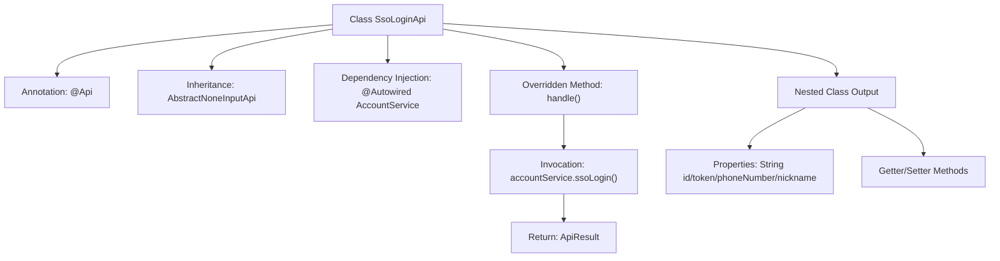

# Basic Information

|      |      |
|------|------|
| Name | SsoLoginApi |
| Language | .java |
| Code Path | WeFe/manager/manager-service/src/main/java/com/welab/wefe/manager/service/api/account/SsoLoginApi.java |
| Package Name | com.welab.wefe.manager.service.api.account |
| Dependencies | ['com.welab.wefe.common.exception.StatusCodeWithException', 'com.welab.wefe.common.web.api.base.AbstractNoneInputApi', 'com.welab.wefe.common.web.api.base.Api', 'com.welab.wefe.common.web.dto.AbstractApiOutput', 'com.welab.wefe.common.web.dto.ApiResult', 'com.welab.wefe.manager.service.service.AccountService', 'org.springframework.beans.factory.annotation.Autowired'] |
| Brief Description | SSO login API class, path is account/sso_login, no login required, calls the AccountService's ssoLogin method to return user ID, token, phone number, and nickname. |

# Description

This is a Java class named SsoLoginApi, designed to handle Single Sign-On (SSO) functionality. The class inherits from AbstractNoneInputApi and defines an inner class Output as the data structure for the response. The Api annotation specifies the path as account/sso_login and indicates no login authentication is required. The class injects AccountService and completes the login logic by calling its ssoLogin method, returning an output result containing the user ID, token, phone number, and nickname. The Output class inherits from AbstractApiOutput and includes four string fields along with their corresponding getter and setter methods.

# Class Summary

| Name   | Type  | Description |
|-------|------|-------------|
| SsoLoginApi | class | SSO login API class, no login required, calls AccountService for SSO login, returns user ID, token, phone number, and nickname. |


## Class SsoLoginApi

|      |      |
|------|------|
| Access Modifier | @Api(path = "account/sso_login", name = "sso_login", login = false);public |
| Type | class |
| Name | SsoLoginApi |
| Description | SSO login API class, no login required, calls AccountService for SSO login, returns user ID, token, phone number, and nickname. |


### UML Class Diagram

```mermaid
classDiagram
    class AbstractNoneInputApi~T~ {
        <<Abstract>>
        +handle() ApiResult~T~
    }

    class SsoLoginApi {
        -AccountService accountService
        +handle() ApiResult~Output~
    }

    class AccountService {
        <<Interface>>
        +ssoLogin() SsoLoginApi$Output
    }

    class AbstractApiOutput {
        <<Abstract>>
    }

    class SsoLoginApi$Output {
        -String id
        -String token
        -String phoneNumber
        -String nickname
        +getId() String
        +setId(String id)
        +getToken() String
        +setToken(String token)
        +getPhoneNumber() String
        +setPhoneNumber(String phoneNumber)
        +getNickname() String
        +setNickname(String nickname)
    }

    SsoLoginApi --|> AbstractNoneInputApi~SsoLoginApi$Output~ : Inheritance
    SsoLoginApi --> AccountService : Dependency
    SsoLoginApi$Output --|> AbstractApiOutput : Inheritance
```

This code demonstrates the implementation structure of an SSO login API. SsoLoginApi inherits from the generic abstract class AbstractNoneInputApi, handling API requests without input and returning an Output object containing user information. The Output class inherits from AbstractApiOutput, including fields such as ID, token, phone number, and nickname. The AccountService interface provides the ssoLogin() method to implement the specific login logic. The overall design reflects a clear hierarchical structure and dependency relationships.


### Internal Method Call Graph



This code demonstrates the implementation structure of an SSO login API. The SsoLoginApi class defines the interface path through the @Api annotation and inherits from an abstract template class to handle requests without input parameters. The core processing logic resides in the handle() method, which performs SSO login authentication via AccountService and returns an output object containing user ID, token, phone number, and nickname. The flowchart clearly presents the class inheritance relationship, dependency injection, method call chain, and attribute structure of the nested output class, reflecting a typical API controller design pattern.

### Field List

| Name  | Type  | Description |
|-------|-------|------|
| accountService | AccountService | Use @Autowired to automatically inject an instance of AccountService. |

### Method List

| Name  | Type  | Description |
|-------|-------|------|
| handle | ApiResult<Output> | Rewrite the parent class's handle method to invoke the ssoLogin of accountService for single sign-on, returning either a successful result or an exception. |


