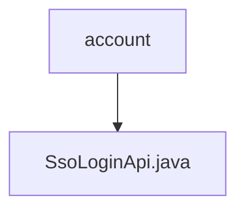

# Basic Information

|      |      |
|------|------|
| Name | account |
| Language | .java |
| Code Path | WeFe/manager/manager-service/src/main/java/com/welab/wefe/manager/service/api/account |
| Package Name | docs.manager.manager-service.src.main.java.com.welab.wefe.manager.service.api.account |
| Brief Description | SSO Login API class, with the path `account/sso_login`, does not require login. It calls the `ssoLogin` method of `AccountService` and returns the user ID, token, phone number, and nickname. |

# Description

This is a Java class named SsoLoginApi, designed to handle Single Sign-On (SSO) functionality. The class inherits from AbstractNoneInputApi and defines an inner class Output as the output data structure. The Api annotation specifies the path as account/sso_login and indicates that no login verification is required. The class injects AccountService and completes the login logic by calling its ssoLogin method, returning an output result containing the user ID, token, phone number, and nickname. The Output class inherits from AbstractApiOutput and includes four string fields along with their corresponding getter and setter methods.

### Package Internal Structure View

This flowchart illustrates the package structure of the account module in the manager-service component of the WeFe project. The account package contains a single file named SsoLoginApi.java. This is a simple single-level structure indicating that only one API interface file exists under the account directory, which handles SSO login-related functionalities.

# File List

| Name   | Type  | Description |
|-------|------|-------------|
| [SsoLoginApi.java](SsoLoginApi.md) | file | SSO login API class, path is account/sso_login, no login required, calls the AccountService's ssoLogin method to return user ID, token, phone number, and nickname. |

