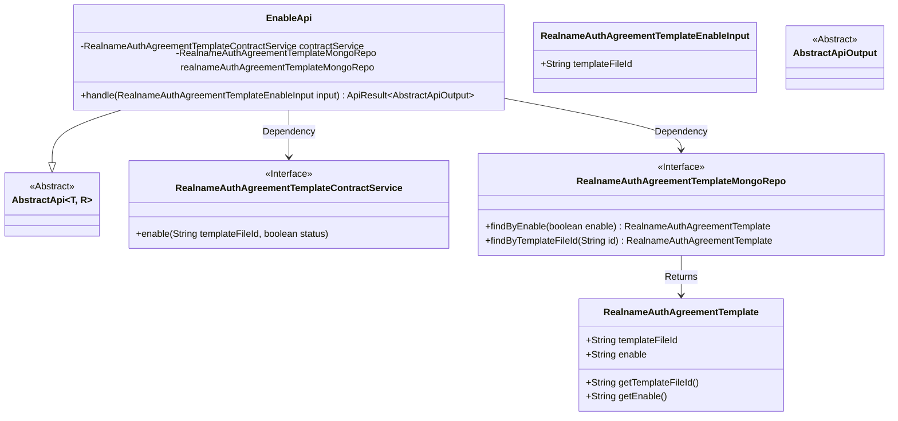
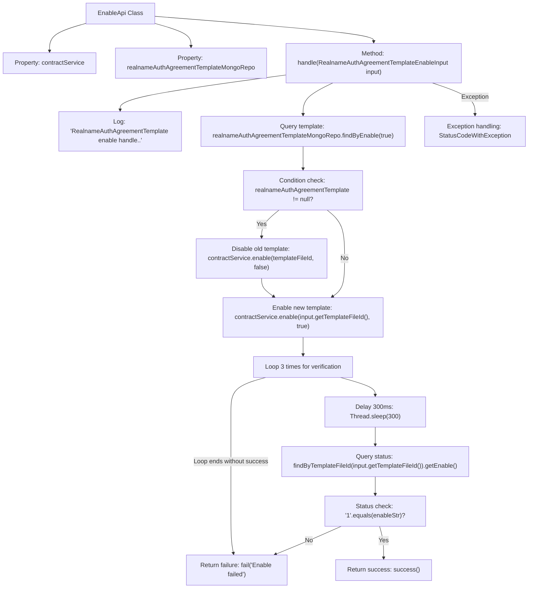

# Basic Information

|      |      |
|------|------|
| Name | EnableApi |
| Language | .java |
| Code Path | WeFe/manager/manager-service/src/main/java/com/welab/wefe/manager/service/api/agreement/EnableApi.java |
| Package Name | com.welab.wefe.manager.service.api.agreement |
| Dependencies | ['com.welab.wefe.common.StatusCode', 'com.welab.wefe.common.data.mongodb.entity.union.RealnameAuthAgreementTemplate', 'com.welab.wefe.common.data.mongodb.repo.RealnameAuthAgreementTemplateMongoRepo', 'com.welab.wefe.common.exception.StatusCodeWithException', 'com.welab.wefe.common.web.api.base.AbstractApi', 'com.welab.wefe.common.web.api.base.Api', 'com.welab.wefe.common.web.dto.AbstractApiOutput', 'com.welab.wefe.common.web.dto.ApiResult', 'com.welab.wefe.manager.service.dto.agreement.RealnameAuthAgreementTemplateEnableInput', 'com.welab.wefe.manager.service.service.RealnameAuthAgreementTemplateContractService', 'org.springframework.beans.factory.annotation.Autowired'] |
| Brief Description | API classes for enabling real-name authentication protocol templates query MongoDB and operate template files via contract services, supporting the activation of new templates and status verification, with a maximum of 3 retries, returning an error upon failure. |

# Description

This is a Java class named EnableApi, designed to handle the enabling functionality of real-name authentication agreement templates. It extends AbstractApi, accepts RealnameAuthAgreementTemplateEnableInput as input, and returns AbstractApiOutput. The class injects two services: RealnameAuthAgreementTemplateContractService and RealnameAuthAgreementTemplateMongoRepo. The main logic involves: first checking if there are any enabled templates and disabling them, then enabling the newly specified template file ID. A three-time retry mechanism is implemented to verify successful enabling, returning an error message if it fails. The entire process includes exception handling and logging.

# Class Summary

| Name   | Type  | Description |
|-------|------|-------------|
| EnableApi | class | This is an API class for enabling real-name authentication protocol templates. It checks the status of existing templates and invokes services to update the activation status, with a maximum of 3 retries to ensure successful operation. Failure returns an error message. |

## Class EnableApi

|      |      |
|------|------|
| Access Modifier | @Api(path = "realname/auth/agreement/template/enable", name = "realname_auth_agreement_template_enable");public |
| Type | class |
| Name | EnableApi |
| Description | This is an API class for enabling real-name authentication protocol templates. It checks the status of existing templates and invokes services to update the activation status, with a maximum of 3 retries to ensure successful operation. Failure returns an error message. |

### UML Class Diagram

This code demonstrates the implementation class `EnableApi` for a real-name authentication agreement template enabling API. It inherits from the generic abstract class `AbstractApi`, accesses data through `RealnameAuthAgreementTemplateMongoRepo`, and invokes the `RealnameAuthAgreementTemplateContractService` to perform the enabling operation. The class diagram clearly illustrates the inheritance and dependency relationships among core classes, including the input parameter class, MongoDB repository interface, contract service interface, and template entity class, fully reflecting the component collaboration structure when the system processes enable requests.

### Internal Method Call Graph

This flowchart illustrates the complete process of the EnableApi class handling the enabling of real-name authentication agreement templates. It first queries MongoDB for enabled templates, disables any existing template if found, then enables the new template file. A 3-retry mechanism verifies successful enabling (status '1') with 300ms intervals between attempts. If unsuccessful, it returns failure, with any exceptions captured and converted to system errors. The workflow demonstrates atomic template enabling operations with status verification mechanisms.

### Field List

| Name  | Type  | Description |
|-------|-------|------|
| realnameAuthAgreementTemplateMongoRepo | RealnameAuthAgreementTemplateMongoRepo | Automatically injected MongoDB repository instance with real-name authentication protocol template. |
| contractService | RealnameAuthAgreementTemplateContractService | Using @Autowired to automatically inject the RealnameAuthAgreementTemplateContractService instance contractService. |

### Method List

| Name  | Type  | Description |
|-------|-------|------|
| handle | ApiResult<AbstractApiOutput> | Processing the real-name authentication protocol template activation: first disable the existing template, then enable the new template, with a maximum of 3 retries to check the status. Return an error if failed, or return success if successful. |

