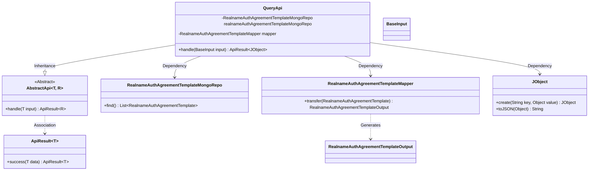
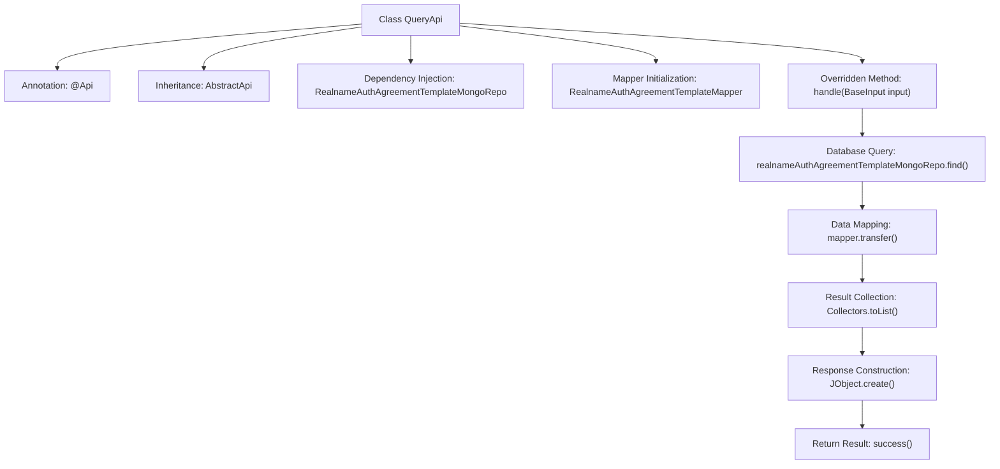

# Basic Information

|      |      |
|------|------|
| Name | QueryApi |
| Language | .java |
| Code Path | WeFe/manager/manager-service/src/main/java/com/welab/wefe/manager/service/api/agreement/QueryApi.java |
| Package Name | com.welab.wefe.manager.service.api.agreement |
| Dependencies | ['com.welab.wefe.common.data.mongodb.repo.RealnameAuthAgreementTemplateMongoRepo', 'com.welab.wefe.common.util.JObject', 'com.welab.wefe.common.web.api.base.AbstractApi', 'com.welab.wefe.common.web.api.base.Api', 'com.welab.wefe.common.web.dto.ApiResult', 'com.welab.wefe.manager.service.dto.agreement.RealnameAuthAgreementTemplateOutput', 'com.welab.wefe.manager.service.dto.base.BaseInput', 'com.welab.wefe.manager.service.mapper.RealnameAuthAgreementTemplateMapper', 'org.mapstruct.factory.Mappers', 'org.springframework.beans.factory.annotation.Autowired', 'java.util.List', 'java.util.stream.Collectors'] |
| Brief Description | This is an API class for querying real-name authentication agreement templates, which retrieves data from MongoDB and converts it into JSON format for return. |

# Description

This is a Java class named QueryApi, designed to handle requests for querying real-name authentication agreement templates. It inherits from the AbstractApi base class, using BaseInput as the input type and JObject as the output type. The class injects RealnameAuthAgreementTemplateMongoRepo for database operations and utilizes RealnameAuthAgreementTemplateMapper for object conversion. The handle method implements the core logic: querying all real-name authentication agreement template data from MongoDB, converting it into a list of output objects, and finally encapsulating it into a successful response containing a JSON-formatted list.

# Class Summary

| Name   | Type  | Description |
|-------|------|-------------|
| QueryApi | class | This is an API class for querying real-name authentication agreement templates, which retrieves data through a MongoDB repository, converts it using a mapper, and returns a list of results in JSON format. |

## Class QueryApi

|      |      |
|------|------|
| Access Modifier | @Api(path = "realname/auth/agreement/template/query", name = "realname_auth_agreement_template_query");public |
| Type | class |
| Name | QueryApi |
| Description | This is an API class for querying real-name authentication agreement templates, which retrieves data through a MongoDB repository, converts it using a mapper, and returns a list of results in JSON format. |

### UML Class Diagram

This code demonstrates the implementation class QueryApi for a real-name authentication agreement template query API, which inherits from the generic abstract class AbstractApi, processes BaseInput and returns an ApiResult containing JSON objects. It primarily relies on MongoDB repository to fetch data, converts entities to output objects via Mapper, and ultimately constructs responses using JObject. The class diagram clearly reflects inheritance relationships, dependency injection, and utility class collaboration, embodying a typical Spring Boot layered architecture design pattern.

### Internal Method Call Graph

This code implements the QueryApi class, primarily used for querying real-name authentication agreement templates. The process starts with the handle method, which first queries data via the MongoDB repository, then uses Mapper to transform entities into output objects, and finally encapsulates the result list into JSON format for return. The entire workflow demonstrates a complete processing chain from data retrieval to response, reflecting clear responsibility layering and data transformation logic.

### Field List

| Name  | Type  | Description |
|-------|-------|------|
| mapper = Mappers.getMapper(RealnameAuthAgreementTemplateMapper.class) | RealnameAuthAgreementTemplateMapper | Declare a protected RealnameAuthAgreementTemplateMapper object mapper, and obtain an instance through the Mappers.getMapper method. |
| realnameAuthAgreementTemplateMongoRepo | RealnameAuthAgreementTemplateMongoRepo | Use @Autowired to automatically inject the MongoDB repository for the real-name authentication protocol template. |

### Method List

| Name  | Type  | Description |
|-------|-------|------|
| handle | ApiResult<JObject> | This method overrides the parent class's processing logic, queries the real-name authentication agreement template list, converts it into output objects, and finally encapsulates it as a successful response containing a JSON list. |

