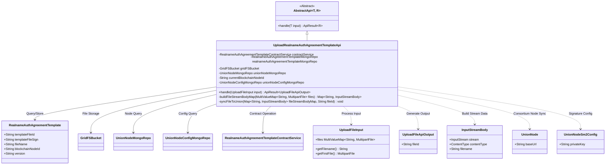
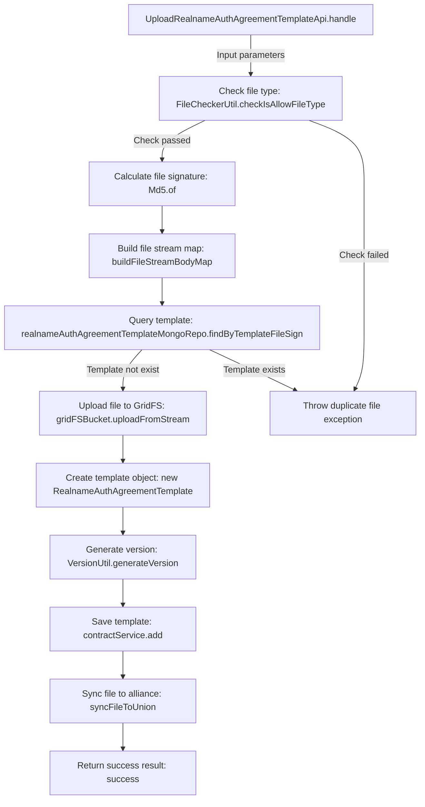
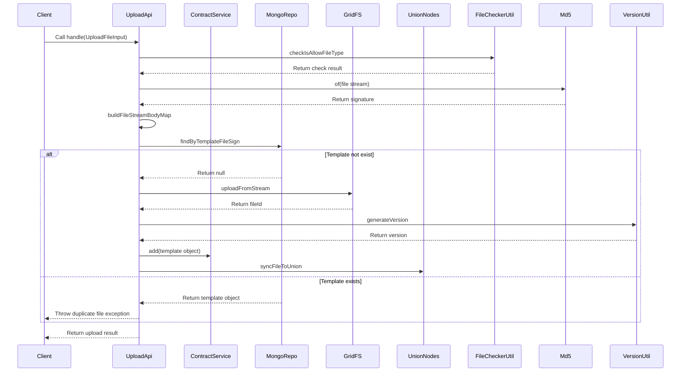

# Basic Information

|      |      |
|------|------|
| Name | UploadRealnameAuthAgreementTemplateApi |
| Language | .java |
| Code Path | WeFe/manager/manager-service/src/main/java/com/welab/wefe/manager/service/api/agreement/UploadRealnameAuthAgreementTemplateApi.java |
| Package Name | com.welab.wefe.manager.service.api.agreement |
| Dependencies | ['com.mongodb.client.gridfs.GridFSBucket', 'com.mongodb.client.gridfs.model.GridFSUploadOptions', 'com.welab.wefe.common.StatusCode', 'com.welab.wefe.common.data.mongodb.entity.union.RealnameAuthAgreementTemplate', 'com.welab.wefe.common.data.mongodb.entity.union.UnionNode', 'com.welab.wefe.common.data.mongodb.entity.union.UnionNodeSm2Config', 'com.welab.wefe.common.data.mongodb.repo.RealnameAuthAgreementTemplateMongoRepo', 'com.welab.wefe.common.data.mongodb.repo.UnionNodeConfigMongoRepo', 'com.welab.wefe.common.data.mongodb.repo.UnionNodeMongoRepo', 'com.welab.wefe.common.exception.StatusCodeWithException', 'com.welab.wefe.common.util.JObject', 'com.welab.wefe.common.util.Md5', 'com.welab.wefe.common.util.SM2Util', 'com.welab.wefe.common.util.StringUtil', 'com.welab.wefe.common.web.api.base.AbstractApi', 'com.welab.wefe.common.web.api.base.Api', 'com.welab.wefe.common.web.dto.ApiResult', 'com.welab.wefe.common.web.dto.UploadFileApiOutput', 'com.welab.wefe.manager.service.dto.common.UploadFileInput', 'com.welab.wefe.manager.service.service.RealnameAuthAgreementTemplateContractService', 'com.welab.wefe.manager.service.task.UploadFileSyncToUnionTask', 'com.welab.wefe.manager.service.util.FileCheckerUtil', 'com.welab.wefe.manager.service.util.VersionUtil', 'org.apache.http.entity.ContentType', 'org.apache.http.entity.mime.content.InputStreamBody', 'org.bson.Document', 'org.springframework.beans.factory.annotation.Autowired', 'org.springframework.util.MultiValueMap', 'org.springframework.web.multipart.MultipartFile', 'java.io.IOException', 'java.util.HashMap', 'java.util.List', 'java.util.Map'] |
| Brief Description | API class for uploading real-name authentication agreement templates, checking file types, generating signatures, storing to GridFS, synchronizing to consortium nodes, and avoiding duplicate uploads. |

# Description

The code defines an API class for uploading real-name authentication agreement templates. Key functionalities include: validating uploaded file types, generating file signatures, storing files in a GridFS database, creating template records, and synchronizing them to consortium blockchain nodes. The processing flow involves file type validation, MD5 signature generation, GridFS storage, version number generation, and duplicate file detection. It also implements synchronization to other consortium nodes, including data signature verification and asynchronous task triggering. Exception handling covers mismatched file types, duplicate uploads, and IO read/write errors.

# Class Summary

| Name   | Type  | Description |
|-------|------|-------------|
| UploadRealnameAuthAgreementTemplateApi | class | Upload real-name authentication agreement template API, check file type and signature, store it in GridFS and synchronize to consortium nodes to avoid duplicate uploads. |

## Class UploadRealnameAuthAgreementTemplateApi

|      |      |
|------|------|
| Access Modifier | @Api(path = "realname/auth/agreement/template/upload", name = "realname_auth_agreement_template_upload");public |
| Type | class |
| Name | UploadRealnameAuthAgreementTemplateApi |
| Description | Upload real-name authentication agreement template API, check file type and signature, store it in GridFS and synchronize to consortium nodes to avoid duplicate uploads. |

### UML Class Diagram

This class diagram illustrates the core structure of the Real-name Authentication Agreement Template Upload API. The UploadRealnameAuthAgreementTemplateApi inherits from the generic abstract class AbstractApi, implementing file upload, version management, and consortium node synchronization through multiple repository services (MongoRepo) and file storage components (GridFSBucket). Key processing steps include: file type validation, MD5 signature verification, GridFS storage, version number generation, smart contract registration, and SM2-signed synchronization to other consortium nodes. The diagram clearly depicts interaction relationships between 7 core data models and 5 external dependency components.

### Internal Method Call Graph

The flowchart describes the core processing flow of the real-name authentication agreement template upload API, covering the complete process from file type checking, signature calculation, template query to GridFS storage and alliance node synchronization, including exception handling branches. The sequence diagram illustrates the detailed timing relationships from client invocation to component interactions, highlighting the branch logic for template existence judgment and cross-service collaboration process.

### Field List

| Name  | Type  | Description |
|-------|-------|------|
| unionNodeMongoRepo | UnionNodeMongoRepo | Using @Autowired to automatically inject the UnionNodeMongoRepo instance. |
| realnameAuthAgreementTemplateMongoRepo | RealnameAuthAgreementTemplateMongoRepo | Automatically injected MongoDB repository instance for real-name authentication protocol template. |
| unionNodeConfigMongoRepo | UnionNodeConfigMongoRepo | Automatically inject the UnionNodeConfigMongoRepo instance. |
| currentBlockchainNodeId | String | The code snippet declares a private String variable named currentBlockchainNodeId and uses the @Autowired annotation for automatic dependency injection. |
| gridFSBucket | GridFSBucket | Using @Autowired to automatically inject a GridFSBucket instance. |
| contractService | RealnameAuthAgreementTemplateContractService | Automatically inject the real-name authentication protocol template contract service instance. |

### Method List

| Name  | Type  | Description |
|-------|-------|------|
| handle | ApiResult<UploadFileApiOutput> | Handle file uploads, check file types, generate signatures, store in GridFS, and avoid duplicate uploads. |
| buildFileStreamBodyMap | Map<String, InputStreamBody> | This method converts MultipartFile in the MultiValueMap into a Map of InputStreamBody, handling file streams and content types, and throws a file IO error in case of exceptions. |
| syncFileToUnion | void | The method `syncFileToUnion` synchronizes files to alliance nodes, using SM2 signature verification, iterates through the node list and initiates upload tasks, and logs exceptions when they occur. |

