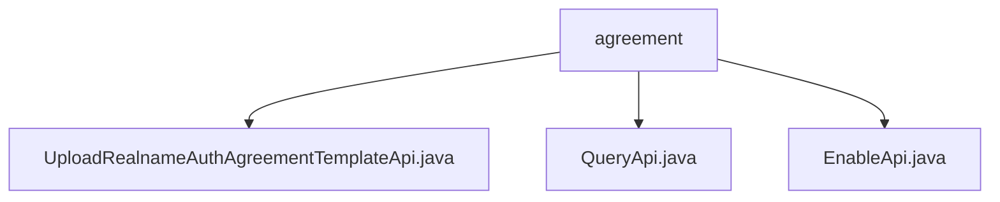

# Basic Information

|      |      |
|------|------|
| Name | agreement |
| Language | .java |
| Code Path | WeFe/manager/manager-service/src/main/java/com/welab/wefe/manager/service/api/agreement |
| Package Name | docs.manager.manager-service.src.main.java.com.welab.wefe.manager.service.api.agreement |
| Brief Description | The UploadApi class handles the upload of real-name authentication agreements, including file validation, storage, version management, and synchronization with the consortium blockchain. The QueryApi class retrieves protocol template data and returns a JSON list. The EnableApi class manages template activation status, supporting the deactivation of old templates and activation of new ones, with a built-in retry mechanism. |

# Description

## Overview  
The core responsibility of this module is to manage the full lifecycle of real-name authentication agreement templates, including upload, query, and enable operations, with support for file storage, version control, and consortium blockchain synchronization. The interface specifications cover file type validation (e.g., PDF/PNG), MD5 signature generation, GridFS storage, version number auto-increment, and consortium node data synchronization, using JObject as the universal output format.  

Key data structures include RealnameAuthAgreementTemplate (template record), BaseInput (basic request parameters), and RealnameAuthAgreementTemplateEnableInput (enable-specific parameters). External dependencies involve MongoDB (GridFS storage), consortium blockchain nodes (data synchronization), and MD5 signature services. For example, the upload API ensures successful consortium blockchain synchronization through three retries.  

## Key Business Scenarios  
The complete business workflow is as follows: user uploads file → system validates and stores → queries available templates → enables specified version, resembling a configuration management center model. Interactions adopt a standard RESTful style, such as the upload interface triggering asynchronous consortium blockchain synchronization and the query interface returning a JSON list.  

Typical scenarios include: new agreement version release (automatically disabling old versions) and multi-node data consistency maintenance (via signature verification). API types are categorized into data operation classes (e.g., EnableApi) and query classes (e.g., QueryApi). For instance, the enable API first checks existing active templates and enforces downgrades.

### Package Internal Structure View

This flowchart illustrates three Java files under the agreement directory: UploadRealnameAuthAgreementTemplateApi, QueryApi, and EnableApi. All three files are directly subordinate to the agreement directory without any deeper subdirectory hierarchy. The diagram clearly depicts the direct containment relationship between agreement as the parent node and the three API implementation files.

# File List

| Name   | Type  | Description |
|-------|------|-------------|
| [UploadRealnameAuthAgreementTemplateApi.java](UploadRealnameAuthAgreementTemplateApi.md) | file | API class for uploading real-name authentication agreement templates, checking file types, generating signatures, storing to GridFS, and synchronizing to consortium nodes to avoid duplicate uploads. |
| [QueryApi.java](QueryApi.md) | file | This is an API class for querying real-name authentication agreement templates, which retrieves data from MongoDB and converts it into JSON format for return. |
| [EnableApi.java](EnableApi.md) | file | API class for enabling real-name authentication protocol templates, which queries MongoDB and operates template files via contract services, supports enabling new templates and verifying their status, with a maximum of 3 retries, and returns an error upon failure. |

