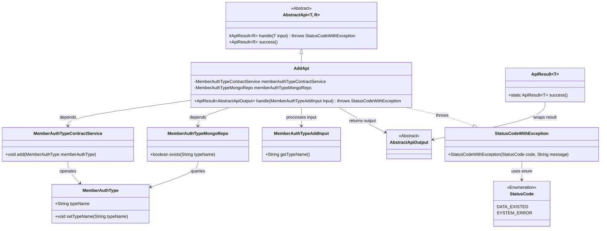
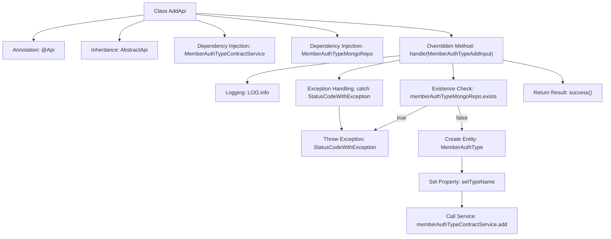

# Basic Information

|      |      |
|------|------|
| Name | AddApi |
| Language | .java |
| Code Path | WeFe/manager/manager-service/src/main/java/com/welab/wefe/manager/service/api/authtype/AddApi.java |
| Package Name | com.welab.wefe.manager.service.api.authtype |
| Dependencies | ['com.welab.wefe.common.StatusCode', 'com.welab.wefe.common.data.mongodb.entity.union.MemberAuthType', 'com.welab.wefe.common.data.mongodb.repo.MemberAuthTypeMongoRepo', 'com.welab.wefe.common.exception.StatusCodeWithException', 'com.welab.wefe.common.web.api.base.AbstractApi', 'com.welab.wefe.common.web.api.base.Api', 'com.welab.wefe.common.web.dto.AbstractApiOutput', 'com.welab.wefe.common.web.dto.ApiResult', 'com.welab.wefe.manager.service.dto.authtype.MemberAuthTypeAddInput', 'com.welab.wefe.manager.service.service.MemberAuthTypeContractService', 'org.springframework.beans.factory.annotation.Autowired'] |
| Brief Description | This is a class named AddApi, used for adding member authentication types. It checks whether the type already exists, and if not, adds a new type via memberAuthTypeContractService. If the type exists or an error occurs, it throws the corresponding exception. |

# Description

This is a Java class named AddApi, designed to handle API requests for adding member authentication types. The class extends AbstractApi, accepts MemberAuthTypeAddInput as an input parameter, and returns AbstractApiOutput. Its primary functionality includes checking whether the authentication type name already exists—throwing an exception if it does—or otherwise creating a new MemberAuthType object and adding it via the memberAuthTypeContractService. The process utilizes memberAuthTypeMongoRepo for data queries and handles potential StatusCodeWithException exceptions through catch blocks.

# Class Summary

| Name   | Type  | Description |
|-------|------|-------------|
| AddApi | class | This is an API class for adding member authentication types, which checks if the type name exists and creates and saves it if it does not. |

## Class AddApi

|      |      |
|------|------|
| Access Modifier | @Api(path = "member/authtype/add", name = "member_authtype_add");public |
| Type | class |
| Name | AddApi |
| Description | This is an API class for adding member authentication types, which checks if the type name exists and creates and saves it if it does not. |

### UML Class Diagram

This code demonstrates the implementation class AddApi for a member authentication type addition API, which inherits from the generic abstract class AbstractApi. Its primary function is to handle requests for adding member authentication types, checking via MemberAuthTypeMongoRepo whether the type already exists, and if not, adding the new type through MemberAuthTypeContractService. The process includes input validation, business logic processing, and exception management, utilizing a custom status code enumeration and exception class StatusCodeWithException for unified error handling. The class diagram clearly illustrates the dependency relationships and inheritance hierarchy among the components.

### Internal Method Call Graph

This flowchart illustrates the core processing flow of the AddApi class. It begins with defining the API path through annotation, inheriting an abstract class, and injecting two service dependencies. The main logic resides in the handle method: first checking the existence of the type name (throwing an exception if exists), otherwise creating a MemberAuthType object and invoking the service layer to write data. The entire process includes exception handling and logging, ultimately returning a success result. Arrows clearly depict conditional branching and exception handling paths.

### Field List

| Name  | Type  | Description |
|-------|-------|------|
| memberAuthTypeMongoRepo | MemberAuthTypeMongoRepo | Using @Autowired to automatically inject an instance of MemberAuthTypeMongoRepo. |
| memberAuthTypeContractService | MemberAuthTypeContractService | Automatically inject the MemberAuthTypeContractService service instance. |

### Method List

| Name  | Type  | Description |
|-------|-------|------|
| handle | ApiResult<AbstractApiOutput> | Process the request to add a member authentication type, check if the type name already exists, throw an exception if it exists, otherwise create and save the new type, and return a system error after catching the exception. |

