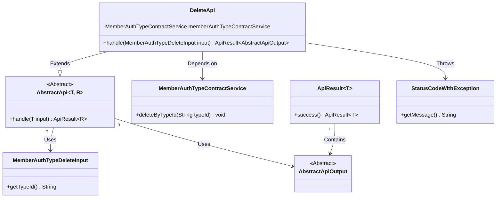
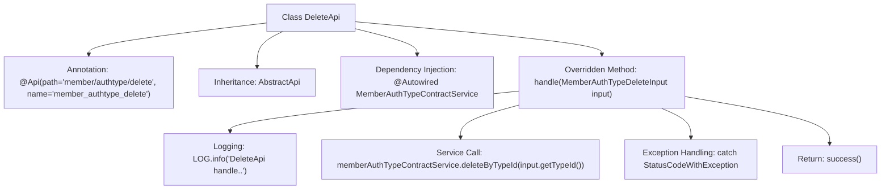

# Basic Information

|      |      |
|------|------|
| Name | DeleteApi |
| Language | .java |
| Code Path | WeFe/manager/manager-service/src/main/java/com/welab/wefe/manager/service/api/authtype/DeleteApi.java |
| Package Name | com.welab.wefe.manager.service.api.authtype |
| Dependencies | ['com.welab.wefe.common.StatusCode', 'com.welab.wefe.common.exception.StatusCodeWithException', 'com.welab.wefe.common.web.api.base.AbstractApi', 'com.welab.wefe.common.web.api.base.Api', 'com.welab.wefe.common.web.dto.AbstractApiOutput', 'com.welab.wefe.common.web.dto.ApiResult', 'com.welab.wefe.manager.service.dto.authtype.MemberAuthTypeDeleteInput', 'com.welab.wefe.manager.service.service.MemberAuthTypeContractService', 'org.springframework.beans.factory.annotation.Autowired'] |
| Brief Description | Delete the API class for member authentication type, process the input parameter MemberAuthTypeDeleteInput, call memberAuthTypeContractService to delete the record with the specified typeId, return AbstractApiOutput upon success, and throw StatusCodeWithException in case of exceptions. |

# Description

The code defines a class named DeleteApi, which handles member authentication type deletion requests. The class annotation specifies the API path and name. It inherits from AbstractApi, accepts MemberAuthTypeDeleteInput as input, and returns AbstractApiOutput. The deleteByTypeId method is invoked via the auto-injected MemberAuthTypeContractService to perform the deletion operation. Exceptions are caught during processing, and a system error status code is thrown. Upon success, it returns a successful result.

# Class Summary

| Name   | Type  | Description |
|-------|------|-------------|
| DeleteApi | class | API for deleting member authentication type, which receives the type ID and invokes the service to delete it, returning a system error in case of exceptions. |

## Class DeleteApi

|      |      |
|------|------|
| Access Modifier | @Api(path = "member/authtype/delete", name = "member_authtype_delete");public |
| Type | class |
| Name | DeleteApi |
| Description | API for deleting member authentication type, which receives the type ID and invokes the service to delete it, returning a system error in case of exceptions. |

### UML Class Diagram

This code demonstrates the implementation class `DeleteApi` for a deletion API, which inherits from the generic abstract class `AbstractApi`, processes `MemberAuthTypeDeleteInput` input, and returns `AbstractApiOutput` results. The class diagram clearly illustrates the inheritance relationships, dependent services, and exception handling mechanisms. The `MemberAuthTypeContractService` provides core deletion functionality, while `StatusCodeWithException` is used for error handling. The overall structure aligns with Spring's dependency injection pattern.

### Internal Method Call Graph

This code represents a Spring framework-based API class primarily designed for handling member authentication type deletion operations. The flowchart illustrates the complete process from class declaration through dependency injection, core business logic processing (including logging and service invocation), exception catching, and ultimately returning a successful result. The class inherits from the generic abstract class AbstractApi, implements specific business logic via the handle method, and utilizes the custom exception StatusCodeWithException for error handling.

### Field List

| Name  | Type  | Description |
|-------|-------|------|
| memberAuthTypeContractService | MemberAuthTypeContractService | Using @Autowired to automatically inject an instance of the MemberAuthTypeContractService. |

### Method List

| Name  | Type  | Description |
|-------|-------|------|
| handle | ApiResult<AbstractApiOutput> | Process API requests for deleting member authentication types, invoke the service to remove records of the specified type ID, catch exceptions, and return success or error status. |

