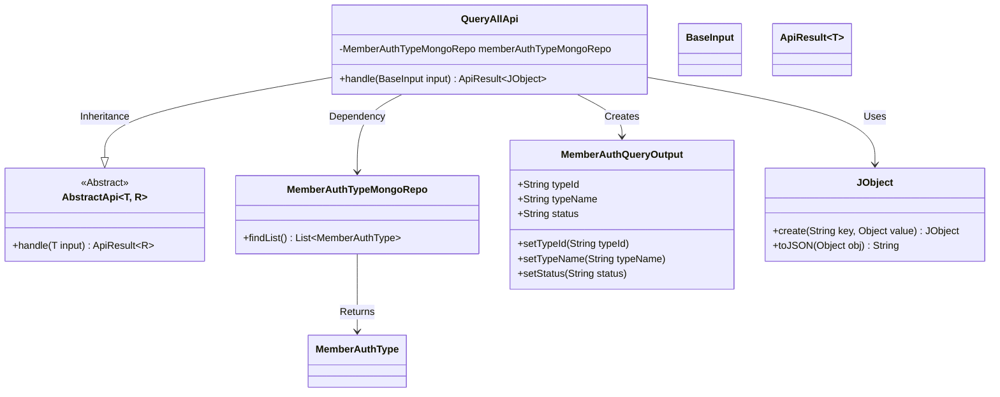
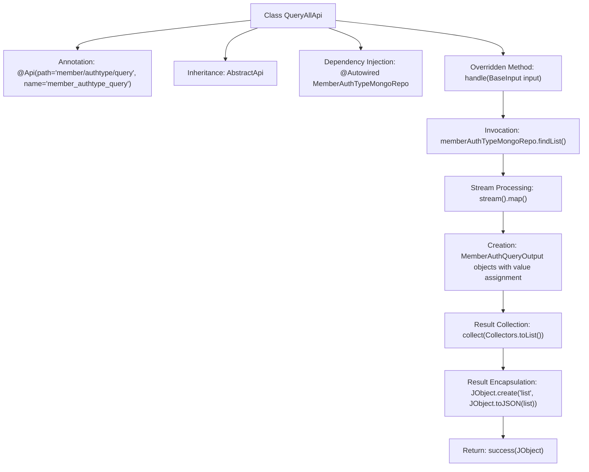

# Basic Information

|      |      |
|------|------|
| Name | QueryAllApi |
| Language | .java |
| Code Path | WeFe/manager/manager-service/src/main/java/com/welab/wefe/manager/service/api/authtype/QueryAllApi.java |
| Package Name | com.welab.wefe.manager.service.api.authtype |
| Dependencies | ['com.welab.wefe.common.data.mongodb.dto.member.MemberAuthQueryOutput', 'com.welab.wefe.common.data.mongodb.repo.MemberAuthTypeMongoRepo', 'com.welab.wefe.common.util.JObject', 'com.welab.wefe.common.web.api.base.AbstractApi', 'com.welab.wefe.common.web.api.base.Api', 'com.welab.wefe.common.web.dto.ApiResult', 'com.welab.wefe.manager.service.dto.base.BaseInput', 'org.springframework.beans.factory.annotation.Autowired', 'java.util.List', 'java.util.stream.Collectors'] |
| Brief Description | The QueryAllApi class retrieves a list of member authentication types via memberAuthTypeMongoRepo, returning JSON data containing typeId, typeName, and status. The path is member/authtype/query. |

# Description

This is a Java class named QueryAllApi, which extends AbstractApi and is used to handle member authentication type query requests. The class annotation specifies the API path as member/authtype/query. It retrieves data from MongoDB by injecting MemberAuthTypeMongoRepo, converts the query results into a list of MemberAuthQueryOutput objects, and encapsulates them in JSON format for response. Key operations include querying data, mapping fields, and constructing responses.

# Class Summary

| Name   | Type  | Description |
|-------|------|-------------|
| QueryAllApi | class | API for querying member authentication types, which retrieves data from MongoDB and returns a list of type IDs, names, and statuses. |

## Class QueryAllApi

|      |      |
|------|------|
| Access Modifier | @Api(path = "member/authtype/query", name = "member_authtype_query");public |
| Type | class |
| Name | QueryAllApi |
| Description | API for querying member authentication types, which retrieves data from MongoDB and returns a list of type IDs, names, and statuses. |

### UML Class Diagram

This code demonstrates the implementation of a QueryAllApi class for querying member authentication types. It inherits from the generic abstract class AbstractApi, processes BaseInput, and returns an ApiResult containing a JObject. The main functionality involves retrieving a list of member authentication types from the database via MemberAuthTypeMongoRepo, converting them into MemberAuthQueryOutput objects, and encapsulating them in JSON format for return. The class diagram clearly illustrates inheritance, dependency, and creation relationships between classes, as well as the core data flow process.

### Internal Method Call Graph

This code defines a class named `QueryAllApi` for handling member authentication type query requests. It retrieves data from the database via `MemberAuthTypeMongoRepo`, converts the results into a list of `MemberAuthQueryOutput` objects, and ultimately encapsulates them in JSON format for return. The flowchart illustrates the complete processing flow from data query to result return, including data transformation and encapsulation steps.

### Field List

| Name  | Type  | Description |
|-------|-------|------|
| memberAuthTypeMongoRepo | MemberAuthTypeMongoRepo | Using @Autowired to automatically inject the MemberAuthTypeMongoRepo member variable. |

### Method List

| Name  | Type  | Description |
|-------|-------|------|
| handle | ApiResult<JObject> | Processing member authentication type query, converting MongoDB data into an output list and returning a successful result. |

