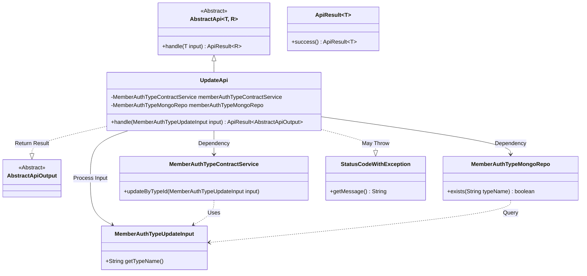
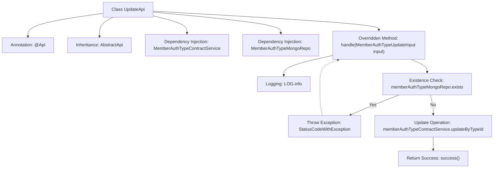

# Basic Information

|      |      |
|------|------|
| Name | UpdateApi |
| Language | .java |
| Code Path | WeFe/manager/manager-service/src/main/java/com/welab/wefe/manager/service/api/authtype/UpdateApi.java |
| Package Name | com.welab.wefe.manager.service.api.authtype |
| Dependencies | ['com.welab.wefe.common.StatusCode', 'com.welab.wefe.common.data.mongodb.repo.MemberAuthTypeMongoRepo', 'com.welab.wefe.common.exception.StatusCodeWithException', 'com.welab.wefe.common.web.api.base.AbstractApi', 'com.welab.wefe.common.web.api.base.Api', 'com.welab.wefe.common.web.dto.AbstractApiOutput', 'com.welab.wefe.common.web.dto.ApiResult', 'com.welab.wefe.manager.service.dto.authtype.MemberAuthTypeUpdateInput', 'com.welab.wefe.manager.service.service.MemberAuthTypeContractService', 'org.springframework.beans.factory.annotation.Autowired'] |
| Brief Description | API class for updating member certification types, which checks for type existence before invoking the service update and returns a system error in case of exceptions. |

# Description

This is a Java class named UpdateApi, designed to handle API requests for updating member authentication types. It extends the AbstractApi base class, accepts MemberAuthTypeUpdateInput as an input parameter, and returns AbstractApiOutput. The class injects two dependency services: MemberAuthTypeContractService and MemberAuthTypeMongoRepo. The core logic is implemented in the handle method: first, it checks whether the input type name already exists—if it does, an exception is thrown; otherwise, it calls the updateByTypeId method of memberAuthTypeContractService to perform the update. Exceptions caught during processing are rethrown as system errors. Upon success, it returns success(). The API path is "member/authtype/update".

# Class Summary

| Name   | Type  | Description |
|-------|------|-------------|
| UpdateApi | class | API class for updating member certification types, which checks if the type exists before calling the service to update data, handles exceptions, and returns the result. |

## Class UpdateApi

|      |      |
|------|------|
| Access Modifier | @Api(path = "member/authtype/update", name = "member_authtype_update");public |
| Type | class |
| Name | UpdateApi |
| Description | API class for updating member certification types, which checks if the type exists before calling the service to update data, handles exceptions, and returns the result. |

### UML Class Diagram

This code demonstrates an UpdateApi implementation class for member authentication type updates, which inherits from the generic abstract class AbstractApi. It primarily relies on MemberAuthTypeContractService for business processing and uses MemberAuthTypeMongoRepo to check data existence. It throws a StatusCodeWithException when the type already exists and returns AbstractApiOutput upon success. The class diagram clearly illustrates inheritance relationships, dependency relationships, and exception handling mechanisms, reflecting a typical service-layer invocation pattern in the Spring framework.

### Internal Method Call Graph

The flowchart illustrates the core processing flow of the UpdateApi class. This API first checks whether the type name in the input parameters already exists. If it exists, a "DATA_EXISTED" exception is thrown; otherwise, it invokes the contract service to perform the update operation. The entire process includes logging, data validation, business operations, and exception handling, ultimately returning a success status or encapsulating system errors.

### Field List

| Name  | Type  | Description |
|-------|-------|------|
| memberAuthTypeMongoRepo | MemberAuthTypeMongoRepo | Using @Autowired to automatically inject the MemberAuthTypeMongoRepo member variable. |
| memberAuthTypeContractService | MemberAuthTypeContractService | Automatically inject member authentication type contract service instances. |

### Method List

| Name  | Type  | Description |
|-------|-------|------|
| handle | ApiResult<AbstractApiOutput> | Process the member authentication type update request, check if the type exists, return an error if it exists, otherwise update and return success. |

