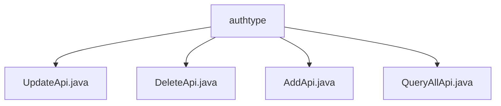

# Basic Information

|      |      |
|------|------|
| Name | authtype |
| Language | .java |
| Code Path | WeFe/manager/manager-service/src/main/java/com/welab/wefe/manager/service/api/authtype |
| Package Name | docs.manager.manager-service.src.main.java.com.welab.wefe.manager.service.api.authtype |
| Brief Description | The UpdateApi handles updates to authentication types, checking the name before invoking the service to update. The DeleteApi processes deletion requests, calling the service to remove the type. The AddApi adds new authentication types, verifying the name before creating the object. The QueryAllApi retrieves all authentication types, fetching data from MongoDB and returning it. |

# Description

## Overview  
This module provides a comprehensive lifecycle management API group for member authentication types, encompassing capabilities such as addition, deletion, modification, and query. Its core responsibilities include authentication type creation (AddApi), update (UpdateApi), deletion (DeleteApi), and query (QueryAllApi), all standardized through unified inheritance of AbstractApi. The interface specifications adhere to RESTful conventions, e.g., the path "member/authtype/update" corresponds to update operations. Key data structures include input DTOs like MemberAuthTypeAddInput and response bodies like MemberAuthQueryOutput. External dependencies involve the MemberAuthTypeContractService smart contract service and the MemberAuthTypeMongoRepo persistence layer component, resembling a CRUD hub pattern.  

## Key Business Scenarios  
A typical workflow includes: validating type name uniqueness during addition (e.g., duplicate-check logic in AddApi), locating data via typeId during updates/deletions (e.g., DeleteApi invoking deleteByTypeId). Query scenarios directly fetch full datasets from MongoDB and transform outputs. All interactions follow a three-phase "parameter validation → business operation → exception handling" model, akin to a gateway filter chain. The complete functionality covers authentication type configuration needs, such as maintaining consortium member permission systems. All APIs return standardized AbstractApiOutput responses, with integration cases including frontend console calls or cross-service permission synchronization.

### Package Internal Structure View

This flowchart illustrates the structural relationships of four API files under the authtype directory. With authtype as the parent node, it contains four child node files: UpdateApi, DeleteApi, AddApi, and QueryAllApi. These files belong to the same hierarchical level and collectively constitute the API interface implementation part of the authtype module.

# File List

| Name   | Type  | Description |
|-------|------|-------------|
| [UpdateApi.java](UpdateApi.md) | file | API class for updating member certification types, checks if the type exists before calling the service to update, and returns a system error in case of exceptions. |
| [DeleteApi.java](DeleteApi.md) | file | Delete the API class for member authentication types, process the input parameter MemberAuthTypeDeleteInput, call memberAuthTypeContractService to delete the record with the specified typeId, return AbstractApiOutput upon success, and throw StatusCodeWithException in case of exceptions. |
| [AddApi.java](AddApi.md) | file | This is a class named AddApi, used for adding member authentication types. It checks whether the type already exists, and if not, adds a new type via memberAuthTypeContractService. If the type exists or an error occurs, it throws the corresponding exception. |
| [QueryAllApi.java](QueryAllApi.md) | file | The QueryAllApi class retrieves a list of member authentication types via memberAuthTypeMongoRepo, returning JSON data containing typeId, typeName, and status. The path is member/authtype/query. |

