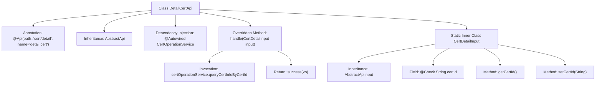

# Basic Information

|      |      |
|------|------|
| Name | DetailCertApi |
| Language | .java |
| Code Path | WeFe/manager/manager-service/src/main/java/com/welab/wefe/manager/service/api/cert/DetailCertApi.java |
| Package Name | com.welab.wefe.manager.service.api.cert |
| Dependencies | ['org.springframework.beans.factory.annotation.Autowired', 'com.webank.cert.mgr.model.vo.CertVO', 'com.webank.cert.mgr.service.CertOperationService', 'com.welab.wefe.common.fieldvalidate.annotation.Check', 'com.welab.wefe.common.web.api.base.AbstractApi', 'com.welab.wefe.common.web.api.base.Api', 'com.welab.wefe.common.web.dto.AbstractApiInput', 'com.welab.wefe.common.web.dto.ApiResult', 'com.welab.wefe.manager.service.api.cert.DetailCertApi.CertDetailInput'] |
| Brief Description | The DetailCertApi class handles certificate detail queries, accepts the certId parameter, invokes the certOperationService to perform the query, and returns a CertVO result. |

# Description

The DetailCertApi is an API class for handling certificate details, with the path cert/detail. It inherits from AbstractApi, accepts CertDetailInput as input, and returns a CertVO result. It queries certificate information by invoking the queryCertInfoByCertId method through the injected CertOperationService. The inner class CertDetailInput includes the mandatory field certId along with its getter and setter methods. The API processing logic is encapsulated in the handle method, which returns an ApiResult containing the query results upon success.

# Class Summary

| Name   | Type  | Description |
|-------|------|-------------|
| DetailCertApi | class | The DetailCertApi class handles certificate detail queries, accepts the certId parameter, invokes the certOperationService to perform the query, and returns a CertVO result. |


## Class DetailCertApi

|      |      |
|------|------|
| Access Modifier | @Api(path = "cert/detail", name = "detail cert");public |
| Type | class |
| Name | DetailCertApi |
| Description | The DetailCertApi class handles certificate detail queries, accepts the certId parameter, invokes the certOperationService to perform the query, and returns a CertVO result. |


### UML Class Diagram

```mermaid
classDiagram
    class DetailCertApi {
        -CertOperationService certOperationService
        +handle(CertDetailInput input) ApiResult~CertVO~
    }
    <<interface>> AbstractApi~T, R~ {
        <<abstract>>
        +handle(T input) ApiResult~R~
    }
    class CertDetailInput {
        -String certId
        +String getCertId()
        +void setCertId(String certId)
    }
    class AbstractApiInput {
        <<abstract>>
    }
    class CertVO {
    }
    class ApiResult~T~ {
    }
    class CertOperationService {
        +queryCertInfoByCertId(String certId) CertVO
    }

    DetailCertApi --> AbstractApi~CertDetailInput, CertVO~ : extends
    DetailCertApi --> CertOperationService : depends
    CertDetailInput --> AbstractApiInput : extends
    CertOperationService --> CertVO : returns
    DetailCertApi ..> CertDetailInput : uses
    AbstractApi~T, R~ <|-- DetailCertApi : implements
```

This class diagram illustrates that DetailCertApi inherits from the generic abstract class AbstractApi and implements its handle method. DetailCertApi depends on CertOperationService to query certificate information, using the inner class CertDetailInput as an input parameter. CertDetailInput inherits from AbstractApiInput and contains the certificate ID field with getter/setter methods. CertOperationService returns a CertVO object, which is ultimately wrapped by ApiResult for return. The overall structure reflects a typical layered design pattern for API request processing.


### Internal Method Call Graph



This code describes a certificate detail handling API class `DetailCertApi`, which inherits from `AbstractApi` with specified input type `CertDetailInput` and output type `CertVO`. The main flow involves querying certificate information through the injected `CertOperationService` and returning a success result. The `CertDetailInput` static inner class contains the mandatory `certId` field with its getter/setter methods, inheriting from `AbstractApiInput`. The complete workflow demonstrates the full call chain from API entry to business processing.

### Field List

| Name  | Type  | Description |
|-------|-------|------|
| certOperationService | CertOperationService | The code snippet uses @Autowired to automatically inject an instance of CertOperationService. |

### Method List

| Name  | Type  | Description |
|-------|-------|------|
| handle | ApiResult<CertVO> | This method overrides the parent class logic, queries certificate information by certificate ID, and returns the result. It invokes the `queryCertInfoByCertId` method of `certOperationService` to obtain a `CertVO` object, and finally encapsulates it as a successful `ApiResult` for return. |


