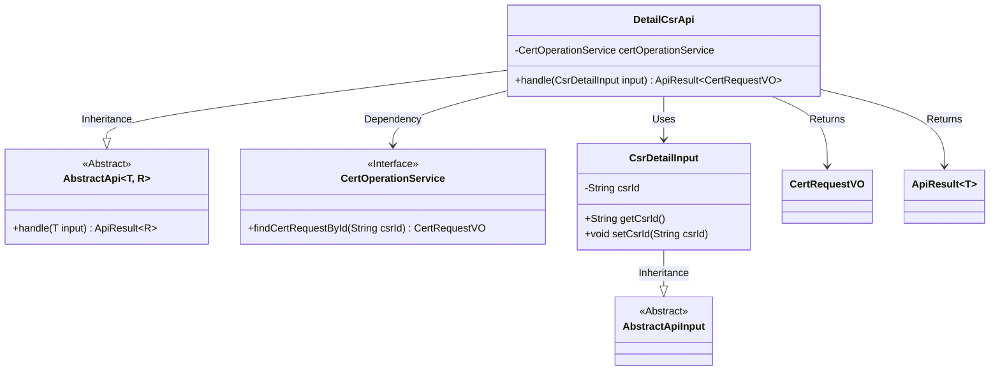
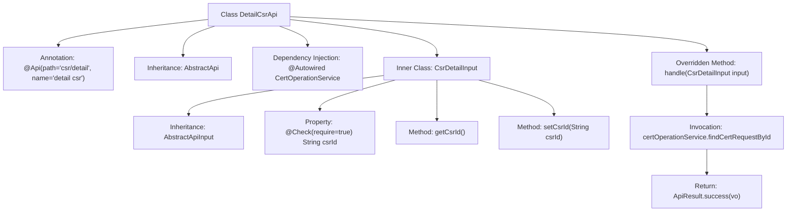

# Basic Information

|      |      |
|------|------|
| Name | DetailCsrApi |
| Language | .java |
| Code Path | WeFe/manager/manager-service/src/main/java/com/welab/wefe/manager/service/api/cert/DetailCsrApi.java |
| Package Name | com.welab.wefe.manager.service.api.cert |
| Dependencies | ['org.springframework.beans.factory.annotation.Autowired', 'com.webank.cert.mgr.model.vo.CertRequestVO', 'com.webank.cert.mgr.service.CertOperationService', 'com.welab.wefe.common.fieldvalidate.annotation.Check', 'com.welab.wefe.common.web.api.base.AbstractApi', 'com.welab.wefe.common.web.api.base.Api', 'com.welab.wefe.common.web.dto.AbstractApiInput', 'com.welab.wefe.common.web.dto.ApiResult', 'com.welab.wefe.manager.service.api.cert.DetailCsrApi.CsrDetailInput'] |
| Brief Description | The DetailCsrApi class handles CSR detail queries, invoking certOperationService with csrId to retrieve certificate request information and returning CertRequestVO. The input parameter CsrDetailInput must include csrId. |

# Description

The DetailCsrApi is an API class for handling certificate request details, with the path `csr/detail`. It inherits from `AbstractApi`, with generic parameters `CsrDetailInput` and `CertRequestVO`. By injecting the `CertOperationService`, it queries and returns certificate request information based on the input `csrId`. `CsrDetailInput` is an internal static class that inherits from `AbstractApiInput`, containing the mandatory `csrId` field along with its getter and setter methods. The API processing logic is implemented in the `handle` method, which returns an `ApiResult` object containing the query result upon success.

# Class Summary

| Name   | Type  | Description |
|-------|------|-------------|
| DetailCsrApi | class | The `DetailCsrApi` class handles CSR detail requests, queries certificate request information via `csrId`, and returns the result. The input must include the `csrId` field. |

## Class DetailCsrApi

|      |      |
|------|------|
| Access Modifier | @Api(path = "csr/detail", name = "detail csr");public |
| Type | class |
| Name | DetailCsrApi |
| Description | The `DetailCsrApi` class handles CSR detail requests, queries certificate request information via `csrId`, and returns the result. The input must include the `csrId` field. |

### UML Class Diagram

This code demonstrates an API implementation for handling CSR (Certificate Signing Request) details. The DetailCsrApi inherits from the generic abstract class AbstractApi, specifying the input type as CsrDetailInput (containing the mandatory csrId field) and the output type as CertRequestVO. It retrieves certificate request data through the dependency-injected CertOperationService interface and returns the result encapsulated in ApiResult. The class diagram clearly illustrates inheritance relationships, dependency relationships, and the concretization of generic parameters, reflecting a Spring-style API layer implementation approach.

### Internal Method Call Graph

This flowchart illustrates the structure of the DetailCsrApi class and its key components. The class defines an API path via the @Api annotation, inherits from the AbstractApi template class, and implements the handle method to process requests. The inner class CsrDetailInput encapsulates input parameters, including the mandatory field csrId with its getter/setter methods. The core logic queries certificate request data through certOperationService and returns a successful result, demonstrating clear hierarchical relationships and invocation flow.

### Field List

| Name  | Type  | Description |
|-------|-------|------|
| certOperationService | CertOperationService | The code snippet uses the @Autowired annotation to automatically inject an instance of CertOperationService. |

### Method List

| Name  | Type  | Description |
|-------|-------|------|
| handle | ApiResult<CertRequestVO> | This method overrides the parent class logic, queries the certificate request information based on the csrId in the input parameters, and returns an ApiResult object containing the query results. |

