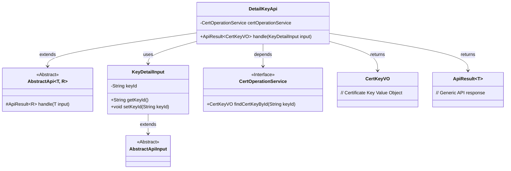
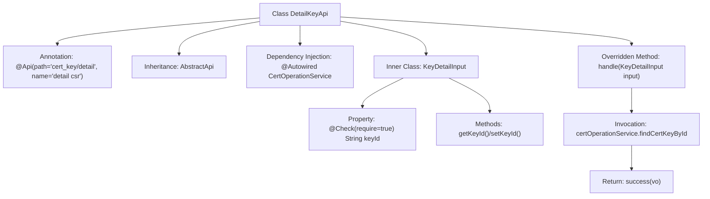
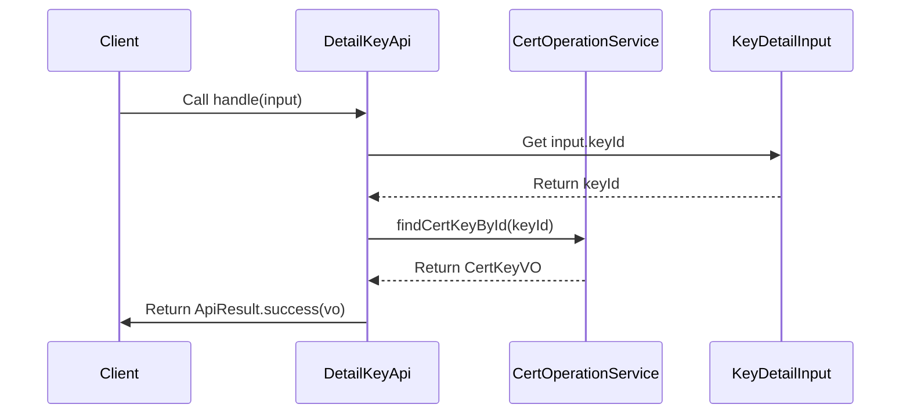

# Basic Information

|      |      |
|------|------|
| Name | DetailKeyApi |
| Language | .java |
| Code Path | WeFe/manager/manager-service/src/main/java/com/welab/wefe/manager/service/api/cert/DetailKeyApi.java |
| Package Name | com.welab.wefe.manager.service.api.cert |
| Dependencies | ['org.springframework.beans.factory.annotation.Autowired', 'com.webank.cert.mgr.model.vo.CertKeyVO', 'com.webank.cert.mgr.service.CertOperationService', 'com.welab.wefe.common.fieldvalidate.annotation.Check', 'com.welab.wefe.common.web.api.base.AbstractApi', 'com.welab.wefe.common.web.api.base.Api', 'com.welab.wefe.common.web.dto.AbstractApiInput', 'com.welab.wefe.common.web.dto.ApiResult', 'com.welab.wefe.manager.service.api.cert.DetailKeyApi.KeyDetailInput'] |
| Brief Description | The DetailKeyApi class handles certificate key detail queries, retrieving CertKeyVO data by invoking certOperationService with a keyId. The input parameter KeyDetailInput must contain a non-null keyId. |

# Description

The code defines an API class named `DetailKeyApi`, designed to handle certificate key detail query requests. The class path is `cert_key/detail`, and its name is `detail csr`. It inherits from `AbstractApi`, accepts `KeyDetailInput` as the input parameter, and returns a result of type `CertKeyVO`. Internally, it queries the key details by `keyId` using the `findCertKeyById` method from `CertOperationService`.  

`KeyDetailInput` is a nested class that inherits from `AbstractApiInput` and includes a required field `keyId` along with its getter/setter methods. The processing logic is encapsulated in the `handle` method, which returns the query result upon success.

# Class Summary

| Name   | Type  | Description |
|-------|------|-------------|
| DetailKeyApi | class | The DetailKeyApi class handles certificate key detail queries, retrieving CertKeyVO data by invoking certOperationService with the keyId. The input parameter KeyDetailInput must contain a non-null keyId. |

## Class DetailKeyApi

|      |      |
|------|------|
| Access Modifier | @Api(path = "cert_key/detail", name = "detail csr");public |
| Type | class |
| Name | DetailKeyApi |
| Description | The DetailKeyApi class handles certificate key detail queries, retrieving CertKeyVO data by invoking certOperationService with the keyId. The input parameter KeyDetailInput must contain a non-null keyId. |

### UML Class Diagram

This code demonstrates the class structure of an API for handling certificate key details. DetailKeyApi inherits from the generic abstract class AbstractApi and queries certificate key information through the CertOperationService. The input parameter KeyDetailInput inherits from AbstractApiInput and contains the required field keyId. The class diagram clearly illustrates inheritance relationships, dependencies, and the use of generic parameters, reflecting a typical API layer design pattern in the Spring framework.

### Internal Method Call Graph

This code defines an API class DetailKeyApi for handling certificate key details, which inherits from the abstract template class AbstractApi and invokes the CertOperationService via dependency injection to query key information. The inner class KeyDetailInput encapsulates validation logic for the mandatory parameter keyId. The flowchart illustrates the class structure and invocation relationships, while the sequence diagram depicts the complete interaction flow from client request to result return.

### Field List

| Name  | Type  | Description |
|-------|-------|------|
| certOperationService | CertOperationService | Using @Autowired to automatically inject an instance of CertOperationService. |

### Method List

| Name  | Type  | Description |
|-------|-------|------|
| handle | ApiResult<CertKeyVO> | Method override, query the certificate key based on the input ID and return the result. |

