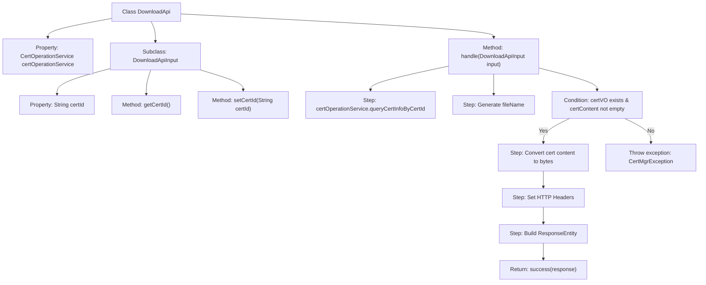

# Basic Information

|      |      |
|------|------|
| Name | DownloadApi |
| Language | .java |
| Code Path | WeFe/manager/manager-service/src/main/java/com/welab/wefe/manager/service/api/cert/DownloadApi.java |
| Package Name | com.welab.wefe.manager.service.api.cert |
| Dependencies | ['java.net.URLEncoder', 'org.apache.commons.lang3.StringUtils', 'org.springframework.beans.factory.annotation.Autowired', 'org.springframework.http.HttpHeaders', 'org.springframework.http.MediaType', 'org.springframework.http.ResponseEntity', 'com.webank.cert.mgr.enums.MgrExceptionCodeEnums', 'com.webank.cert.mgr.exception.CertMgrException', 'com.webank.cert.mgr.model.vo.CertVO', 'com.webank.cert.mgr.service.CertOperationService', 'com.webank.cert.toolkit.utils.CertUtils', 'com.welab.wefe.common.fieldvalidate.annotation.Check', 'com.welab.wefe.common.web.api.base.AbstractApi', 'com.welab.wefe.common.web.api.base.Api', 'com.welab.wefe.common.web.dto.AbstractApiInput', 'com.welab.wefe.common.web.dto.ApiResult', 'com.welab.wefe.manager.service.api.cert.DownloadApi.DownloadApiInput'] |
| Brief Description | The DownloadApi class handles certificate download requests, queries the certificate content by certId, and returns a byte stream response. It sets HTTP headers to control caching and filename, and throws an exception if the certificate does not exist. |

# Description

The `DownloadApi` class is an API for downloading certificates, inheriting from `AbstractApi`. It processes `DownloadApiInput` and returns `ResponseEntity<byte[]>`. It queries certificate information via `certOperationService`, generates a filename and a byte array containing the certificate content. It sets HTTP response headers, including cache control, content disposition, and filename encoding. If the certificate does not exist, it throws an exception. `DownloadApiInput` includes the mandatory `certId` field along with its getter and setter methods.

# Class Summary

| Name   | Type  | Description |
|-------|------|-------------|
| DownloadApi | class | The DownloadApi class handles certificate download requests, queries the certificate content via certId, and returns a byte stream response including the filename and cache control headers. It throws an exception if the certificate does not exist. |


## Class DownloadApi

|      |      |
|------|------|
| Access Modifier | @Api(path = "cert/download", name = "download cert");public |
| Type | class |
| Name | DownloadApi |
| Description | The DownloadApi class handles certificate download requests, queries the certificate content via certId, and returns a byte stream response including the filename and cache control headers. It throws an exception if the certificate does not exist. |


### UML Class Diagram

```mermaid
classDiagram
    class DownloadApi {
        -CertOperationService certOperationService
        +handle(DownloadApiInput input) ApiResult~ResponseEntity~byte[]~~
    }

    class DownloadApiInput {
        -String certId
        +String getCertId()
        +void setCertId(String certId)
    }

    class AbstractApi~T, R~ {
        <<Abstract>>
    }

    class CertOperationService {
        <<Interface>>
        +queryCertInfoByCertId(String certId) CertVO
    }

    class CertVO {
        +String issuerCN
        +String certContent
    }

    class ResponseEntity~T~ {
        +ok() ResponseEntity~T~
        +headers(HttpHeaders headers) ResponseEntity~T~
        +contentType(MediaType contentType) ResponseEntity~T~
        +body(T body) ResponseEntity~T~
    }

    class HttpHeaders {
        +add(String headerName, String headerValue) void
    }

    class CertUtils {
        <<Utility>>
        +convertStrToCert(String certStr) Certificate
        +toBytes(Certificate cert) byte[]
    }

    DownloadApi --> CertOperationService : Dependency
    DownloadApi --> DownloadApiInput : Uses
    DownloadApi --|> AbstractApi~DownloadApiInput, ResponseEntity~byte[]~~ : Extends
    DownloadApiInput --|> AbstractApiInput : Extends
    CertOperationService ..> CertVO : Returns
    DownloadApi ..> CertUtils : Invokes
    DownloadApi ..> ResponseEntity~byte[]~ : Constructs
    ResponseEntity~byte[]~ ..> HttpHeaders : Uses
```

Class Diagram Description: This diagram illustrates the core structure of the certificate download API. DownloadApi inherits from the generic abstract class AbstractApi, processes DownloadApiInput, and returns ResponseEntity<byte[]>. It queries certificate information via CertOperationService, performs format conversion using CertUtils, and ultimately constructs a response entity containing HTTP header information. DownloadApiInput, as an input parameter class, inherits from AbstractApiInput and contains the certificate ID field with accessor methods.


### Internal Method Call Graph



This flowchart illustrates the core logic of the DownloadApi class. The process starts with the handle method, which first queries certificate information via certId, then validates data integrity. If valid, it converts the certificate format and sets HTTP response headers, ultimately returning a file download response; if invalid, it throws a "certificate not found" exception. DownloadApiInput serves as an inner class to encapsulate the certId parameter, containing standard getter/setter methods. The entire flow clearly demonstrates the complete processing chain and exception branches of the certificate download API.

### Field List

| Name  | Type  | Description |
|-------|-------|------|
| certOperationService | CertOperationService | Automatically inject the CertOperationService service instance. |

### Method List

| Name  | Type  | Description |
|-------|-------|------|
| handle | ApiResult<ResponseEntity<byte[]>> | This method retrieves certificate information based on the certificate ID, generates the certificate file, and sets HTTP response headers to return it for download. If the certificate does not exist, an exception is thrown. |


