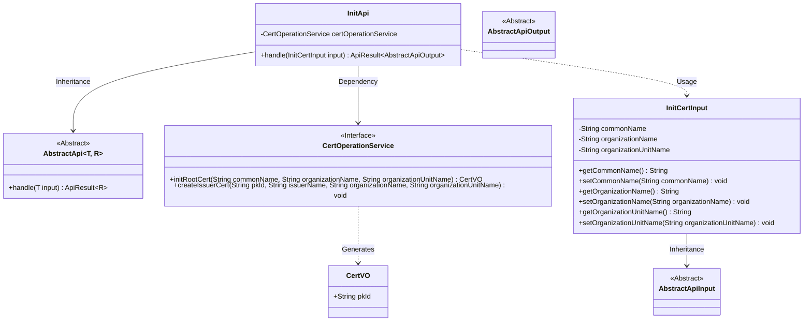
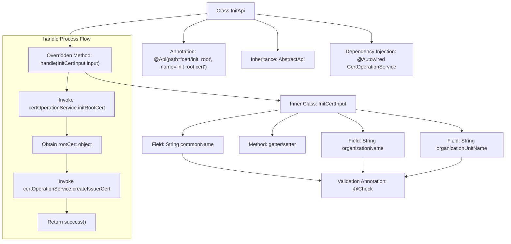

# Basic Information

|      |      |
|------|------|
| Name | InitApi |
| Language | .java |
| Code Path | WeFe/manager/manager-service/src/main/java/com/welab/wefe/manager/service/api/cert/InitApi.java |
| Package Name | com.welab.wefe.manager.service.api.cert |
| Dependencies | ['org.springframework.beans.factory.annotation.Autowired', 'com.webank.cert.mgr.model.vo.CertVO', 'com.webank.cert.mgr.service.CertOperationService', 'com.welab.wefe.common.fieldvalidate.annotation.Check', 'com.welab.wefe.common.web.api.base.AbstractApi', 'com.welab.wefe.common.web.api.base.Api', 'com.welab.wefe.common.web.dto.AbstractApiInput', 'com.welab.wefe.common.web.dto.AbstractApiOutput', 'com.welab.wefe.common.web.dto.ApiResult', 'com.welab.wefe.manager.service.api.cert.InitApi.InitCertInput'] |
| Brief Description | The InitApi class is used to initialize root certificates and issue certificates, accepting common name, organization name, and organizational unit name as mandatory input parameters. |

# Description

The code defines an API class named `InitApi`, which is used to initialize the root certificate and issuer certificate. The API path is `cert/init_root`, and it accepts input parameters including the common name, organization name, and organizational unit name. The processing logic involves calling the `CertOperationService` to initialize the root certificate, followed by creating the issuer certificate. The input class `InitCertInput` inherits from `AbstractApiInput`, contains three mandatory fields, and provides corresponding getter and setter methods. Upon successful execution, it returns a success result.

# Class Summary

| Name   | Type  | Description |
|-------|------|-------------|
| InitApi | class | Initialize the root certificate API, which accepts common name, organization name, and organizational unit name, then generates a root certificate and issues an issuer certificate. |

## Class InitApi

|      |      |
|------|------|
| Access Modifier | @Api(path = "cert/init_root", name = "init root cert");public |
| Type | class |
| Name | InitApi |
| Description | Initialize the root certificate API, which accepts common name, organization name, and organizational unit name, then generates a root certificate and issues an issuer certificate. |

### UML Class Diagram

This class diagram illustrates the core structure of a certificate initialization system. InitApi inherits from the generic abstract class AbstractApi, processing InitCertInput and returning AbstractApiOutput results. The system implements root certificate initialization (initRootCert) and issuer certificate creation (createIssuerCert) functionalities through the CertOperationService interface. InitCertInput, as a nested class inheriting from AbstractApiInput, contains three mandatory fields and exposes properties via getters/setters. CertVO serves as a data transfer object carrying certificate primary key information, demonstrating clear hierarchical structure and separation of responsibilities throughout the workflow.

### Internal Method Call Graph

This code describes an API class InitApi for initializing root certificates, which implements specific business logic by inheriting an abstract template class. The flowchart illustrates the class structure relationships and the execution flow of the core method handle, which involves two key operations: initializing the root certificate and creating the issuer certificate, ultimately returning a success result. The inner class InitCertInput encapsulates input parameters with validation annotations, demonstrating clear separation of responsibilities.

### Field List

| Name  | Type  | Description |
|-------|-------|------|
| certOperationService | CertOperationService | Automatically inject the CertOperationService instance. |

### Method List

| Name  | Type  | Description |
|-------|-------|------|
| handle | ApiResult<AbstractApiOutput> | This method handles the initialization of certificate requests by first creating a root certificate, then issuing an Issuer certificate, and finally returning a successful result. |

