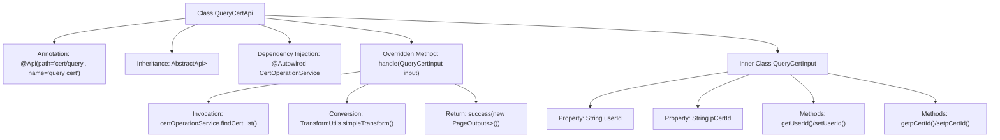

# Basic Information

|      |      |
|------|------|
| Name | QueryCertApi |
| Language | .java |
| Code Path | WeFe/manager/manager-service/src/main/java/com/welab/wefe/manager/service/api/cert/QueryCertApi.java |
| Package Name | com.welab.wefe.manager.service.api.cert |
| Dependencies | ['java.util.List', 'org.springframework.beans.factory.annotation.Autowired', 'com.webank.cert.mgr.model.vo.CertVO', 'com.webank.cert.mgr.service.CertOperationService', 'com.webank.cert.mgr.utils.TransformUtils', 'com.welab.wefe.common.data.mongodb.dto.PageOutput', 'com.welab.wefe.common.data.mongodb.entity.manager.CertInfo', 'com.welab.wefe.common.web.api.base.AbstractApi', 'com.welab.wefe.common.web.api.base.Api', 'com.welab.wefe.common.web.dto.ApiResult', 'com.welab.wefe.manager.service.api.cert.QueryCertApi.QueryCertInput', 'com.welab.wefe.manager.service.dto.base.PageInput'] |
| Brief Description | The QueryCertApi class is an API for querying certificates, which retrieves the certificate list through CertOperationService and converts it into CertVO format for return. The input parameters include user ID and issuer certificate ID, and the output is paginated certificate data. |

# Description

This is an API class named QueryCertApi, designed for querying certificate information. It inherits from AbstractApi, accepts QueryCertInput as the input parameter, and returns a paginated result PageOutput containing a list of CertVO. QueryCertInput includes two fields: user ID and issuer certificate ID. Internally, the API retrieves the certificate list via the findCertList method of CertOperationService and uses TransformUtils to convert the results into the CertVO type. Finally, it returns the result containing pagination information and the transformed data.

# Class Summary

| Name   | Type  | Description |
|-------|------|-------------|
| QueryCertApi | class | The QueryCertApi class is used to query certificate lists, accepting a user ID and issuer certificate ID as input, and returning paginated certificate information. It processes the query through CertOperationService, converts the results into CertVO format, and then returns them. |


## Class QueryCertApi

|      |      |
|------|------|
| Access Modifier | @Api(path = "cert/query", name = "query cert");public |
| Type | class |
| Name | QueryCertApi |
| Description | The QueryCertApi class is used to query certificate lists, accepting a user ID and issuer certificate ID as input, and returning paginated certificate information. It processes the query through CertOperationService, converts the results into CertVO format, and then returns them. |


### UML Class Diagram

```mermaid
classDiagram
    class AbstractApi~T, R~ {
        <<Abstract>>
        +handle(T input) ApiResult~R~
    }

    class QueryCertApi {
        -CertOperationService certOperationService
        +handle(QueryCertInput input) ApiResult~PageOutput~CertVO~~
    }
    QueryCertApi --|> AbstractApi~QueryCertInput, PageOutput~CertVO~~ : Inheritance

    class QueryCertInput {
        -String userId
        -String pCertId
        +String getUserId()
        +void setUserId(String userId)
        +String getpCertId()
        +void setpCertId(String pCertId)
    }
    QueryCertInput --|> PageInput : Inheritance

    class PageInput {
        <<Abstract>>
    }

    class CertOperationService {
        <<Interface>>
        +findCertList(String userId, String pCertId, ...) PageOutput~CertInfo~
    }
    QueryCertApi --> CertOperationService : Dependency

    class PageOutput~T~ {
        +int pageIndex
        +int total
        +int pageSize
        +int totalPage
        +List~T~ list
    }

    class CertVO {
    }

    class CertInfo {
    }

    class ApiResult~T~ {
    }

    class TransformUtils {
        <<Utility>>
        +simpleTransform(List~S~, Class~T~) List~T~
    }
    QueryCertApi --> TransformUtils : Dependency
```

This code demonstrates the implementation of a certificate query API, where QueryCertApi inherits from AbstractApi, processes QueryCertInput, and returns paginated CertVO results. It primarily involves invoking the CertOperationService for certificate operations and utilizes TransformUtils for object transformation. The class diagram clearly illustrates inheritance and dependency relationships among components, including the use of generic classes like PageOutput and ApiResult, as well as the auxiliary role of the utility class TransformUtils. The overall design adheres to layered architecture principles, achieving separation between business logic and data transformation.


### Internal Method Call Graph



This code implements the QueryCertApi class, primarily used for querying certificate information. The process starts from the handle method, which first queries the certificate list through certOperationService, then converts data format using TransformUtils, and finally returns paginated results. The inner class QueryCertInput encapsulates query parameters including user ID and issuer certificate ID. The entire flow demonstrates a complete business logic chain from parameter processing to data querying and result conversion.

### Field List

| Name  | Type  | Description |
|-------|-------|------|
| certOperationService | CertOperationService | The code snippet uses @Autowired to automatically inject an instance of CertOperationService. |

### Method List

| Name  | Type  | Description |
|-------|-------|------|
| handle | ApiResult<PageOutput<CertVO>> | This method processes the query certificate list request, invokes the service to retrieve paginated results, converts them into VO objects, and finally returns a successful response. |


