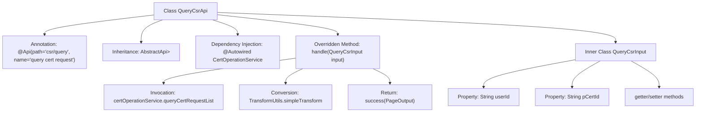

# Basic Information

|      |      |
|------|------|
| Name | QueryCsrApi |
| Language | .java |
| Code Path | WeFe/manager/manager-service/src/main/java/com/welab/wefe/manager/service/api/cert/QueryCsrApi.java |
| Package Name | com.welab.wefe.manager.service.api.cert |
| Dependencies | ['java.util.List', 'org.springframework.beans.factory.annotation.Autowired', 'com.webank.cert.mgr.model.vo.CertRequestVO', 'com.webank.cert.mgr.service.CertOperationService', 'com.webank.cert.mgr.utils.TransformUtils', 'com.welab.wefe.common.data.mongodb.dto.PageOutput', 'com.welab.wefe.common.data.mongodb.entity.manager.CertRequestInfo', 'com.welab.wefe.common.web.api.base.AbstractApi', 'com.welab.wefe.common.web.api.base.Api', 'com.welab.wefe.common.web.dto.ApiResult', 'com.welab.wefe.manager.service.api.cert.QueryCsrApi.QueryCsrInput', 'com.welab.wefe.manager.service.dto.base.PageInput'] |
| Brief Description | API class for querying certificate requests, handling paginated queries. The input includes user ID and issuer certificate ID, and the output is a paginated result of the certificate request list. |

# Description

QueryCsrApi is an API class designed for querying certificate signing requests, located at the path csr/query. It inherits from AbstractApi, accepts QueryCsrInput as the input parameter, and returns a paginated result PageOutput containing CertRequestVO. Internally, it retrieves the certificate request list via the queryCertRequestList method of CertOperationService and converts it into VO objects using TransformUtils. QueryCsrInput includes two fields, userId and pCertId, to specify query conditions. Upon successful processing, it returns paginated data, including page number, total count, page size, total pages, and the converted list.

# Class Summary

| Name   | Type  | Description |
|-------|------|-------------|
| QueryCsrApi | class | The QueryCsrApi class handles certificate request queries, retrieves paginated results through CertOperationService, and converts them into VO for return. The input includes user ID and issuing authority certificate ID. |


## Class QueryCsrApi

|      |      |
|------|------|
| Access Modifier | @Api(path = "csr/query", name = "query cert request");public |
| Type | class |
| Name | QueryCsrApi |
| Description | The QueryCsrApi class handles certificate request queries, retrieves paginated results through CertOperationService, and converts them into VO for return. The input includes user ID and issuing authority certificate ID. |


### UML Class Diagram

```mermaid
classDiagram
    class QueryCsrApi {
        -CertOperationService certOperationService
        +handle(QueryCsrInput input) ApiResult~PageOutput~CertRequestVO~~
    }

    class AbstractApi~T, R~ {
        <<Abstract>>
        +handle(T input) ApiResult~R~
    }

    class QueryCsrInput {
        -String userId
        -String pCertId
        +String getUserId()
        +void setUserId(String userId)
        +String getpCertId()
        +void setpCertId(String pCertId)
    }

    class PageInput {
        <<Abstract>>
    }

    class CertOperationService {
        <<Interface>>
        +queryCertRequestList(String userId, String pCertId, int pageIndex, int pageSize) PageOutput~CertRequestInfo~
    }

    class PageOutput~T~ {
        +int pageIndex
        +int total
        +int pageSize
        +int totalPage
        +List~T~ list
    }

    class CertRequestVO {
    }

    class CertRequestInfo {
    }

    class TransformUtils {
        <<Utility>>
        +simpleTransform(List~S~ source, Class~T~ targetClass) List~T~
    }

    class ApiResult~T~ {
        +T data
        +boolean success
    }

    QueryCsrApi --> AbstractApi~QueryCsrInput, PageOutput~CertRequestVO~~ : Extends
    QueryCsrApi --> CertOperationService : Depends
    QueryCsrInput --> PageInput : Extends
    QueryCsrApi ..> QueryCsrInput : Uses
    QueryCsrApi ..> PageOutput~CertRequestVO~~ : Uses
    QueryCsrApi ..> CertRequestVO : Uses
    CertOperationService ..> PageOutput~CertRequestInfo~ : Returns
    QueryCsrApi ..> TransformUtils : Uses
    TransformUtils ..> CertRequestVO : Transforms
    TransformUtils ..> CertRequestInfo : Transforms
    PageOutput~CertRequestInfo~ ..> CertRequestInfo : Contains
    PageOutput~CertRequestVO~~ ..> CertRequestVO : Contains
    ApiResult~PageOutput~CertRequestVO~~ ..> PageOutput~CertRequestVO~~ : Wraps
```

This code demonstrates the implementation of a certificate query API, where QueryCsrApi extends AbstractApi to process QueryCsrInput and return paginated certificate request data. It primarily involves components such as CertOperationService invocation, PageOutput pagination result encapsulation, and CertRequestVO value object transformation. The class diagram clearly illustrates inheritance, dependency, and usage relationships among components, including key interactions like generic class parameter passing, interface implementation, and utility class invocation.


### Internal Method Call Graph



This code demonstrates a certificate query request handling API class QueryCsrApi, which inherits from AbstractApi and implements the handle method. The workflow includes: querying certificate request lists via certOperationService, converting result types using TransformUtils, and finally returning paginated data. The inner class QueryCsrInput encapsulates query parameters, containing two fields (user ID and issuing authority certificate ID) along with their access methods. The entire process exemplifies a typical API request handling pattern, encompassing service invocation, data transformation, and result encapsulation.

### Field List

| Name  | Type  | Description |
|-------|-------|------|
| certOperationService | CertOperationService | The code snippet uses the @Autowired annotation to automatically inject an instance of CertOperationService. |

### Method List

| Name  | Type  | Description |
|-------|-------|------|
| handle | ApiResult<PageOutput<CertRequestVO>> | This method processes the query certificate request list, invokes the service to retrieve paginated data, converts the results, and returns a paginated response. |


