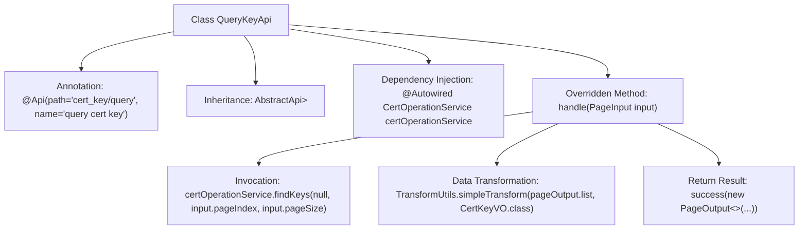

# Basic Information

|      |      |
|------|------|
| Name | QueryKeyApi |
| Language | .java |
| Code Path | WeFe/manager/manager-service/src/main/java/com/welab/wefe/manager/service/api/cert/QueryKeyApi.java |
| Package Name | com.welab.wefe.manager.service.api.cert |
| Dependencies | ['java.util.List', 'org.springframework.beans.factory.annotation.Autowired', 'com.webank.cert.mgr.model.vo.CertKeyVO', 'com.webank.cert.mgr.service.CertOperationService', 'com.webank.cert.mgr.utils.TransformUtils', 'com.welab.wefe.common.data.mongodb.dto.PageOutput', 'com.welab.wefe.common.data.mongodb.entity.manager.CertKeyInfo', 'com.welab.wefe.common.web.api.base.AbstractApi', 'com.welab.wefe.common.web.api.base.Api', 'com.welab.wefe.common.web.dto.ApiResult', 'com.welab.wefe.manager.service.dto.base.PageInput'] |
| Brief Description | API class for querying certificate keys, inherits from AbstractApi, uses CertOperationService to paginate query key information, converts it to CertKeyVO, and returns the paginated result. |

# Description

This is an API class named QueryKeyApi, designed for querying certificate keys. It inherits from AbstractApi, processes PageInput, and returns PageOutput<CertKeyVO>. The class injects the CertOperationService, retrieves paginated data via the findKeys method, and uses TransformUtils to convert CertKeyInfo into CertKeyVO. Finally, it returns a result containing pagination information and the transformed data. The API path is cert_key/query, with the functional description being "query cert key."

# Class Summary

| Name   | Type  | Description |
|-------|------|-------------|
| QueryKeyApi | class | Query Certificate Key API, which accepts pagination parameters, invokes the CertOperationService to query the key list, converts it into CertKeyVO, and returns the paginated result. |


## Class QueryKeyApi

|      |      |
|------|------|
| Access Modifier | @Api(path = "cert_key/query", name = "query cert key");public |
| Type | class |
| Name | QueryKeyApi |
| Description | Query Certificate Key API, which accepts pagination parameters, invokes the CertOperationService to query the key list, converts it into CertKeyVO, and returns the paginated result. |


### UML Class Diagram

```mermaid
classDiagram
    class QueryKeyApi {
        -CertOperationService certOperationService
        +handle(PageInput input) ApiResult~PageOutput~CertKeyVO~~
    }
    class AbstractApi~T, R~ {
        <<Abstract>>
        +handle(T input) ApiResult~R~
    }
    class CertOperationService {
        <<Interface>>
        +findKeys(Object param, int pageIndex, int pageSize) PageOutput~CertKeyInfo~
    }
    class PageInput {
        +int pageIndex
        +int pageSize
        +int getPageIndex()
        +int getPageSize()
    }
    class PageOutput~T~ {
        +int pageIndex
        +int total
        +int pageSize
        +int totalPage
        +List~T~ list
        +getPageIndex()
        +getTotal()
        +getPageSize()
        +getTotalPage()
        +getList()
    }
    class CertKeyVO {
        // Certificate Key View Object
    }
    class CertKeyInfo {
        // Certificate Key Information Entity
    }
    class TransformUtils {
        <<Utility>>
        +simpleTransform(List~S~ source, Class~T~ targetClass) List~T~
    }
    class ApiResult~T~ {
        +T data
        +boolean success
        +String message
        +success(T data)
    }

    QueryKeyApi --|> AbstractApi~PageInput, PageOutput~CertKeyVO~~ : Inheritance
    QueryKeyApi --> CertOperationService : Dependency
    QueryKeyApi --> PageInput : Uses
    QueryKeyApi --> PageOutput~CertKeyVO~ : Returns
    QueryKeyApi --> TransformUtils : Invokes
    PageOutput~CertKeyInfo~ --> CertKeyInfo : Contains
    PageOutput~CertKeyVO~ --> CertKeyVO : Contains
    CertOperationService ..> PageOutput~CertKeyInfo~ : Returns
    TransformUtils ..> CertKeyVO : Transformation Target
```

This code describes a certificate key query API interface `QueryKeyApi`, which inherits from the generic abstract class `AbstractApi`. It retrieves paginated data through the `CertOperationService` and uses the `TransformUtils` utility class to convert `CertKeyInfo` entities into `CertKeyVO` view objects. The class diagram illustrates the inheritance, dependency, and association relationships among core classes, including pagination input/output structures, service interface invocations, and data transformation processes, reflecting a clear hierarchical structure and division of responsibilities.


### Internal Method Call Graph



This code implements the QueryKeyApi class, primarily used for querying certificate key information. By inheriting from AbstractApi and overriding the handle method, it processes paginated query requests. The workflow includes: invoking certOperationService to retrieve paginated key data, transforming data types using TransformUtils, and finally returning the encapsulated pagination result. The entire process clearly demonstrates the handling chain from data acquisition to result return.

### Field List

| Name  | Type  | Description |
|-------|-------|------|
| certOperationService | CertOperationService | Automatically inject the CertOperationService instance. |

### Method List

| Name  | Type  | Description |
|-------|-------|------|
| handle | ApiResult<PageOutput<CertKeyVO>> | This method handles paginated query of certificate keys, converts the retrieved data into VO objects after calling the service, and returns the paginated results. |


