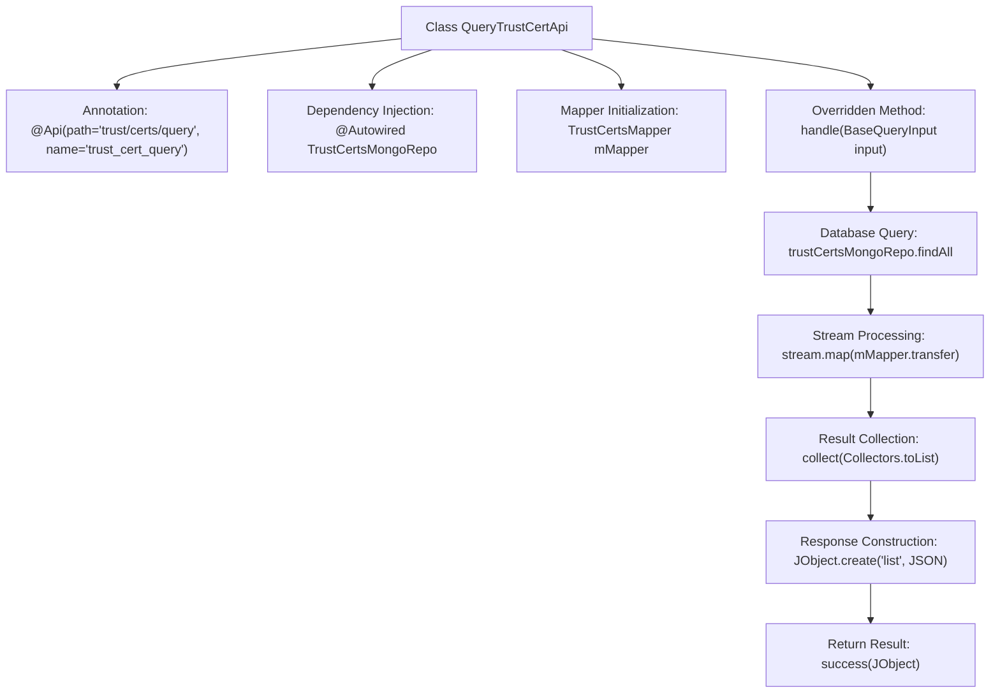

# Basic Information

|      |      |
|------|------|
| Name | QueryTrustCertApi |
| Language | .java |
| Code Path | WeFe/manager/manager-service/src/main/java/com/welab/wefe/manager/service/api/cert/QueryTrustCertApi.java |
| Package Name | com.welab.wefe.manager.service.api.cert |
| Dependencies | ['com.welab.wefe.common.data.mongodb.repo.TrustCertsMongoRepo', 'com.welab.wefe.common.util.JObject', 'com.welab.wefe.common.web.api.base.AbstractApi', 'com.welab.wefe.common.web.api.base.Api', 'com.welab.wefe.common.web.dto.ApiResult', 'com.welab.wefe.manager.service.dto.base.BaseQueryInput', 'com.welab.wefe.manager.service.dto.cert.TrustCertsQueryOutput', 'com.welab.wefe.manager.service.mapper.TrustCertsMapper', 'org.mapstruct.factory.Mappers', 'org.springframework.beans.factory.annotation.Autowired', 'java.util.List', 'java.util.stream.Collectors'] |
| Brief Description | Query Trust Certificate API, retrieves the certificate list from MongoDB and converts it to JSON format for return. |

# Description

This is a Java class named QueryTrustCertApi, designed for querying trusted certificate data. It inherits from the AbstractApi base class, using BaseQueryInput as the input type and JObject as the output type. The class is annotated with the @Api annotation, specifying the API path as trust/certs/query. It injects TrustCertsMongoRepo for database operations and performs object conversion through TrustCertsMapper. The handle method implements the core logic: querying all certificate data based on the input status, converting them into a list of TrustCertsQueryOutput objects, and finally encapsulating the result as a successful response containing a JSON list.

# Class Summary

| Name   | Type  | Description |
|-------|------|-------------|
| QueryTrustCertApi | class | The QueryTrustCertApi class handles trust certificate queries, retrieves data via MongoDB, and maps it to JSON output. The input is BaseQueryInput, and it returns an ApiResult containing a list of certificates. |


## Class QueryTrustCertApi

|      |      |
|------|------|
| Access Modifier | @Api(path = "trust/certs/query", name = "trust_cert_query");public |
| Type | class |
| Name | QueryTrustCertApi |
| Description | The QueryTrustCertApi class handles trust certificate queries, retrieves data via MongoDB, and maps it to JSON output. The input is BaseQueryInput, and it returns an ApiResult containing a list of certificates. |


### UML Class Diagram

```mermaid
classDiagram
    class QueryTrustCertApi {
        -TrustCertsMongoRepo trustCertsMongoRepo
        -TrustCertsMapper mMapper
        +handle(BaseQueryInput input) ApiResult~JObject~
    }
    <<Interface>> {
        interface JObject {
            +toJSON(Object obj) String
            +create(String key, String value) JObject
        }
    }
    class BaseQueryInput {
        +String getStatus()
    }
    class TrustCertsMongoRepo {
        +findAll(String status) List~TrustCerts~
    }
    class TrustCertsMapper {
        +transfer(TrustCerts source) TrustCertsQueryOutput
    }
    class TrustCertsQueryOutput
    class TrustCerts
    class ApiResult~T~ {
        +success(T data) ApiResult~T~
    }
    class AbstractApi~I,O~ {
        <<Abstract>>
        +handle(I input) ApiResult~O~
    }

    QueryTrustCertApi --> AbstractApi~BaseQueryInput,JObject~ : Inheritance
    QueryTrustCertApi --> TrustCertsMongoRepo : Dependency
    QueryTrustCertApi --> TrustCertsMapper : Dependency
    TrustCertsMapper --> TrustCerts : Transform
    TrustCertsMapper --> TrustCertsQueryOutput : Generate
    TrustCertsMongoRepo --> TrustCerts : Query
    JObject ..> TrustCertsQueryOutput : Serialize
    AbstractApi~BaseQueryInput,JObject~ <|-- QueryTrustCertApi : Implementation
```

This code demonstrates a trusted certificate query API implementation that inherits from the generic abstract class AbstractApi, retrieves data through MongoDB repository, and transforms results using Mapper. The class diagram clearly presents the collaboration between the core class QueryTrustCertApi and surrounding components (such as data access layer TrustCertsMongoRepo and object mapper TrustCertsMapper), as well as the inheritance structure of the generic base class AbstractApi, reflecting the complete processing flow from data query to JSON output.


### Internal Method Call Graph



This flowchart illustrates the core processing flow of the QueryTrustCertApi class. It begins with defining the API path through annotations, injecting the MongoDB repository and mapper. When handling a request, it queries data from the database, performs object transformation via stream processing, and finally encapsulates the results in JSON format for response. The entire process demonstrates a complete pipeline from data retrieval to response generation, highlighting the combined use of Spring dependency injection and functional stream processing.

### Field List

| Name  | Type  | Description |
|-------|-------|------|
| mMapper = Mappers.getMapper(TrustCertsMapper.class) | TrustCertsMapper | Declare a protected TrustCertsMapper instance, obtaining the mapper through the Mappers utility class. |
| trustCertsMongoRepo | TrustCertsMongoRepo | Use @Autowired to automatically inject the TrustCertsMongoRepo repository instance. |

### Method List

| Name  | Type  | Description |
|-------|-------|------|
| handle | ApiResult<JObject> | This method queries the list of trust certificates in the specified state, converts them into JSON format, and returns the successful result. |


