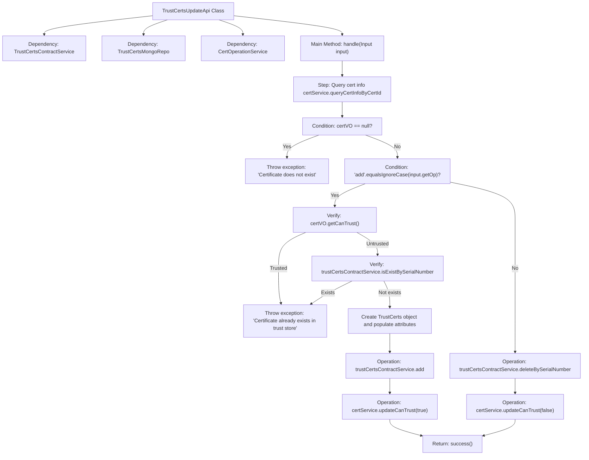

# Basic Information

|      |      |
|------|------|
| Name | TrustCertsUpdateApi |
| Language | .java |
| Code Path | WeFe/manager/manager-service/src/main/java/com/welab/wefe/manager/service/api/cert/TrustCertsUpdateApi.java |
| Package Name | com.welab.wefe.manager.service.api.cert |
| Dependencies | ['cn.hutool.core.bean.BeanUtil', 'com.webank.cert.mgr.model.vo.CertVO', 'com.webank.cert.mgr.service.CertOperationService', 'com.welab.wefe.common.StatusCode', 'com.welab.wefe.common.data.mongodb.entity.union.TrustCerts', 'com.welab.wefe.common.data.mongodb.repo.TrustCertsMongoRepo', 'com.welab.wefe.common.exception.StatusCodeWithException', 'com.welab.wefe.common.fieldvalidate.annotation.Check', 'com.welab.wefe.common.web.api.base.AbstractApi', 'com.welab.wefe.common.web.api.base.Api', 'com.welab.wefe.common.web.dto.AbstractApiInput', 'com.welab.wefe.common.web.dto.AbstractApiOutput', 'com.welab.wefe.common.web.dto.ApiResult', 'com.welab.wefe.manager.service.service.TrustCertsContractService', 'org.springframework.beans.factory.annotation.Autowired'] |
| Brief Description | The TrustCertsUpdateApi handles updates to the certificate trust store, supporting both addition and removal operations. After verifying the existence of the certificate, it invokes the corresponding service based on the operation type to complete the update and returns the operation result. |

# Description

The TrustCertsUpdateApi is an API class responsible for handling trust store certificate updates, with the endpoint path `trust/certs/update`. It inherits from `AbstractApi`, accepts `Input` parameters, and returns `AbstractApiOutput`. Its core functionality involves updating certificate trust status based on the operation type (`add` or `delete`). For add operations, it verifies certificate existence—creating a `TrustCerts` object, setting its attributes, and storing it in the trust store if absent, followed by updating the trust status. Delete operations remove certificates from the trust store and update their status. Mandatory input parameters include `certId` (certificate ID) and `op` (operation type). The process captures exceptions and returns corresponding status codes.

# Class Summary

| Name   | Type  | Description |
|-------|------|-------------|
| TrustCertsUpdateApi | class | Trust certificate update API, handles certificate addition or deletion operations, verifies certificate existence and updates trust store status. |


## Class TrustCertsUpdateApi

|      |      |
|------|------|
| Access Modifier | @Api(path = "trust/certs/update", name = "trust_certs_add");public |
| Type | class |
| Name | TrustCertsUpdateApi |
| Description | Trust certificate update API, handles certificate addition or deletion operations, verifies certificate existence and updates trust store status. |


### UML Class Diagram

```mermaid
classDiagram
    class TrustCertsUpdateApi {
        -TrustCertsContractService trustCertsContractService
        -TrustCertsMongoRepo trustCertsMongoRepo
        -CertOperationService certService
        +handle(Input input) ApiResult~AbstractApiOutput~
    }
    <<Interface>> TrustCertsUpdateApi {
        <<Interface>>
    }

    class AbstractApi~T, R~ {
        <<Abstract>>
    }

    class TrustCertsContractService {
        +isExistBySerialNumber(String serialNumber) boolean
        +add(TrustCerts trustCerts) void
        +deleteBySerialNumber(String serialNumber) void
    }

    class TrustCertsMongoRepo {
    }

    class CertOperationService {
        +queryCertInfoByCertId(String certId) CertVO
        +updateCanTrust(String serialNumber, boolean canTrust) void
    }

    class CertVO {
        -String pkId
        -String serialNumber
        -Boolean canTrust
        -Boolean isCACert
        -Boolean isRootCert
        -String issuerCN
        -String subjectCN
        -String pCertId
        // getters/setters
    }

    class TrustCerts {
        -String certId
        -String serialNumber
        -String isCaCert
        -String isRootCert
        -String issuerCn
        -String subjectCn
        -String pCertId
        // getters/setters
    }

    class StatusCodeWithException {
        -StatusCode statusCode
        -String message
    }

    class Input {
        -String certId
        -String op
        +getCertId() String
        +setCertId(String certId) void
        +getOp() String
        +setOp(String op) void
    }

    class AbstractApiInput {
        <<Abstract>>
    }

    class AbstractApiOutput {
        <<Abstract>>
    }

    TrustCertsUpdateApi --> TrustCertsContractService : Dependency
    TrustCertsUpdateApi --> TrustCertsMongoRepo : Dependency
    TrustCertsUpdateApi --> CertOperationService : Dependency
    TrustCertsUpdateApi --> Input : Uses
    TrustCertsUpdateApi ..|> AbstractApi : Inherits
    Input --|> AbstractApiInput : Inherits
    AbstractApiOutput <|-- AbstractApi : Generic Parameter
```

Class Diagram Description: This diagram illustrates the TrustCertsUpdateApi class and its related dependencies. TrustCertsUpdateApi inherits from AbstractApi and handles certificate update operations, relying on three service classes: TrustCertsContractService, TrustCertsMongoRepo, and CertOperationService. The Input class, as an inner class, inherits from AbstractApiInput and contains certificate ID and operation type fields. The class diagram clearly presents the hierarchical structure and collaboration relationships among the components.


### Internal Method Call Graph



This code represents an API class for managing trusted certificate updates, primarily handling certificate addition and deletion operations. The flowchart illustrates the complete processing logic: first querying certificate information and reporting errors if nonexistent; for addition operations, it checks whether the certificate already exists, creating new records and updating status if not; deletion operations directly remove records and update status. The entire process includes multiple verification steps and exception handling, ultimately returning operation results.

### Field List

| Name  | Type  | Description |
|-------|-------|------|
| trustCertsContractService | TrustCertsContractService | Automatically inject the TrustCertsContractService service instance. |
| trustCertsMongoRepo | TrustCertsMongoRepo | Using @Autowired to automatically inject the TrustCertsMongoRepo repository instance. |
| certService | CertOperationService | Using @Autowired to automatically inject the CertOperationService instance certService. |

### Method List

| Name  | Type  | Description |
|-------|-------|------|
| handle | ApiResult<AbstractApiOutput> | Processing certificate trust update operation: Query certificate information, if the operation is "add", check and add to the trust store; otherwise, delete it. Return a success result if the operation succeeds, or throw an exception if it fails. |


