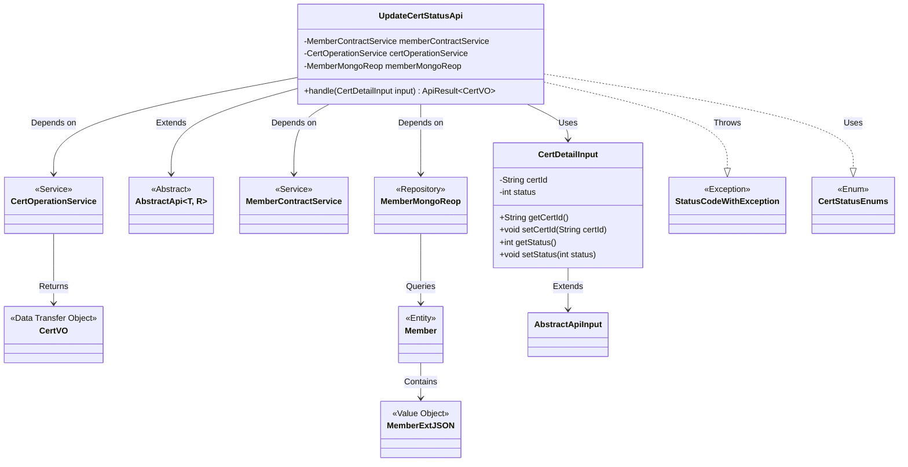
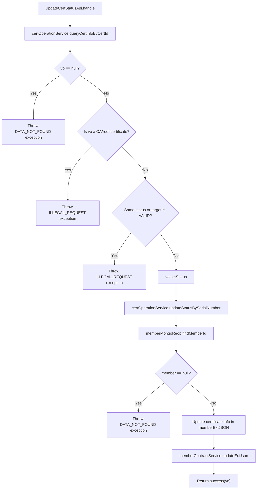

# Basic Information

|      |      |
|------|------|
| Name | UpdateCertStatusApi |
| Language | .java |
| Code Path | WeFe/manager/manager-service/src/main/java/com/welab/wefe/manager/service/api/cert/UpdateCertStatusApi.java |
| Package Name | com.welab.wefe.manager.service.api.cert |
| Dependencies | ['com.webank.cert.mgr.model.vo.CertVO', 'com.webank.cert.mgr.service.CertOperationService', 'com.webank.cert.toolkit.enums.CertStatusEnums', 'com.welab.wefe.common.StatusCode', 'com.welab.wefe.common.data.mongodb.entity.union.Member', 'com.welab.wefe.common.data.mongodb.entity.union.ext.MemberExtJSON', 'com.welab.wefe.common.data.mongodb.repo.MemberMongoReop', 'com.welab.wefe.common.exception.StatusCodeWithException', 'com.welab.wefe.common.fieldvalidate.annotation.Check', 'com.welab.wefe.common.web.api.base.AbstractApi', 'com.welab.wefe.common.web.api.base.Api', 'com.welab.wefe.common.web.dto.AbstractApiInput', 'com.welab.wefe.common.web.dto.ApiResult', 'com.welab.wefe.manager.service.api.cert.UpdateCertStatusApi.CertDetailInput', 'com.welab.wefe.manager.service.service.MemberContractService', 'org.springframework.beans.factory.annotation.Autowired'] |
| Brief Description | API for updating certificate status, which verifies the validity of the certificate before updating its status and synchronizing it to the blockchain, including input parameter validation. |

# Description

The code defines an API class named UpdateCertStatusApi, which is used to update certificate status. The API path is cert/update_status, accepting CertDetailInput as input parameters and returning CertVO as the result. The main logic includes: querying certificate information, verifying that the certificate is neither a CA nor a root certificate, prohibiting setting the status to valid, updating the certificate status, and synchronizing it to the blockchain. The input parameters contain mandatory fields certId and status. During processing, it checks whether the data exists and the legality of the operation, ultimately updating the certificate status, content, and serial number in the member extension information.

# Class Summary

| Name   | Type  | Description |
|-------|------|-------------|
| UpdateCertStatusApi | class | The UpdateCertStatusApi is used to update certificate status, verifying inputs before updating database and blockchain data. Operations on CA/root certificates or setting them to a valid status are prohibited. The input must include the certificate ID and status code. |

## Class UpdateCertStatusApi

|      |      |
|------|------|
| Access Modifier | @Api(path = "cert/update_status", name = "update cert status");public |
| Type | class |
| Name | UpdateCertStatusApi |
| Description | The UpdateCertStatusApi is used to update certificate status, verifying inputs before updating database and blockchain data. Operations on CA/root certificates or setting them to a valid status are prohibited. The input must include the certificate ID and status code. |

### UML Class Diagram

This code describes the implementation of a certificate status update API, primarily consisting of the UpdateCertStatusApi class and its internal input class CertDetailInput. The API relies on three service classes—MemberContractService, CertOperationService, and MemberMongoReop—to process certificate status update requests, including data validation, status updates, and blockchain synchronization. The class diagram illustrates inheritance, dependency, and usage relationships among these classes, as well as the involved exception and enum types. The overall design adheres to layered architecture principles, separating business logic, data access, and external service calls.

### Internal Method Call Graph

This flowchart illustrates the complete certificate status update process: first querying certificate information and performing multiple validations (existence check, certificate type check, status legality check), then updating the database status upon passing all checks, and finally synchronizing to the blockchain. The process contains 5 validation nodes and 3 external service calls, strictly adhering to the "fail-fast" principle where any failed check immediately terminates the flow and throws the corresponding exception.

### Field List

| Name  | Type  | Description |
|-------|-------|------|
| certOperationService | CertOperationService | Using @Autowired to automatically inject an instance of CertOperationService. |
| memberContractService | MemberContractService | Automatically inject member contract service instances. |
| memberMongoReop | MemberMongoReop | Using @Autowired to automatically inject the MemberMongoReop repository instance. |

### Method List

| Name  | Type  | Description |
|-------|-------|------|
| handle | ApiResult<CertVO> | This method queries certificate information based on the certificate ID, verifies its validity, updates the status, and synchronizes it to the blockchain. Exceptions are thrown if the data does not exist, the operation is illegal, or the status is invalid. |

