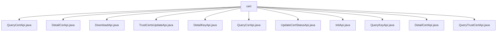

# Basic Information

|      |      |
|------|------|
| Name | cert |
| Language | .java |
| Code Path | WeFe/manager/manager-service/src/main/java/com/welab/wefe/manager/service/api/cert |
| Package Name | docs.manager.manager-service.src.main.java.com.welab.wefe.manager.service.api.cert |
| Brief Description | QueryCertApi queries certificate information, DetailCsrApi processes certificate request details, DownloadApi downloads certificates, TrustCertsUpdateApi updates the trust store, DetailKeyApi queries key details, QueryCsrApi queries certificate requests, UpdateCertStatusApi updates certificate status, InitApi initializes the root certificate, QueryKeyApi queries keys, DetailCertApi processes certificate details, QueryTrustCertApi queries trusted certificates. |

# Description

## Overview  
The core responsibility of this module is to provide full lifecycle management functions for certificates, including querying, downloading, updating status, and trust store maintenance. The interface specifications uniformly inherit from `AbstractApi`, adopting paginated queries to return `PageOutput` or directly returning VO objects. For example, `QueryCertApi` returns a list of `CertVO`, while `DownloadApi` returns a byte stream response. Key data structures include certificate view objects such as `CertVO`, `CertRequestVO`, and `CertKeyVO`, as well as various Input parameters like `QueryCertInput` and `CertDetailInput`. External dependencies primarily consist of data service components such as `CertOperationService` and `TrustCertsMongoRepo`. For instance, `CertOperationService` is used to update certificate statuses and synchronize trust stores.

## Key Business Scenarios  
The module supports three major scenarios: certificate initialization, querying, status management, and trust store maintenance. Similar to a certificate management center model, `InitApi` initializes root certificates, `QueryCsrApi` performs paginated queries for certificate requests, and `TrustCertsUpdateApi` dynamically maintains the trust store. Interaction modes include standard CRUD operations and file downloads. For example, `DownloadApi` handles certificate downloads, while `UpdateCertStatusApi` synchronizes statuses to the blockchain. Typical applications include users viewing certificate details via `DetailCertApi` and administrators reviewing trusted certificates via `QueryTrustCertApi`. API types encompass query classes (e.g., `QueryKeyApi`), detail classes (e.g., `DetailKeyApi`), and operation classes (e.g., `InitApi`). Integration examples include paginated queries coupled with status updates.

### Package Internal Structure View

This flowchart illustrates the hierarchical structure of certificate-related APIs in the WeFe management service. All API files are located under the cert directory, encompassing 11 specific functional interfaces such as certificate query, detail viewing, downloading, and status updates, clearly presenting the complete functional set of the certificate management module.

# File List

| Name   | Type  | Description |
|-------|------|-------------|
| [QueryCertApi.java](QueryCertApi.md) | file | The QueryCertApi class is an API for querying certificates, which retrieves the certificate list through CertOperationService and converts it into CertVO format for return. The input parameters include the user ID and the issuing authority certificate ID, and the output is paginated certificate data. |
| [DetailCsrApi.java](DetailCsrApi.md) | file | The `DetailCsrApi` class handles CSR detail queries, invoking the `certOperationService` with `csrId` to retrieve certificate request information and returning a `CertRequestVO`. The input parameter `CsrDetailInput` must include `csrId`. |
| [DownloadApi.java](DownloadApi.md) | file | The DownloadApi class handles certificate download requests, queries the certificate content via certId, and returns a byte stream response. It sets HTTP headers to control caching and filename, and throws an exception if the certificate does not exist. |
| [TrustCertsUpdateApi.java](TrustCertsUpdateApi.md) | file | The TrustCertsUpdateApi handles truststore certificate updates, supporting both addition and removal operations. After verifying the certificate's existence, it invokes the corresponding service based on the operation type to complete the update and returns the operation result. |
| [DetailKeyApi.java](DetailKeyApi.md) | file | The DetailKeyApi class handles certificate key detail queries, retrieving CertKeyVO data by invoking certOperationService with a keyId. The input parameter KeyDetailInput must contain a non-null keyId. |
| [QueryCsrApi.java](QueryCsrApi.md) | file | API class for querying certificate requests, handling paginated queries. The input includes user ID and issuer certificate ID, and the output is a paginated result of the certificate request list. |
| [UpdateCertStatusApi.java](UpdateCertStatusApi.md) | file | API for updating certificate status, which checks the validity of the certificate, updates the status, and synchronizes it to the blockchain, including input parameter validation. |
| [InitApi.java](InitApi.md) | file | The InitApi class is used to initialize root certificates and issue certificates, accepting common name, organization name, and organizational unit name as mandatory input parameters. |
| [QueryKeyApi.java](QueryKeyApi.md) | file | The API class for querying certificate keys, inheriting from AbstractApi, uses CertOperationService to paginate and query key information, converts it into CertKeyVO, and returns the paginated result. |
| [DetailCertApi.java](DetailCertApi.md) | file | The DetailCertApi class handles certificate detail queries, accepts the certId parameter, invokes the certOperationService to perform the query, and returns a CertVO result. |
| [QueryTrustCertApi.java](QueryTrustCertApi.md) | file | Query Trust Certificate API, retrieves the certificate list from MongoDB and converts it to JSON format for return. |

