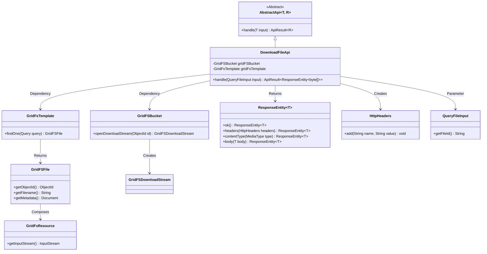
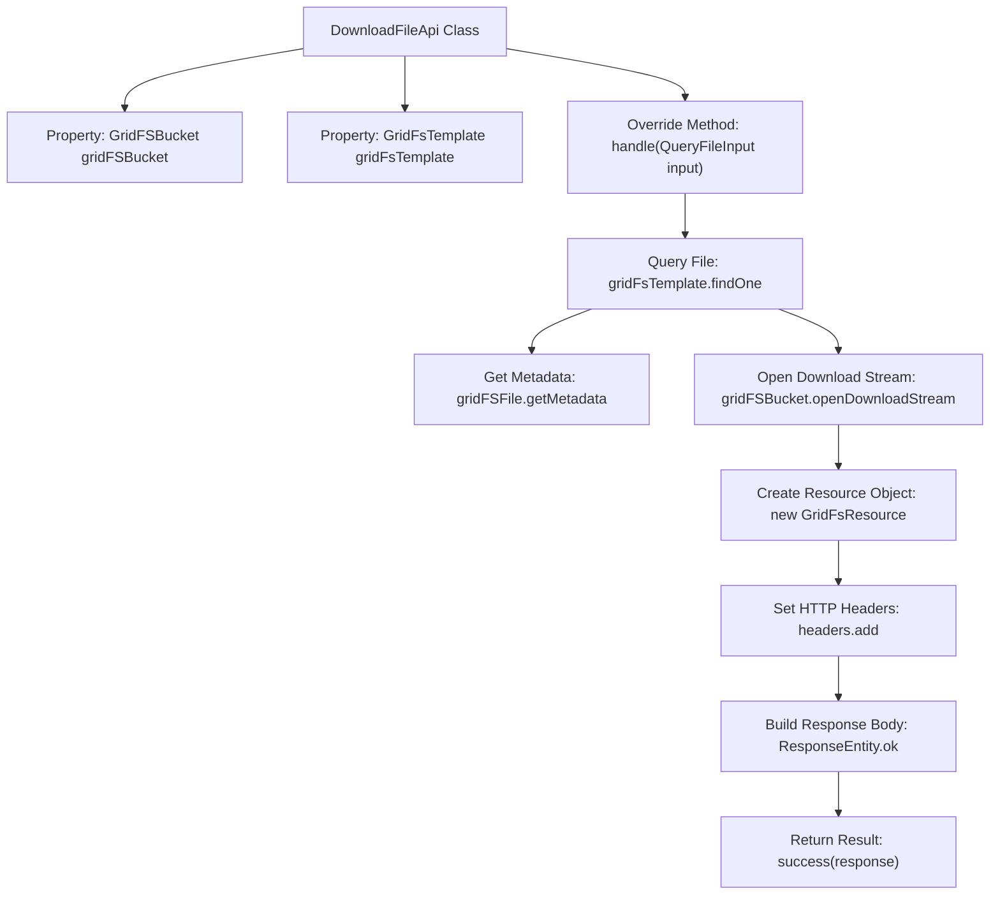

# Basic Information

|      |      |
|------|------|
| Name | DownloadFileApi |
| Language | .java |
| Code Path | WeFe/manager/manager-service/src/main/java/com/welab/wefe/manager/service/api/common/DownloadFileApi.java |
| Package Name | com.welab.wefe.manager.service.api.common |
| Dependencies | ['com.mongodb.client.gridfs.GridFSBucket', 'com.mongodb.client.gridfs.GridFSDownloadStream', 'com.mongodb.client.gridfs.model.GridFSFile', 'com.welab.wefe.common.data.mongodb.util.QueryBuilder', 'com.welab.wefe.common.web.api.base.AbstractApi', 'com.welab.wefe.common.web.api.base.Api', 'com.welab.wefe.common.web.dto.ApiResult', 'com.welab.wefe.manager.service.dto.common.QueryFileInput', 'org.apache.commons.io.IOUtils', 'org.springframework.beans.factory.annotation.Autowired', 'org.springframework.data.mongodb.gridfs.GridFsResource', 'org.springframework.data.mongodb.gridfs.GridFsTemplate', 'org.springframework.http.HttpHeaders', 'org.springframework.http.MediaType', 'org.springframework.http.ResponseEntity', 'java.io.IOException', 'java.net.URLEncoder'] |
| Brief Description | The DownloadFileApi class is used to download files from GridFS, query files based on the input ID, set response headers, and return the file byte stream. It includes cache control, filename encoding, and content type handling. |

# Description

The code defines an API class named `DownloadFileApi`, designed to handle file download requests. It inherits from `AbstractApi`, accepts `QueryFileInput` as input, and returns a `ResponseEntity<byte[]>` response. The file with the specified ID is queried from MongoDB via GridFS. HTTP response headers, including cache control, content type, filename, etc., are configured, and the file content is returned as a byte array. The entire process includes file querying, stream processing, response header configuration, and response body construction.

# Class Summary

| Name   | Type  | Description |
|-------|------|-------------|
| DownloadFileApi | class | The DownloadFileApi class is used to download files from GridFS, querying and returning file content based on the file ID, while setting HTTP header information such as cache control and filename encoding. |

## Class DownloadFileApi

|      |      |
|------|------|
| Access Modifier | @Api(path = "download/file", name = "download_file");public |
| Type | class |
| Name | DownloadFileApi |
| Description | The DownloadFileApi class is used to download files from GridFS, querying and returning file content based on the file ID, while setting HTTP header information such as cache control and filename encoding. |

### UML Class Diagram

This code defines a file download API that inherits from the generic abstract class AbstractApi, implementing file query and streaming download through GridFS. The class diagram illustrates the interaction between DownloadFileApi and MongoDB's GridFS components (GridFSBucket, GridFsTemplate), as well as the process of constructing HTTP responses (ResponseEntity, HttpHeaders). The core workflow includes: querying GridFS files by file ID, setting up download streams, building response headers with cache control and filenames, and ultimately returning file content in byte array format. The components collaborate through clear dependency relationships to accomplish the file download functionality.

### Internal Method Call Graph

This flowchart illustrates the complete process of the DownloadFileApi class handling file download requests. Starting with querying the GridFS file by specified ID, it retrieves file metadata, creates a download stream and resource object, then sets HTTP response headers (including cache control and filename encoding), and finally constructs a response entity containing the file's binary data for return. The entire process strictly adheres to MongoDB GridFS file operation standards and ensures response headers comply with best practices for file downloads.

### Field List

| Name  | Type  | Description |
|-------|-------|------|
| gridFsTemplate | GridFsTemplate | Use @Autowired to automatically inject the GridFsTemplate object. |
| gridFSBucket | GridFSBucket | The code snippet declares a private GridFSBucket variable and uses the @Autowired annotation for automatic dependency injection. |

### Method List

| Name  | Type  | Description |
|-------|-------|------|
| handle | ApiResult<ResponseEntity<byte[]>> | This method processes file query requests, retrieves files from GridFS, sets response headers, and returns the file byte stream. It includes cache control, filename encoding, and content type handling. |

