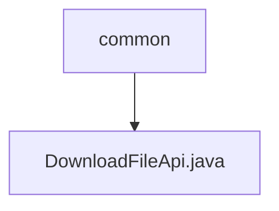

# Basic Information

|      |      |
|------|------|
| Name | common |
| Language | .java |
| Code Path | WeFe/manager/manager-service/src/main/java/com/welab/wefe/manager/service/api/common |
| Package Name | docs.manager.manager-service.src.main.java.com.welab.wefe.manager.service.api.common |
| Brief Description | The `DownloadFileApi` class is used to download files from GridFS. It queries files based on input IDs, sets response headers, and returns file byte streams. It includes cache control, filename encoding, and content type handling. |

# Description

The code defines an API class named `DownloadFileApi`, which handles file download requests. It inherits from `AbstractApi`, accepts `QueryFileInput` as input, and returns a `ResponseEntity<byte[]>` response. The file with the specified ID is queried from MongoDB via GridFS, with HTTP response headers configured to include cache control, content type, filename, etc. The file content is returned as a byte array. The entire process includes file querying, stream processing, response header configuration, and response body construction.

### Package Internal Structure View

This flowchart illustrates the API directory structure of the manager-service module in the WeFe project. The root node "common" represents the public API directory, which contains a specific API implementation file "DownloadFileApi.java". This structure reflects a typical layered design in Java projects, where APIs of different functionalities are organized by modules, with the file download feature categorized under the public API directory.

# File List

| Name   | Type  | Description |
|-------|------|-------------|
| [DownloadFileApi.java](DownloadFileApi.md) | file | The DownloadFileApi class is used to download files from GridFS, query files based on input IDs, set response headers, and return file byte streams. It includes cache control, filename encoding, and content type handling. |

