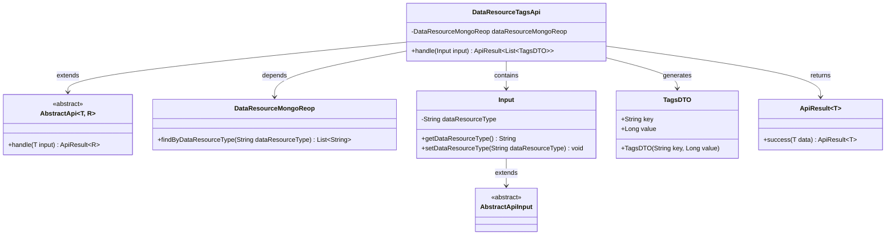
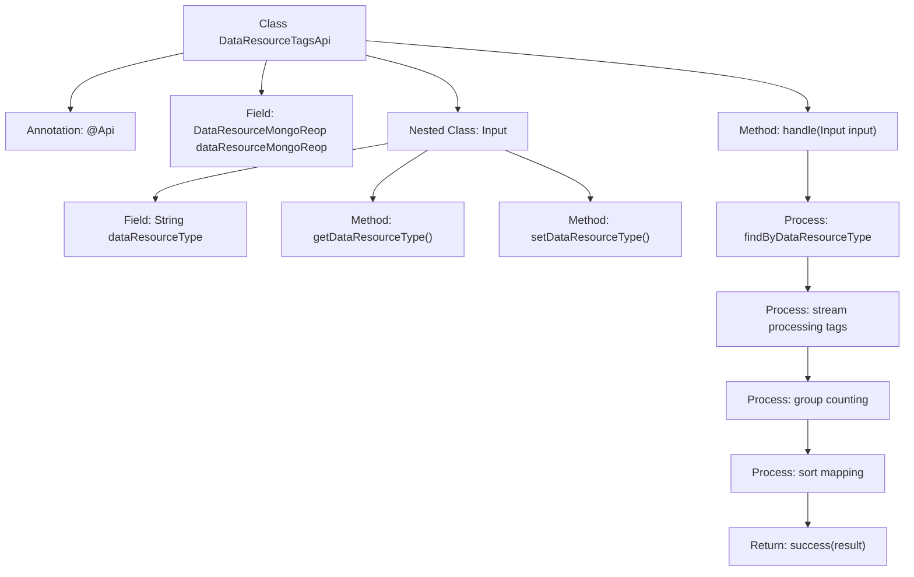

# Basic Information

|      |      |
|------|------|
| Name | DataResourceTagsApi |
| Language | .java |
| Code Path | WeFe/manager/manager-service/src/main/java/com/welab/wefe/manager/service/api/dataresource/DataResourceTagsApi.java |
| Package Name | com.welab.wefe.manager.service.api.dataresource |
| Dependencies | ['com.welab.wefe.common.data.mongodb.repo.DataResourceMongoReop', 'com.welab.wefe.common.exception.StatusCodeWithException', 'com.welab.wefe.common.web.api.base.AbstractApi', 'com.welab.wefe.common.web.api.base.Api', 'com.welab.wefe.common.web.dto.AbstractApiInput', 'com.welab.wefe.common.web.dto.ApiResult', 'com.welab.wefe.manager.service.dto.tag.TagsDTO', 'org.springframework.beans.factory.annotation.Autowired', 'java.io.IOException', 'java.util.Arrays', 'java.util.Comparator', 'java.util.List', 'java.util.Map', 'java.util.stream.Collectors'] |
| Brief Description | This is an API class for querying data resource tags. It retrieves a list of tags from MongoDB based on the input resource type, processes them, and returns a sorted list of DTOs ordered by tag occurrence frequency. |

# Description

The code defines an API class named `DataResourceTagsApi` for querying data resource tags. It inherits from `AbstractApi`, accepts an `Input` parameter, and returns a list of `TagsDTO`. By injecting `DataResourceMongoReop`, it retrieves tag data of the specified type from the database, processes it, and returns the results sorted by tag frequency. The `Input` class includes a `dataResourceType` property to specify the resource type. The processing flow involves querying, grouping, sorting, and result encapsulation.

# Class Summary

| Name   | Type  | Description |
|-------|------|-------------|
| DataResourceTagsApi | class | This is a Java class designed for querying data resource tags. It retrieves tags of a specified type from MongoDB, performs statistical analysis and sorting, then returns a list of tags. The input parameter is dataResourceType, and the output is a list containing tag names and their corresponding counts. |

## Class DataResourceTagsApi

|      |      |
|------|------|
| Access Modifier | @Api(path = "data_resource/tags/query", name = "data_resource_tags_query");public |
| Type | class |
| Name | DataResourceTagsApi |
| Description | This is a Java class designed for querying data resource tags. It retrieves tags of a specified type from MongoDB, performs statistical analysis and sorting, then returns a list of tags. The input parameter is dataResourceType, and the output is a list containing tag names and their corresponding counts. |

### UML Class Diagram

This code demonstrates the implementation of a data resource tag query API, which inherits from the generic abstract class AbstractApi. The DataResourceTagsApi retrieves data from MongoDB via the injected DataResourceMongoReop, processes the input parameter Input, groups and sorts the tags, and finally returns a list of TagsDTO. The class diagram clearly illustrates the inheritance relationships, dependency injection, and data flow, showcasing the end-to-end process from data retrieval to result encapsulation.

### Internal Method Call Graph

This code represents a Spring framework-based API implementation class, primarily designed to query data resource tags from MongoDB and perform statistical processing. The flowchart illustrates the class structure and method invocation chain: starting with the @Api annotation definition, it queries data through the injected MongoDB repository, splits and filters tags, performs group counting, then sorts and maps them into DTO object lists, finally returning a successful result. The nested Input class is used to receive request parameters, containing a data type field with its getter/setter methods. The entire process demonstrates the standard API implementation pattern of data query → processing → response.

### Field List

| Name  | Type  | Description |
|-------|-------|------|
| dataResourceMongoReop | DataResourceMongoReop | Use @Autowired to automatically inject the DataResourceMongoReop data resource MongoDB repository. |

### Method List

| Name  | Type  | Description |
|-------|-------|------|
| handle | ApiResult<List<TagsDTO>> | This method processes the input parameters, retrieves a list of tags from MongoDB, splits them by commas, counts the occurrences of each tag, sorts them, and returns a list of tag DTOs. |

