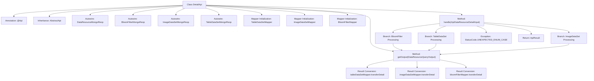

# Basic Information

|      |      |
|------|------|
| Name | DetailApi |
| Language | .java |
| Code Path | WeFe/manager/manager-service/src/main/java/com/welab/wefe/manager/service/api/dataresource/DetailApi.java |
| Package Name | com.welab.wefe.manager.service.api.dataresource |
| Dependencies | ['com.welab.wefe.common.StatusCode', 'com.welab.wefe.common.data.mongodb.constant.MongodbTable', 'com.welab.wefe.common.data.mongodb.dto.dataresource.DataResourceQueryOutput', 'com.welab.wefe.common.data.mongodb.repo.BloomFilterMongoReop', 'com.welab.wefe.common.data.mongodb.repo.DataResourceMongoReop', 'com.welab.wefe.common.data.mongodb.repo.ImageDataSetMongoReop', 'com.welab.wefe.common.data.mongodb.repo.TableDataSetMongoReop', 'com.welab.wefe.common.exception.StatusCodeWithException', 'com.welab.wefe.common.web.api.base.AbstractApi', 'com.welab.wefe.common.web.api.base.Api', 'com.welab.wefe.common.web.dto.ApiResult', 'com.welab.wefe.common.wefe.enums.DataResourceType', 'com.welab.wefe.manager.service.dto.dataresource.ApiDataResourceDetailInput', 'com.welab.wefe.manager.service.dto.dataresource.ApiDataResourceQueryOutput', 'com.welab.wefe.manager.service.mapper.BloomFilterMapper', 'com.welab.wefe.manager.service.mapper.ImageDataSetMapper', 'com.welab.wefe.manager.service.mapper.TableDataSetMapper', 'org.mapstruct.factory.Mappers', 'org.springframework.beans.factory.annotation.Autowired'] |
| Brief Description | The DetailApi class handles detailed queries of data resources, invoking different MongoDB repositories based on the input type to retrieve data and converting it into output results through a mapper. |

# Description

The DetailApi class is an API that handles data resource details, inheriting from AbstractApi. It takes ApiDataResourceDetailInput as input and returns ApiDataResourceQueryOutput as the result. It processes queries for different types of data resources, including BloomFilter, TableDataSet, and ImageDataSet, using the injected MongoDB repository and mapper. Based on the input data resource type, it queries data from the corresponding MongoDB table and converts the output result through the respective mapper. If the type does not match or the query fails, it throws an exception or returns a null value.

# Class Summary

| Name   | Type  | Description |
|-------|------|-------------|
| DetailApi | class | The DetailApi class handles detailed queries of data resources, retrieving data from different MongoDB collections based on the input type (BloomFilter, TableDataSet, ImageDataSet) and converting it to the output format through corresponding Mappers. |


## Class DetailApi

|      |      |
|------|------|
| Access Modifier | @Api(path = "data_resource/detail", name = "data_resource_detail");public |
| Type | class |
| Name | DetailApi |
| Description | The DetailApi class handles detailed queries of data resources, retrieving data from different MongoDB collections based on the input type (BloomFilter, TableDataSet, ImageDataSet) and converting it to the output format through corresponding Mappers. |


### UML Class Diagram

```mermaid
classDiagram
    class AbstractApi~T, R~ {
        <<Abstract>>
        +handle(T input) R
    }

    class DetailApi {
        -DataResourceMongoReop dataResourceMongoReop
        -BloomFilterMongoReop bloomFilterMongoReop
        -ImageDataSetMongoReop imageDataSetMongoReop
        -TableDataSetMongoReop tableDataSetMongoReop
        -TableDataSetMapper tableDataSetMapper
        -ImageDataSetMapper imageDataSetMapper
        -BloomFilterMapper bloomFilterMapper
        +handle(ApiDataResourceDetailInput input) ApiResult~ApiDataResourceQueryOutput~
        -getOutput(DataResourceQueryOutput dataResourceQueryOutput) ApiDataResourceQueryOutput
    }

    class DataResourceMongoReop {
        +findOneByDataResourceId(String dataResourceId, MongodbTable.Union type) DataResourceQueryOutput
    }

    class BloomFilterMongoReop
    class ImageDataSetMongoReop
    class TableDataSetMongoReop

    class TableDataSetMapper {
        +transferDetail(DataResourceQueryOutput output) ApiDataResourceQueryOutput
    }

    class ImageDataSetMapper {
        +transferDetail(DataResourceQueryOutput output) ApiDataResourceQueryOutput
    }

    class BloomFilterMapper {
        +transferDetail(DataResourceQueryOutput output) ApiDataResourceQueryOutput
    }

    class ApiDataResourceDetailInput {
        +String dataResourceId
        +DataResourceType dataResourceType
    }

    class ApiDataResourceQueryOutput
    class DataResourceQueryOutput {
        +DataResourceType dataResourceType
    }

    class ApiResult~T~
    class MongodbTable {
        <<Enumeration>>
        Union
    }

    class DataResourceType {
        <<Enumeration>>
        BloomFilter
        TableDataSet
        ImageDataSet
    }

    DetailApi --|> AbstractApi~ApiDataResourceDetailInput, ApiResult~ApiDataResourceQueryOutput~~ : Inheritance
    DetailApi --> DataResourceMongoReop : Dependency
    DetailApi --> BloomFilterMongoReop : Dependency
    DetailApi --> ImageDataSetMongoReop : Dependency
    DetailApi --> TableDataSetMongoReop : Dependency
    DetailApi --> TableDataSetMapper : Dependency
    DetailApi --> ImageDataSetMapper : Dependency
    DetailApi --> BloomFilterMapper : Dependency
    DataResourceMongoReop --> DataResourceQueryOutput : Returns
    TableDataSetMapper --> ApiDataResourceQueryOutput : Returns
    ImageDataSetMapper --> ApiDataResourceQueryOutput : Returns
    BloomFilterMapper --> ApiDataResourceQueryOutput : Returns
    ApiDataResourceDetailInput --> DataResourceType : Contains
    DataResourceQueryOutput --> DataResourceType : Contains
```

This class diagram illustrates the structural relationships of DetailApi and its related components. DetailApi inherits from the generic abstract class AbstractApi, implementing query processing for three different types of data resources (Bloom Filter, Table Data Set, Image Data Set). It relies on four MongoDB repository classes to fetch data and uses three Mapper classes to transform query results into a unified output format. The enumeration classes DataResourceType and MongodbTable.Union define data type identifiers. The overall design embodies the strategy pattern concept, selecting different data processing paths through type discrimination.


### Internal Method Call Graph



This flowchart illustrates the structure and main processing flow of the DetailApi class. The class implements a data resource detail query interface by inheriting AbstractApi, invoking corresponding MongoDB repositories (BloomFilter/TableDataSet/ImageDataSet) to retrieve data based on different resource types, then converting query results to output objects via Mappers. The flow consists of three key stages: type judgment branching, exception handling, and result conversion, ultimately returning API responses in a standardized format.

### Field List

| Name  | Type  | Description |
|-------|-------|------|
| bloomFilterMongoReop | BloomFilterMongoReop | Using @Autowired to automatically inject the BloomFilterMongoReop repository instance. |
| imageDataSetMapper = Mappers.getMapper(ImageDataSetMapper.class) | ImageDataSetMapper | Declare a protected ImageDataSetMapper instance, obtaining the mapper object via the Mappers.getMapper method. |
| bloomFilterMapper = Mappers.getMapper(BloomFilterMapper.class) | BloomFilterMapper | The code defines a protected BloomFilterMapper instance, obtaining its implementation class via the Mappers.getMapper method. |
| dataResourceMongoReop | DataResourceMongoReop | Use @Autowired to automatically inject the DataResourceMongoReop data resource Mongo repository. |
| tableDataSetMongoReop | TableDataSetMongoReop | Use @Autowired to automatically inject the TableDataSetMongoReop repository instance. |
| tableDataSetMapper = Mappers.getMapper(TableDataSetMapper.class) | TableDataSetMapper | Declare a protected TableDataSetMapper instance, initialized via the Mappers.getMapper method. |
| imageDataSetMongoReop | ImageDataSetMongoReop | Automatically inject the ImageDataSetMongoReop database operation object. |

### Method List

| Name  | Type  | Description |
|-------|-------|------|
| getOutput | ApiDataResourceQueryOutput | This method returns the corresponding conversion result based on the input data type: if the input is empty, it returns null; if it is tabular data, it invokes the table converter; if it is image data, it invokes the image converter; otherwise, it invokes the Bloom filter converter. |
| handle | ApiResult<ApiDataResourceQueryOutput> | The method queries MongoDB data resources based on input types, supporting Bloom filters, tabular data, and image datasets, and throws errors in case of exceptions. |


