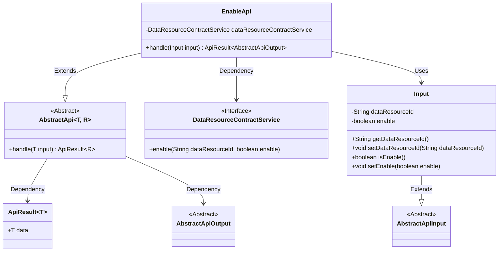

# Basic Information

|      |      |
|------|------|
| Name | EnableApi |
| Language | .java |
| Code Path | WeFe/manager/manager-service/src/main/java/com/welab/wefe/manager/service/api/dataresource/EnableApi.java |
| Package Name | com.welab.wefe.manager.service.api.dataresource |
| Dependencies | ['com.welab.wefe.common.StatusCode', 'com.welab.wefe.common.exception.StatusCodeWithException', 'com.welab.wefe.common.fieldvalidate.annotation.Check', 'com.welab.wefe.common.web.api.base.AbstractApi', 'com.welab.wefe.common.web.api.base.Api', 'com.welab.wefe.common.web.dto.AbstractApiInput', 'com.welab.wefe.common.web.dto.AbstractApiOutput', 'com.welab.wefe.common.web.dto.ApiResult', 'com.welab.wefe.manager.service.service.DataResourceContractService', 'org.springframework.beans.factory.annotation.Autowired'] |
| Brief Description | The EnableApi class handles enable/disable requests for data resources by invoking the DataResourceContractService, requiring the parameters dataResourceId and enable. It returns a system error in case of exceptions. |

# Description

This is a Java class named EnableApi, designed to handle data resource enable/disable requests. It extends AbstractApi and defines an Input class for input parameters, which includes the mandatory fields dataResourceId and enable. The class processes the request by invoking the enable method through dataResourceContractService, returning an empty result upon success and throwing a system error in case of exceptions. The input parameters undergo non-null validation, and getter/setter methods are provided.

# Class Summary

| Name   | Type  | Description |
|-------|------|-------------|
| EnableApi | class | The EnableApi class is used to enable or disable data resources. It takes the dataResourceId and enable parameters, invokes the dataResourceContractService for processing, and returns a system error in case of exceptions. |

## Class EnableApi

|      |      |
|------|------|
| Access Modifier | @Api(path = "data_resource/enable", name = "data_resource_enable");public |
| Type | class |
| Name | EnableApi |
| Description | The EnableApi class is used to enable or disable data resources. It takes the dataResourceId and enable parameters, invokes the dataResourceContractService for processing, and returns a system error in case of exceptions. |

### UML Class Diagram

This code demonstrates an API implementation for enabling data resources. The EnableApi class inherits from the generic abstract class AbstractApi, processing input parameters containing dataResourceId and enable flags, and executes the actual enable operation through the DataResourceContractService interface. The class diagram clearly illustrates inheritance relationships (EnableApi→AbstractApi, Input→AbstractApiInput), dependency relationships (EnableApi→DataResourceContractService), and core data structures (Input class encapsulating request parameters). Exception handling is implemented via StatusCodeWithException, adhering to enterprise-level API design specifications.

### Internal Method Call Graph

```mermaid
graph TD
    A["Class EnableApi"]
    B["Annotation: @Api(path='data_resource/enable', name='data_resource_enable')"]
    C["Inheritance: AbstractApi<Input, AbstractApiOutput>"]
    D["Dependency Injection: @Autowired DataResourceContractService"]
    E["Overridden Method: handle(Input input)"]
    F["Logging: LOG.info('data resource enable handle..')"]
    G["try-catch Block"]
    H["Service Call: dataResourceContractService.enable()"]
    I["Exception Handling: throw StatusCodeWithException"]
    J["Return: success()"]
    K["Nested Class Input"]
    L["Inheritance: AbstractApiInput"]
    M["Field: @Check String dataResourceId"]
    N["Field: @Check boolean enable"]
    O["Getter/Setter Methods"]

    A --> B
    A --> C
    A --> D
    A --> E
    E --> F
    E --> G
    G --> H
    G --> I
    E --> J
    A --> K
    K --> L
    K --> M
    K --> N
    K --> O
```

This code demonstrates a REST API class named EnableApi for handling data resource enable/disable operations. The flowchart clearly presents the class structure, including annotation declaration, parent class inheritance, service injection, and core handle method implementation. The handle method encompasses logging, service invocation, and exception handling processes, while the nested Input class defines required request parameters with validation rules. The overall design adheres to standard API development patterns, achieving separation of business logic and exception handling through layered processing.

### Field List

| Name  | Type  | Description |
|-------|-------|------|
| dataResourceContractService | DataResourceContractService | Automatically inject the DataResourceContractService service instance. |

### Method List

| Name  | Type  | Description |
|-------|-------|------|
| handle | ApiResult<AbstractApiOutput> | This method handles the data resource enabling operation, invokes the service to enable the specified resource, captures exceptions, and returns either success or a system error. |

