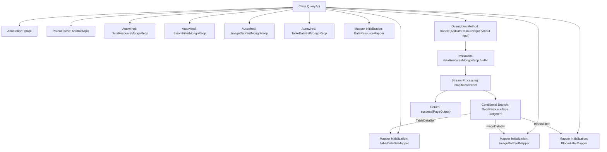

# Basic Information

|      |      |
|------|------|
| Name | QueryApi |
| Language | .java |
| Code Path | WeFe/manager/manager-service/src/main/java/com/welab/wefe/manager/service/api/dataresource/QueryApi.java |
| Package Name | com.welab.wefe.manager.service.api.dataresource |
| Dependencies | ['com.welab.wefe.common.data.mongodb.dto.PageOutput', 'com.welab.wefe.common.data.mongodb.dto.dataresource.DataResourceQueryOutput', 'com.welab.wefe.common.data.mongodb.repo.BloomFilterMongoReop', 'com.welab.wefe.common.data.mongodb.repo.DataResourceMongoReop', 'com.welab.wefe.common.data.mongodb.repo.ImageDataSetMongoReop', 'com.welab.wefe.common.data.mongodb.repo.TableDataSetMongoReop', 'com.welab.wefe.common.web.api.base.AbstractApi', 'com.welab.wefe.common.web.api.base.Api', 'com.welab.wefe.common.web.dto.ApiResult', 'com.welab.wefe.common.wefe.enums.DataResourceType', 'com.welab.wefe.manager.service.dto.dataresource.ApiDataResourceQueryInput', 'com.welab.wefe.manager.service.dto.dataresource.ApiDataResourceQueryOutput', 'com.welab.wefe.manager.service.mapper.BloomFilterMapper', 'com.welab.wefe.manager.service.mapper.DataResourceMapper', 'com.welab.wefe.manager.service.mapper.ImageDataSetMapper', 'com.welab.wefe.manager.service.mapper.TableDataSetMapper', 'org.mapstruct.factory.Mappers', 'org.springframework.beans.factory.annotation.Autowired', 'java.util.List', 'java.util.Objects', 'java.util.stream.Collectors'] |
| Brief Description | The QueryApi class handles data resource queries, retrieves different types of data through the MongoDB repository, converts the output using mappers, and returns paginated results. |

# Description

This is a Java class named QueryApi, which extends AbstractApi and is used to handle data resource query requests. The class injects four MongoDB repository interfaces and four Mapper interfaces. The main method, handle, takes input parameters, queries data through dataResourceMongoReop, and uses different Mappers to transform the results based on the data type, ultimately returning the query results in a paginated format. It supports three data types: table datasets, image datasets, and Bloom filters.

# Class Summary

| Name   | Type  | Description |
|-------|------|-------------|
| QueryApi | class | The QueryApi class handles data resource queries, inherits from AbstractApi, utilizes multiple MongoDB repositories and Mappers for input/output conversion, and returns different results based on resource types. |


## Class QueryApi

|      |      |
|------|------|
| Access Modifier | @Api(path = "data_resource/query", name = "data_resource_query");public |
| Type | class |
| Name | QueryApi |
| Description | The QueryApi class handles data resource queries, inherits from AbstractApi, utilizes multiple MongoDB repositories and Mappers for input/output conversion, and returns different results based on resource types. |


### UML Class Diagram

```mermaid
classDiagram
    class QueryApi {
        -DataResourceMongoReop dataResourceMongoReop
        -BloomFilterMongoReop bloomFilterMongoReop
        -ImageDataSetMongoReop imageDataSetMongoReop
        -TableDataSetMongoReop tableDataSetMongoReop
        -TableDataSetMapper tableDataSetMapper
        -ImageDataSetMapper imageDataSetMapper
        -BloomFilterMapper bloomFilterMapper
        -DataResourceMapper dataResourceMapper
        +handle(ApiDataResourceQueryInput input) ApiResult~PageOutput~ApiDataResourceQueryOutput~~
    }

    class AbstractApi~T, R~ {
        <<Abstract>>
    }

    class ApiDataResourceQueryInput {
    }

    class PageOutput~T~ {
        +int pageIndex
        +long total
        +int pageSize
        +int totalPage
        +List~T~ list
    }

    class ApiDataResourceQueryOutput {
    }

    class DataResourceQueryOutput {
        +DataResourceType dataResourceType
    }

    enum DataResourceType {
        TableDataSet
        ImageDataSet
        BloomFilter
    }

    class DataResourceMongoReop {
        +findAll(DataResourceQueryInput input) PageOutput~DataResourceQueryOutput~
    }

    class BloomFilterMongoReop {
    }

    class ImageDataSetMongoReop {
    }

    class TableDataSetMongoReop {
    }

    class TableDataSetMapper {
        +transferDetail(DataResourceQueryOutput output) ApiDataResourceQueryOutput
    }

    class ImageDataSetMapper {
        +transferDetail(DataResourceQueryOutput output) ApiDataResourceQueryOutput
    }

    class BloomFilterMapper {
        +transferDetail(DataResourceQueryOutput output) ApiDataResourceQueryOutput
    }

    class DataResourceMapper {
        +transferInput(ApiDataResourceQueryInput input) DataResourceQueryInput
    }

    QueryApi --|> AbstractApi~ApiDataResourceQueryInput, PageOutput~ApiDataResourceQueryOutput~~ : Inheritance
    QueryApi --> DataResourceMongoReop : Dependency
    QueryApi --> BloomFilterMongoReop : Dependency
    QueryApi --> ImageDataSetMongoReop : Dependency
    QueryApi --> TableDataSetMongoReop : Dependency
    QueryApi --> TableDataSetMapper : Dependency
    QueryApi --> ImageDataSetMapper : Dependency
    QueryApi --> BloomFilterMapper : Dependency
    QueryApi --> DataResourceMapper : Dependency
    DataResourceMongoReop --> DataResourceQueryOutput : Returns
    DataResourceMongoReop --> DataResourceMapper : Transforms Input
    DataResourceQueryOutput --> DataResourceType : Contains
    TableDataSetMapper --> ApiDataResourceQueryOutput : Transforms
    ImageDataSetMapper --> ApiDataResourceQueryOutput : Transforms
    BloomFilterMapper --> ApiDataResourceQueryOutput : Transforms
```

This code demonstrates the implementation of a query API, where QueryApi inherits from AbstractApi to handle data resource query requests. It relies on multiple MongoDB repositories and mappers to convert query results into a unified output format based on different data resource types (table dataset, image dataset, or Bloom filter). The class diagram clearly illustrates the relationships and dependencies between various classes, including abstract base classes, input/output types, enumeration types, and various mapper and repository classes. The overall design reflects the principles of layering and separation of responsibilities, making it easy to maintain and extend.


### Internal Method Call Graph



This flowchart illustrates the complete structure of the QueryApi class, from class annotations and dependency injection to core business logic processing. It highlights the data processing chain in the handle method: querying raw data from MongoDB, selecting different Mappers for conversion based on data type, filtering null values, and encapsulating paginated results for return. The flow clearly demonstrates key paths of conditional branching and object transformation, reflecting the core logic of data querying and type dispatching.

### Field List

| Name  | Type  | Description |
|-------|-------|------|
| imageDataSetMongoReop | ImageDataSetMongoReop | Using @Autowired to automatically inject an instance of ImageDataSetMongoReop. |
| dataResourceMapper = Mappers.getMapper(DataResourceMapper.class) | DataResourceMapper | Declare a protected DataResourceMapper instance, initialized via the Mappers.getMapper method. |
| dataResourceMongoReop | DataResourceMongoReop | Automatically inject the DataResourceMongoReop data resource MongoDB repository instance. |
| bloomFilterMapper = Mappers.getMapper(BloomFilterMapper.class) | BloomFilterMapper | The BloomFilterMapper instance is obtained through the Mappers.getMapper method. |
| bloomFilterMongoReop | BloomFilterMongoReop | Using @Autowired to automatically inject the BloomFilterMongoRepo repository instance. |
| tableDataSetMapper = Mappers.getMapper(TableDataSetMapper.class) | TableDataSetMapper | Declare a protected TableDataSetMapper instance, initialized via the Mappers.getMapper method. |
| tableDataSetMongoReop | TableDataSetMongoReop | Using @Autowired to automatically inject the TableDataSetMongoReop repository instance. |
| imageDataSetMapper = Mappers.getMapper(ImageDataSetMapper.class) | ImageDataSetMapper | Declare a protected ImageDataSetMapper instance, initialized via the Mappers.getMapper method. |

### Method List

| Name  | Type  | Description |
|-------|-------|------|
| handle | ApiResult<PageOutput<ApiDataResourceQueryOutput>> | This method processes data resource query requests, retrieves paginated results from MongoDB based on input conditions, maps them to different output objects (table datasets, image datasets, Bloom filters) according to resource types, and returns paginated responses after filtering null values. |


