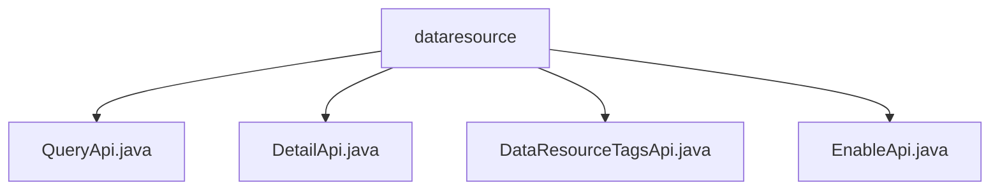

# Basic Information

|      |      |
|------|------|
| Name | dataresource |
| Language | .java |
| Code Path | WeFe/manager/manager-service/src/main/java/com/welab/wefe/manager/service/api/dataresource |
| Package Name | docs.manager.manager-service.src.main.java.com.welab.wefe.manager.service.api.dataresource |
| Brief Description | QueryApi handles data queries, supporting table, image, and Bloom filter types. DetailApi retrieves data details and processes different types of resources. DataResourceTagsApi queries and sorts tags by frequency. EnableApi manages resource activation status and performs parameter validation. |

# Description

## Overview  
The core responsibility of this module is to provide unified query and management capabilities for data resources, including basic queries, detail retrieval, tag searches, and activation control. The interface specifications adhere to the RESTful style, with inputs and outputs inherited from the AbstractApi base class. Data transformation is achieved through injected MongoDB repositories and Mappers. Key data structures include ApiDataResourceDetailInput, TagsDTO, etc., supporting three types: table datasets, image datasets, and Bloom filters. External dependencies include the MongoDB driver, Spring Data, and the internal ContractService. For example, QueryApi performs paginated queries via dataResourceMongoReop, while DetailApi maps different results based on types.  

## Key Business Scenarios  
The module comprehensively covers the lifecycle management of data resources, adopting a layered interaction model of "query-detail-tag." Typical workflows include: after a user initiates a paginated query, they can view specific content via DetailApi or retrieve high-frequency tags through DataResourceTagsApi. For instance, EnableApi can dynamically toggle resource states, similar to a switch mechanism. All APIs share a type-routing mechanism, such as BloomFilter types being automatically routed to the corresponding Mapper. Integration cases demonstrate mixed-type processing capabilities, such as table datasets and image datasets sharing a query interface but being processed separately.

### Package Internal Structure View

This flowchart illustrates four Java files under the dataresource directory: QueryApi.java, DetailApi.java, DataResourceTagsApi.java, and EnableApi.java. These files are directly subordinate to the dataresource node, with no deeper subdirectory structure, presenting a clear and flat hierarchical relationship.

# File List

| Name   | Type  | Description |
|-------|------|-------------|
| [QueryApi.java](QueryApi.md) | file | The QueryApi class handles data resource queries, retrieves different types of data through MongoDB repositories, converts the output using mappers, and returns paginated results. |
| [DetailApi.java](DetailApi.md) | file | The DetailApi class handles detailed queries of data resources, invoking different MongoDB repositories based on the input type to retrieve data and converting it to output results through mappers. |
| [DataResourceTagsApi.java](DataResourceTagsApi.md) | file | This is an API class for querying data resource tags. It retrieves a list of tags from MongoDB based on the input resource type, processes them, and returns a sorted list of DTOs ordered by tag occurrence frequency. |
| [EnableApi.java](EnableApi.md) | file | The EnableApi class handles enable/disable requests for data resources by invoking the DataResourceContractService service. It requires the parameters dataResourceId and enable, and returns a system error in case of exceptions. |

