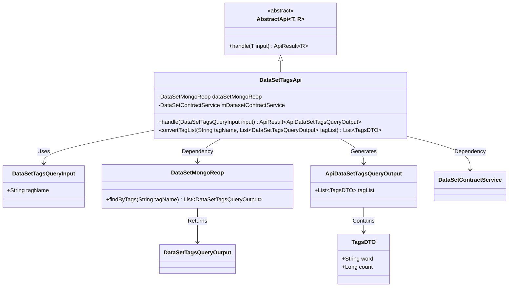
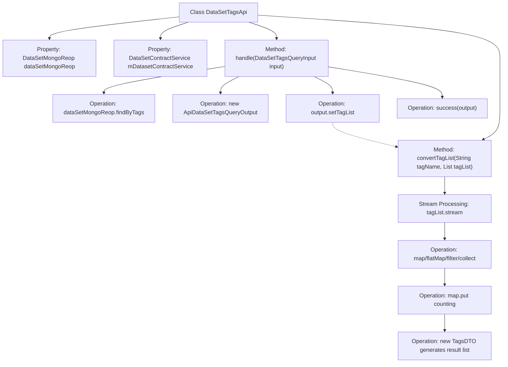

# Basic Information

|      |      |
|------|------|
| Name | DataSetTagsApi |
| Language | .java |
| Code Path | WeFe/manager/manager-service/src/main/java/com/welab/wefe/manager/service/api/dataset/DataSetTagsApi.java |
| Package Name | com.welab.wefe.manager.service.api.dataset |
| Dependencies | ['com.welab.wefe.common.data.mongodb.dto.dataset.DataSetTagsQueryOutput', 'com.welab.wefe.common.data.mongodb.repo.DataSetMongoReop', 'com.welab.wefe.common.util.StringUtil', 'com.welab.wefe.common.web.api.base.AbstractApi', 'com.welab.wefe.common.web.api.base.Api', 'com.welab.wefe.common.web.dto.ApiResult', 'com.welab.wefe.manager.service.dto.tag.ApiDataSetTagsQueryOutput', 'com.welab.wefe.manager.service.dto.tag.DataSetTagsQueryInput', 'com.welab.wefe.manager.service.dto.tag.TagsDTO', 'com.welab.wefe.manager.service.service.DataSetContractService', 'org.springframework.beans.factory.annotation.Autowired', 'java.util', 'java.util.stream.Collectors'] |
| Brief Description | Dataset Label Query API Class, which queries label data through MongoDB and contract services, processes the input, and returns a deduplicated and sorted list of labels along with their counts. |

# Description

This is a Java class named `DataSetTagsApi`, designed for handling dataset tag queries. It extends `AbstractApi`, accepts `DataSetTagsQueryInput` as input, and returns `ApiDataSetTagsQueryOutput`. The class injects two dependencies: `DataSetMongoReop` and `DataSetContractService`. The core logic resides in the `handle` method, which queries data via `dataSetMongoReop` based on tag names, then processes the results using the `convertTagList` method: splitting tags, deduplicating, sorting, and counting the occurrences of each tag. Finally, it converts the results into a list of `TagsDTO` for return. The entire process implements dataset querying and statistical functionality based on tag names.

# Class Summary

| Name   | Type  | Description |
|-------|------|-------------|
| DataSetTagsApi | class | Dataset Label Query API, which retrieves datasets from MongoDB by label names, processes them, and returns a deduplicated and sorted list of labels along with their occurrence counts. |

## Class DataSetTagsApi

|      |      |
|------|------|
| Access Modifier | @Api(path = "data_set/tags/query", name = "dataset_tags_query");public |
| Type | class |
| Name | DataSetTagsApi |
| Description | Dataset Label Query API, which retrieves datasets from MongoDB by label names, processes them, and returns a deduplicated and sorted list of labels along with their occurrence counts. |

### UML Class Diagram

This code demonstrates the implementation of a dataset tags query API. DataSetTagsApi inherits from the generic abstract class AbstractApi, with autowired dependencies on DataSetMongoReop and DataSetContractService services. Its primary function is to process tag name query requests, retrieve matching dataset tag records from MongoDB, and after stream processing for deduplication, filtering, and aggregation, convert them into a DTO list containing tag frequency statistics for response. The convertTagList method implements core business logic including tag splitting, null value filtering, keyword matching, and word frequency counting.

### Internal Method Call Graph

Flowchart Description: This flowchart illustrates the complete processing flow of the DataSetTagsApi class. Starting from the entry method `handle`, it first queries data through `dataSetMongoReop`, then creates an output object and sets the tag list processed by the `convertTagList` method. The `convertTagList` method contains complex stream processing logic including tag splitting, filtering, deduplication, and counting, ultimately generating a TagsDTO list for return. The entire process reflects the complete business logic from data query to result transformation.

### Field List

| Name  | Type  | Description |
|-------|-------|------|
| dataSetMongoReop | DataSetMongoReop | Using @Autowired to automatically inject the DataSetMongoReop repository instance. |
| mDatasetContractService | DataSetContractService | Using @Autowired to automatically inject the DataSetContractService instance variable mDatasetContractService. |

### Method List

| Name  | Type  | Description |
|-------|-------|------|
| handle | ApiResult<ApiDataSetTagsQueryOutput> | This method handles dataset label queries by retrieving a matching list from MongoDB based on the input label name, then returns successful results after conversion. |
| convertTagList | List<TagsDTO> | Split the database tag field, remove duplicates, and sort it, then filter based on the input tag name and count the occurrences, returning a list of tag DTOs. |

