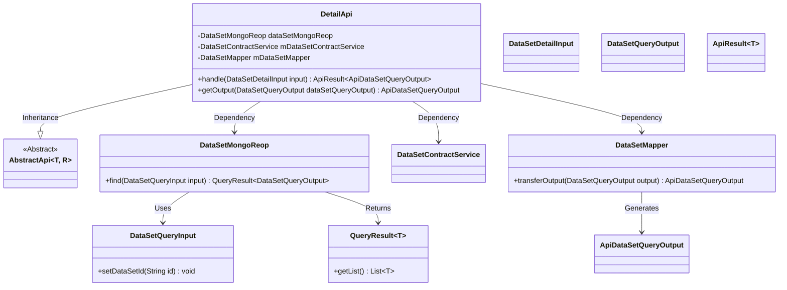
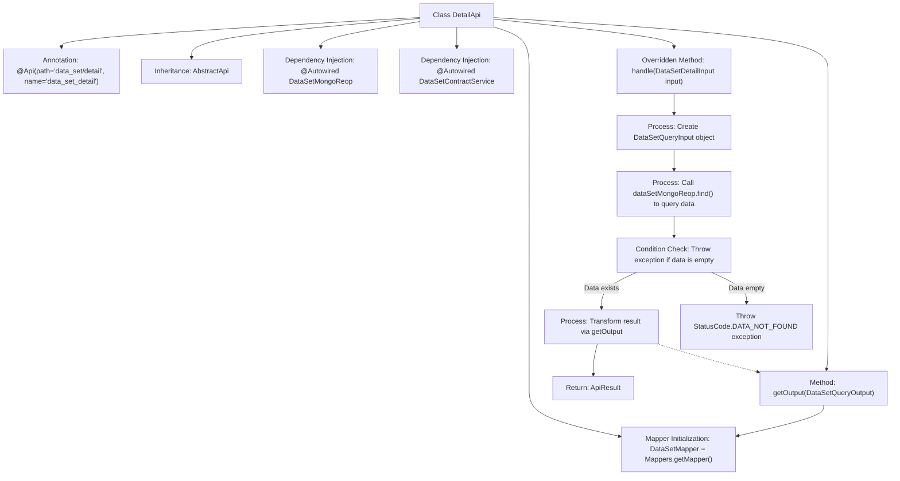

# Basic Information

|      |      |
|------|------|
| Name | DetailApi |
| Language | .java |
| Code Path | WeFe/manager/manager-service/src/main/java/com/welab/wefe/manager/service/api/dataset/DetailApi.java |
| Package Name | com.welab.wefe.manager.service.api.dataset |
| Dependencies | ['com.welab.wefe.common.StatusCode', 'com.welab.wefe.common.data.mongodb.dto.dataset.DataSetQueryInput', 'com.welab.wefe.common.data.mongodb.dto.dataset.DataSetQueryOutput', 'com.welab.wefe.common.data.mongodb.repo.DataSetMongoReop', 'com.welab.wefe.common.exception.StatusCodeWithException', 'com.welab.wefe.common.web.api.base.AbstractApi', 'com.welab.wefe.common.web.api.base.Api', 'com.welab.wefe.common.web.dto.ApiResult', 'com.welab.wefe.manager.service.dto.dataset.ApiDataSetQueryOutput', 'com.welab.wefe.manager.service.dto.dataset.DataSetDetailInput', 'com.welab.wefe.manager.service.mapper.DataSetMapper', 'com.welab.wefe.manager.service.service.DataSetContractService', 'org.mapstruct.factory.Mappers', 'org.springframework.beans.factory.annotation.Autowired', 'java.util.List'] |
| Brief Description | The DetailApi class handles dataset detail queries, retrieving data through MongoDB and mappers, and throws an exception if the data does not exist. |

# Description

The code defines an API class named DetailApi, which handles dataset detail query requests. The class inherits from AbstractApi, specifying the input type DataSetDetailInput and the output type ApiDataSetQueryOutput. It injects two dependency components, DataSetMongoReop and DataSetContractService, via Autowired, and uses DataSetMapper for object conversion. The core logic is implemented in the handle method: it queries MongoDB based on the input ID, throws a DATA_NOT_FOUND exception if no result is found, otherwise converts the query result via the getOutput method and returns a successful response. The entire class is annotated with the Api annotation, with the path set to data_set/detail.

# Class Summary

| Name   | Type  | Description |
|-------|------|-------------|
| DetailApi | class | The DetailApi class handles dataset detail queries, retrieves data through MongoDB and ContractService, throws an exception if the data does not exist, and finally returns the converted query result. |

## Class DetailApi

|      |      |
|------|------|
| Access Modifier | @Api(path = "data_set/detail", name = "data_set_detail");public |
| Type | class |
| Name | DetailApi |
| Description | The DetailApi class handles dataset detail queries, retrieves data through MongoDB and ContractService, throws an exception if the data does not exist, and finally returns the converted query result. |

### UML Class Diagram

Class diagram description: DetailApi inherits from the generic abstract class AbstractApi, injects DataSetMongoReop and DataSetContractService dependencies via Autowired, and holds a DataSetMapper instance. The core method handle processes the DataSetDetailInput parameter, invokes MongoDB queries and transforms results, while the getOutput method implements DTO conversion via Mapper. The overall implementation encapsulates API logic for dataset detail queries, involving three-layer collaboration of data access, business logic, and DTO mapping.

### Internal Method Call Graph

This flowchart illustrates the core structure and processing flow of the DetailApi class. The class inherits from AbstractApi and is annotated with API metadata, obtaining data access components through dependency injection. The main logic resides in the handle method: first constructing query parameters, querying data via MongoDB, validating non-empty results, transforming data format using Mapper, and finally returning an API response. Predefined status code exceptions are thrown in error scenarios, demonstrating a complete data query and transformation processing chain.

### Field List

| Name  | Type  | Description |
|-------|-------|------|
| mDataSetMapper = Mappers.getMapper(DataSetMapper.class) | DataSetMapper | Define the protected variable mDataSetMapper, obtaining an instance of the DataSetMapper class via Mappers.getMapper. |
| mDataSetContractService | DataSetContractService | Using @Autowired to automatically inject an instance of DataSetContractService. |
| dataSetMongoReop | DataSetMongoReop | Use @Autowired to automatically inject the DataSetMongoReop repository instance. |

### Method List

| Name  | Type  | Description |
|-------|-------|------|
| getOutput | ApiDataSetQueryOutput | This method converts DataSetQueryOutput to ApiDataSetQueryOutput and returns the result. |
| handle | ApiResult<ApiDataSetQueryOutput> | Process the dataset query request, check if the result is non-empty and return the first data item; if empty, throw an exception. |

