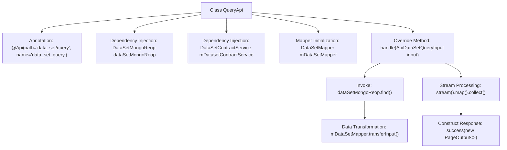

# Basic Information

|      |      |
|------|------|
| Name | QueryApi |
| Language | .java |
| Code Path | WeFe/manager/manager-service/src/main/java/com/welab/wefe/manager/service/api/dataset/QueryApi.java |
| Package Name | com.welab.wefe.manager.service.api.dataset |
| Dependencies | ['com.welab.wefe.common.data.mongodb.dto.PageOutput', 'com.welab.wefe.common.data.mongodb.dto.dataset.DataSetQueryOutput', 'com.welab.wefe.common.data.mongodb.repo.DataSetMongoReop', 'com.welab.wefe.common.web.api.base.AbstractApi', 'com.welab.wefe.common.web.api.base.Api', 'com.welab.wefe.common.web.dto.ApiResult', 'com.welab.wefe.manager.service.dto.dataset.ApiDataSetQueryInput', 'com.welab.wefe.manager.service.dto.dataset.ApiDataSetQueryOutput', 'com.welab.wefe.manager.service.mapper.DataSetMapper', 'com.welab.wefe.manager.service.service.DataSetContractService', 'org.mapstruct.factory.Mappers', 'org.springframework.beans.factory.annotation.Autowired', 'java.util.List', 'java.util.stream.Collectors'] |
| Brief Description | This is a Java class named QueryApi, designed to handle dataset query requests. It extends AbstractApi, accepts ApiDataSetQueryInput as input, and returns paginated ApiDataSetQueryOutput results. It performs data operations through DataSetMongoReop and DataSetContractService, utilizing DataSetMapper for input-output conversion. |

# Description

This is a Java class named QueryApi, which extends AbstractApi and is used to handle dataset query requests. The class is annotated with @Api, specifying the path as "data_set/query". It injects two dependencies, DataSetMongoRepo and DataSetContractService, and initializes the DataSetMapper. The core method, handle, takes ApiDataSetQueryInput as an input parameter, queries data through the MongoDB repository, uses the mapper to transform the input and output, and finally returns a paginated ApiResult containing the page number, total count, page size, total pages, and the converted data list. The entire process implements a complete data processing flow from input to output.

# Class Summary

| Name   | Type  | Description |
|-------|------|-------------|
| QueryApi | class | This is an API class for querying datasets, which retrieves data through a MongoDB repository, uses a mapper to transform input and output, and returns paginated results. |


## Class QueryApi

|      |      |
|------|------|
| Access Modifier | @Api(path = "data_set/query", name = "data_set_query");public |
| Type | class |
| Name | QueryApi |
| Description | This is an API class for querying datasets, which retrieves data through a MongoDB repository, uses a mapper to transform input and output, and returns paginated results. |


### UML Class Diagram

```mermaid
classDiagram
    class QueryApi {
        -DataSetMongoReop dataSetMongoReop
        -DataSetContractService mDatasetContractService
        -DataSetMapper mDataSetMapper
        +handle(ApiDataSetQueryInput input) ApiResult~PageOutput~ApiDataSetQueryOutput~~
    }
    class AbstractApi~T, R~ {
        <<Abstract>>
        +handle(T input) R
    }
    class ApiDataSetQueryInput
    class PageOutput~T~ {
        +List~T~ list
        +int pageIndex
        +long total
        +int pageSize
        +int totalPage
    }
    class ApiDataSetQueryOutput
    class DataSetQueryOutput
    class DataSetMapper {
        +transferInput(ApiDataSetQueryInput) DataSetQueryInput
        +transferOutput(DataSetQueryOutput) ApiDataSetQueryOutput
    }
    class DataSetMongoReop {
        +find(DataSetQueryInput) PageOutput~DataSetQueryOutput~
    }
    class DataSetContractService

    QueryApi --|> AbstractApi~ApiDataSetQueryInput, PageOutput~ApiDataSetQueryOutput~~ : Inheritance
    QueryApi --> DataSetMongoReop : Dependency
    QueryApi --> DataSetContractService : Dependency
    QueryApi --> DataSetMapper : Dependency
    DataSetMapper --> ApiDataSetQueryInput : Transform
    DataSetMapper --> DataSetQueryOutput : Transform
    DataSetMapper --> ApiDataSetQueryOutput : Transform
    DataSetMongoReop --> PageOutput~DataSetQueryOutput~ : Return
```

This code demonstrates the implementation class QueryApi for a query API, which inherits from the generic abstract class AbstractApi to handle dataset query requests. QueryApi utilizes DataSetMongoReop via dependency injection for MongoDB queries and employs DataSetMapper for input/output type conversion. The core workflow includes: converting API input into query conditions, executing paginated queries, and transforming results into API output format. The class diagram clearly presents dependency relationships between components and type conversion logic, reflecting the design philosophy of layered architecture and separation of responsibilities.


### Internal Method Call Graph



This flowchart illustrates the core structure and processing flow of the QueryApi class. The class defines the API path through annotations, injects MongoDB repository and service dependencies, and initializes a data transformation Mapper. The main business logic is implemented in the handle method: first transforming input parameters via Mapper and querying MongoDB, then processing output data with streams, and finally constructing a paginated response. The entire process demonstrates a complete data processing chain from input parameters to paginated output.

### Field List

| Name  | Type  | Description |
|-------|-------|------|
| mDatasetContractService | DataSetContractService | Automatically inject protected data collection contract service instances. |
| dataSetMongoReop | DataSetMongoReop | Use @Autowired to automatically inject the DataSetMongoReop repository instance. |
| mDataSetMapper = Mappers.getMapper(DataSetMapper.class) | DataSetMapper | Declare and initialize a protected dataset mapper instance, using the Mapper utility class to obtain the mapper class object. |

### Method List

| Name  | Type  | Description |
|-------|-------|------|
| handle | ApiResult<PageOutput<ApiDataSetQueryOutput>> | This method processes dataset query requests, converts input parameters into query conditions, retrieves paginated results from MongoDB, and returns the paginated data after transforming the output format. |


