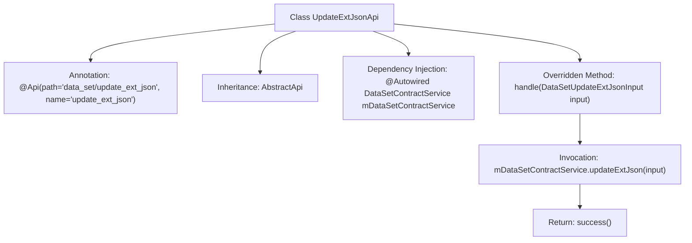

# Basic Information

|      |      |
|------|------|
| Name | UpdateExtJsonApi |
| Language | .java |
| Code Path | WeFe/manager/manager-service/src/main/java/com/welab/wefe/manager/service/api/dataset/UpdateExtJsonApi.java |
| Package Name | com.welab.wefe.manager.service.api.dataset |
| Dependencies | ['com.welab.wefe.common.exception.StatusCodeWithException', 'com.welab.wefe.common.web.api.base.AbstractApi', 'com.welab.wefe.common.web.api.base.Api', 'com.welab.wefe.common.web.dto.AbstractApiOutput', 'com.welab.wefe.common.web.dto.ApiResult', 'com.welab.wefe.manager.service.dto.dataset.DataSetUpdateExtJsonInput', 'com.welab.wefe.manager.service.service.DataSetContractService', 'org.springframework.beans.factory.annotation.Autowired'] |
| Brief Description | This is an API class named UpdateExtJsonApi, designed to handle update requests for dataset extended JSON. It inherits from AbstractApi, accepts DataSetUpdateExtJsonInput as input, and returns AbstractApiOutput. The functionality is implemented by invoking the updateExtJson method of mDataSetContractService. |

# Description

This is an API class named UpdateExtJsonApi, designed for updating external JSON information of a dataset. It inherits from the AbstractApi base class, accepts input parameters of type DataSetUpdateExtJsonInput, and returns results of type AbstractApiOutput. The class injects the DataSetContractService and processes business logic through its updateExtJson method. The API path is "data_set/update_ext_json", and the processing may throw a StatusCodeWithException.

# Class Summary

| Name   | Type  | Description |
|-------|------|-------------|
| UpdateExtJsonApi | class | This is an API class named UpdateExtJsonApi, designed to handle dataset external JSON update requests. It inherits from AbstractApi, accepts DataSetUpdateExtJsonInput as input, and returns AbstractApiOutput. The core logic is executed by invoking the updateExtJson method of mDataSetContractService. |


## Class UpdateExtJsonApi

|      |      |
|------|------|
| Access Modifier | @Api(path = "data_set/update_ext_json", name = "update_ext_json");public |
| Type | class |
| Name | UpdateExtJsonApi |
| Description | This is an API class named UpdateExtJsonApi, designed to handle dataset external JSON update requests. It inherits from AbstractApi, accepts DataSetUpdateExtJsonInput as input, and returns AbstractApiOutput. The core logic is executed by invoking the updateExtJson method of mDataSetContractService. |


### UML Class Diagram

```mermaid
classDiagram
    class AbstractApi~T, R~ {
        <<Abstract>>
        +handle(T input) ApiResult~R~
    }
    // AbstractApi is a generic base class defining core processing logic

    class UpdateExtJsonApi {
        -DataSetContractService mDataSetContractService
        +handle(DataSetUpdateExtJsonInput input) ApiResult~AbstractApiOutput~
    }
    // API class implementing specific business logic

    class DataSetUpdateExtJsonInput {
        // Input parameter DTO
    }

    class AbstractApiOutput {
        <<Abstract>>
        // Base output type
    }

    class DataSetContractService {
        <<Interface>>
        +updateExtJson(DataSetUpdateExtJsonInput input)
    }
    // Data service contract interface

    UpdateExtJsonApi --|> AbstractApi : Inheritance
    UpdateExtJsonApi --> DataSetContractService : Dependency
    UpdateExtJsonApi ..> DataSetUpdateExtJsonInput : Uses
    UpdateExtJsonApi ..> AbstractApiOutput : Uses
```

This code demonstrates an API implementation structure based on an abstract template. UpdateExtJsonApi inherits from the generic abstract class AbstractApi, obtains a DataSetContractService instance through dependency injection, and implements the core business logic for processing DataSetUpdateExtJsonInput parameters. The class diagram clearly shows inheritance relationships, interface dependencies, and associations between input/output types, illustrating a typical application of the Template Method pattern in API development.


### Internal Method Call Graph



This flowchart illustrates the core structure of the UpdateExtJsonApi class, an API implementation that inherits from AbstractApi and defines its interface path via the @Api annotation. The main logic resides in the handle method, which first invokes the updateExtJson method of mDataSetContractService to process input parameters, then returns a success result. The class automatically injects the DataSetContractService dependency through @Autowired.

### Field List

| Name  | Type  | Description |
|-------|-------|------|
| mDataSetContractService | DataSetContractService | Automatically inject dataset contract service instances. |

### Method List

| Name  | Type  | Description |
|-------|-------|------|
| handle | ApiResult<AbstractApiOutput> | This method overrides the parent class logic, invokes the service to update the dataset extension JSON, and returns an empty result upon success. |


