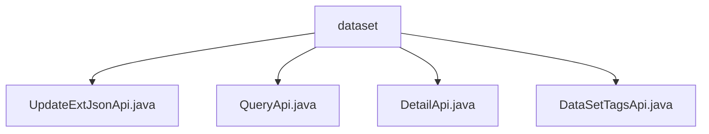

# Basic Information

|      |      |
|------|------|
| Name | dataset |
| Language | .java |
| Code Path | WeFe/manager/manager-service/src/main/java/com/welab/wefe/manager/service/api/dataset |
| Package Name | docs.manager.manager-service.src.main.java.com.welab.wefe.manager.service.api.dataset |
| Brief Description | Four API classes: UpdateExtJsonApi updates dataset JSON, QueryApi queries datasets, DetailApi retrieves details, and DataSetTagsApi handles tag queries. All inherit from AbstractApi, inject service processing logic, specify paths, and return results. |

# Description

## Overview  
The core responsibility of this module is to provide dataset management functionalities, including updating JSON metadata, querying datasets, retrieving details, and label statistics. The interface specifications adhere to a unified design: inheriting from the AbstractApi base class, using the Api annotation to define paths (e.g., "data_set/update_ext_json"), with both input and output being specific DTO types (e.g., DataSetUpdateExtJsonInput).  

Key data structures include DataSetUpdateExtJsonInput, ApiDataSetQueryOutput, etc., implemented through DataSetMapper for object conversion. External dependencies include DataSetContractService (contract service) and DataSetMongoReop (MongoDB operations), such as DetailApi querying detailed data via MongoDB.  

## Primary Business Scenarios  
The module supports typical dataset operation workflows: updating metadata (UpdateExtJsonApi), paginated queries (QueryApi), detail retrieval (DetailApi), and label analysis (DataSetTagsApi). The interaction mode resembles an enhanced CRUD, such as DataSetTagsApi performing segmentation, deduplication, and sorting during label statistics.  

Functional completeness is reflected in end-to-end processing: input validation → data operations → result conversion → exception handling (e.g., DATA_NOT_FOUND). Typical applications include data retrieval (QueryApi) and tag cloud generation (DataSetTagsApi). API types encompass write operations (UpdateExtJsonApi) and read operations (DetailApi), with integration cases such as collaborative data processing via MongoDB and contract services.

### Package Internal Structure View

This flowchart illustrates the hierarchical structure of the dataset service APIs. The root node is the `dataset` folder, which contains four specific API implementation files: `UpdateExtJsonApi`, `QueryApi`, `DetailApi`, and `DataSetTagsApi`. These files reside at the same level, directly under the `dataset` directory, with no deeper nesting relationships.

# File List

| Name   | Type  | Description |
|-------|------|-------------|
| [UpdateExtJsonApi.java](UpdateExtJsonApi.md) | file | This is an API class named UpdateExtJsonApi, designed to handle update requests for dataset extended JSON. It inherits from AbstractApi, accepts DataSetUpdateExtJsonInput as input, and returns AbstractApiOutput. The functionality is implemented by calling the updateExtJson method of mDataSetContractService. |
| [QueryApi.java](QueryApi.md) | file | This is a Java class named QueryApi, designed to handle dataset query requests. It extends AbstractApi, accepts ApiDataSetQueryInput as input, and returns paginated ApiDataSetQueryOutput results. It performs data operations via DataSetMongoReop and DataSetContractService, utilizing DataSetMapper for input-output conversion. |
| [DetailApi.java](DetailApi.md) | file | The DetailApi class handles dataset detail queries, retrieving data through MongoDB and mappers, and throws an exception if the data does not exist. |
| [DataSetTagsApi.java](DataSetTagsApi.md) | file | Dataset Label Query API class, which queries label data through MongoDB and contract services, processes the input, and returns a deduplicated and sorted list of labels along with their counts. |

