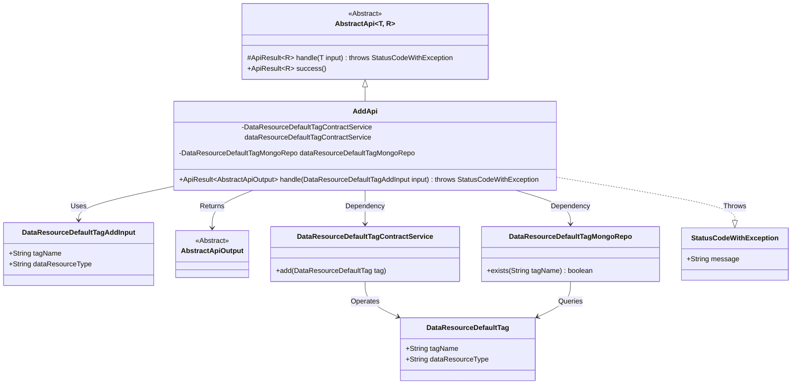
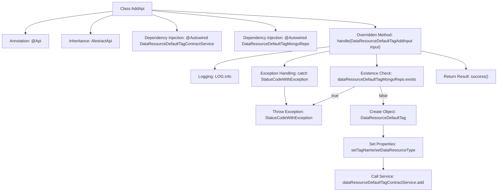

# Basic Information

|      |      |
|------|------|
| Name | AddApi |
| Language | .java |
| Code Path | WeFe/manager/manager-service/src/main/java/com/welab/wefe/manager/service/api/defaulttag/AddApi.java |
| Package Name | com.welab.wefe.manager.service.api.defaulttag |
| Dependencies | ['com.welab.wefe.common.StatusCode', 'com.welab.wefe.common.data.mongodb.entity.union.DataResourceDefaultTag', 'com.welab.wefe.common.data.mongodb.repo.DataResourceDefaultTagMongoRepo', 'com.welab.wefe.common.exception.StatusCodeWithException', 'com.welab.wefe.common.web.api.base.AbstractApi', 'com.welab.wefe.common.web.api.base.Api', 'com.welab.wefe.common.web.dto.AbstractApiOutput', 'com.welab.wefe.common.web.dto.ApiResult', 'com.welab.wefe.manager.service.dto.tag.DataResourceDefaultTagAddInput', 'com.welab.wefe.manager.service.service.DataResourceDefaultTagContractService', 'org.springframework.beans.factory.annotation.Autowired'] |
| Brief Description | This is a Java class named AddApi, designed for adding default tags. It checks whether a tag exists; if not, it creates a new tag, and if the tag already exists, it throws an exception. It uses MongoDB for data storage and validation. |

# Description

This is a Java class named AddApi, designed to handle API requests for adding default tags. It extends the AbstractApi class, accepts DataResourceDefaultTagAddInput as input, and returns AbstractApiOutput. The class injects two services: DataResourceDefaultTagContractService and DataResourceDefaultTagMongoRepo. The core logic is implemented in the handle method: first, it checks if the tag already exists, throwing an exception if it does; otherwise, it creates a new tag object, sets its name and type, and finally calls the service to add the tag. During processing, exceptions are caught and rethrown, and a success result is returned upon successful execution.

# Class Summary

| Name   | Type  | Description |
|-------|------|-------------|
| AddApi | class | This is an API class for adding default tags, which checks if the tag name exists. If it does not exist, a new tag is created; if it exists, an exception is thrown. |

## Class AddApi

|      |      |
|------|------|
| Access Modifier | @Api(path = "data_resource/default_tag/add", name = "default_tag_add");public |
| Type | class |
| Name | AddApi |
| Description | This is an API class for adding default tags, which checks if the tag name exists. If it does not exist, a new tag is created; if it exists, an exception is thrown. |

### UML Class Diagram

Class diagram description: This diagram illustrates that the AddApi class inherits from the generic abstract class AbstractApi and depends on two service classes, DataResourceDefaultTagContractService and DataResourceDefaultTagMongoRepo. AddApi processes the DataResourceDefaultTagAddInput parameter, returns an AbstractApiOutput result, and may throw a StatusCodeWithException. The DataResourceDefaultTag entity is manipulated by service and repository classes, demonstrating the complete call chain for the tag addition functionality.

### Internal Method Call Graph

This flowchart illustrates the core processing logic of the AddApi class. It begins with defining the API path through annotations, inheriting from an abstract parent class, and injecting two service dependencies. The main logic is implemented in the handle method: first checking if the tag exists (throwing an exception if it does), otherwise creating a new tag object, setting its properties, and completing the addition via the contract service. The entire process includes exception handling and logging, ultimately returning a success result. The workflow clearly demonstrates the complete chain of data validation, business processing, and exception management.

### Field List

| Name  | Type  | Description |
|-------|-------|------|
| dataResourceDefaultTagMongoRepo | DataResourceDefaultTagMongoRepo | Using @Autowired to automatically inject an instance of DataResourceDefaultTagMongoRepo. |
| dataResourceDefaultTagContractService | DataResourceDefaultTagContractService | Automatically inject default label contract service instances. |

### Method List

| Name  | Type  | Description |
|-------|-------|------|
| handle | ApiResult<AbstractApiOutput> | Process the request to add a default tag, check if the tag name already exists, and return an error if it does. Otherwise, create a new tag and save it. Return a system error in case of exceptions. |

