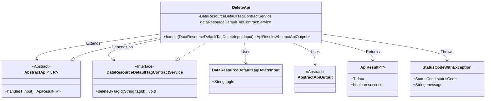
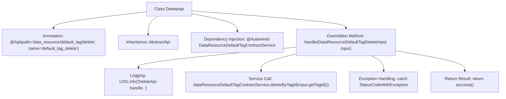

# Basic Information

|      |      |
|------|------|
| Name | DeleteApi |
| Language | .java |
| Code Path | WeFe/manager/manager-service/src/main/java/com/welab/wefe/manager/service/api/defaulttag/DeleteApi.java |
| Package Name | com.welab.wefe.manager.service.api.defaulttag |
| Dependencies | ['com.welab.wefe.common.StatusCode', 'com.welab.wefe.common.exception.StatusCodeWithException', 'com.welab.wefe.common.web.api.base.AbstractApi', 'com.welab.wefe.common.web.api.base.Api', 'com.welab.wefe.common.web.dto.AbstractApiOutput', 'com.welab.wefe.common.web.dto.ApiResult', 'com.welab.wefe.manager.service.dto.tag.DataResourceDefaultTagDeleteInput', 'com.welab.wefe.manager.service.service.DataResourceDefaultTagContractService', 'org.springframework.beans.factory.annotation.Autowired'] |
| Brief Description | The DeleteApi class handles requests to delete default tags by invoking the deleteByTagId method of the dataResourceDefaultTagContractService, catching exceptions, and returning either a success or error status. |

# Description

This is a Java class named DeleteApi, designed to handle API requests for default tag deletion. It inherits from the AbstractApi base class, accepts DataResourceDefaultTagDeleteInput as an input parameter, and returns a result of type AbstractApiOutput. The class injects the DataResourceDefaultTagContractService, implementing tag deletion functionality by calling its deleteByTagId method. During processing, logs are recorded, and potential StatusCodeWithException errors are caught, converted to system error codes, and rethrown. Upon successful execution, it returns a success status.

# Class Summary

| Name   | Type  | Description |
|-------|------|-------------|
| DeleteApi | class | This is an API class for deleting default tags, which calls the service layer method to delete data based on the tag ID, handles exceptions, and returns a successful result. |

## Class DeleteApi

|      |      |
|------|------|
| Access Modifier | @Api(path = "data_resource/default_tag/delete", name = "default_tag_delete");public |
| Type | class |
| Name | DeleteApi |
| Description | This is an API class for deleting default tags, which calls the service layer method to delete data based on the tag ID, handles exceptions, and returns a successful result. |

### UML Class Diagram

This code demonstrates a DeleteApi implementation class that inherits from the generic abstract class AbstractApi, processes DataResourceDefaultTagDeleteInput type input, and returns ApiResult<AbstractApiOutput>. The class implements deletion logic through the dependency-injected DataResourceDefaultTagContractService interface and may throw StatusCodeWithException. The class diagram clearly illustrates inheritance relationships, dependency relationships, and the use of type parameters, reflecting a Spring-style API controller implementation approach.

### Internal Method Call Graph

This flowchart illustrates the core structure and workflow of the DeleteApi class. The class defines its API path through the @Api annotation, inherits from the AbstractApi template class, and injects the DataResourceDefaultTagContractService. The main processing logic resides in the handle method: it first logs the operation, then invokes the service to delete a tag, wraps caught exceptions as system errors, and finally returns a success response. The entire process demonstrates a standard API handling pattern, encompassing key stages such as input parameter validation, business operations, exception handling, and result return.

### Field List

| Name  | Type  | Description |
|-------|-------|------|
| dataResourceDefaultTagContractService | DataResourceDefaultTagContractService | Automatically inject default tag contract service instances. |

### Method List

| Name  | Type  | Description |
|-------|-------|------|
| handle | ApiResult<AbstractApiOutput> | This method handles the deletion of default tag requests, invokes the service to remove the specified tag ID, catches exceptions, and returns either success or a system error. |

