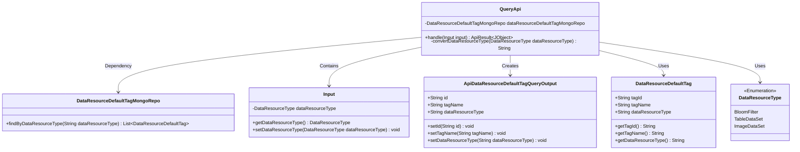
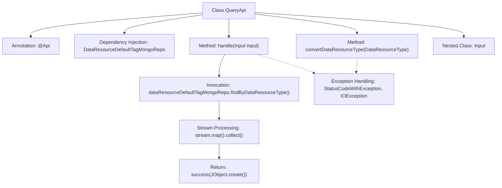
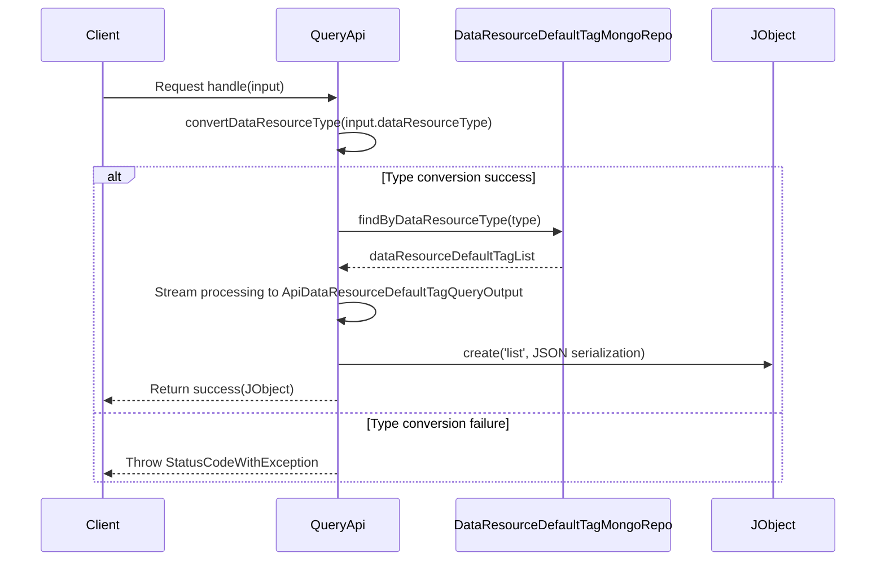

# Basic Information

|      |      |
|------|------|
| Name | QueryApi |
| Language | .java |
| Code Path | WeFe/manager/manager-service/src/main/java/com/welab/wefe/manager/service/api/defaulttag/QueryApi.java |
| Package Name | com.welab.wefe.manager.service.api.defaulttag |
| Dependencies | ['com.welab.wefe.common.StatusCode', 'com.welab.wefe.common.data.mongodb.entity.union.DataResourceDefaultTag', 'com.welab.wefe.common.data.mongodb.repo.DataResourceDefaultTagMongoRepo', 'com.welab.wefe.common.exception.StatusCodeWithException', 'com.welab.wefe.common.util.JObject', 'com.welab.wefe.common.web.api.base.AbstractApi', 'com.welab.wefe.common.web.api.base.Api', 'com.welab.wefe.common.web.dto.ApiResult', 'com.welab.wefe.common.wefe.enums.DataResourceType', 'com.welab.wefe.manager.service.dto.base.BaseInput', 'com.welab.wefe.manager.service.dto.tag.ApiDataResourceDefaultTagQueryOutput', 'org.springframework.beans.factory.annotation.Autowired', 'java.io.IOException', 'java.util.List', 'java.util.stream.Collectors'] |
| Brief Description | Query API class, retrieves the default tag list of data resources through MongoDB, supports filtering by type and returns results in JSON format. The input includes resource type parameters, with type conversion performed during processing. |

# Description

The code defines an API class named QueryApi for querying default tag data. The API path is "data_resource/default_tag/query" and does not require login. It inherits from AbstractApi, with Input as the input type and JObject as the output. Its primary function is to query data from MongoDB via DataResourceDefaultTagMongoRepo, filter results based on the input data resource type, and return the query results as a list of ApiDataResourceDefaultTagQueryOutput objects. The convertDataResourceType method handles the conversion logic for data resource types. The Input inner class includes a DataResourceType field named dataResourceType along with its getter and setter methods.

# Class Summary

| Name   | Type  | Description |
|-------|------|-------------|
| QueryApi | class | This is an API class for querying default tags, which retrieves the tag list corresponding to the data resource type through a MongoDB repository, converts it into the output format, and returns the result. It supports conversion processing for multiple data resource types. |

## Class QueryApi

|      |      |
|------|------|
| Access Modifier | @Api(path = "data_resource/default_tag/query", name = "default_tag_query", login = false);public |
| Type | class |
| Name | QueryApi |
| Description | This is an API class for querying default tags, which retrieves the tag list corresponding to the data resource type through a MongoDB repository, converts it into the output format, and returns the result. It supports conversion processing for multiple data resource types. |

### UML Class Diagram

This code defines a QueryApi class, inherited from AbstractApi, for handling data resource default tag query requests. Its main functionality is to query data from the database via DataResourceDefaultTagMongoRepo and convert the results into ApiDataResourceDefaultTagQueryOutput format before returning. The Input class serves as the input parameter, containing a field of DataResourceType enumeration type. The code includes type conversion logic and exception handling, with a clear overall structure and well-defined responsibilities.

### Internal Method Call Graph

This flowchart illustrates the core structure of the QueryApi class, including annotation declaration, dependency injection, the main business method handle(), and the processing flow of the type conversion method convertDataResourceType(). The sequence diagram details the complete process from client request to response, highlighting key steps such as data resource type conversion, MongoDB query, result set transformation, and JSON serialization, while also including exception handling paths. The entire workflow implements the functionality of querying default tag data based on input parameters and formatting the output.

### Field List

| Name  | Type  | Description |
|-------|-------|------|
| dataResourceDefaultTagMongoRepo | DataResourceDefaultTagMongoRepo | Using @Autowired to automatically inject an instance of DataResourceDefaultTagMongoRepo. |

### Method List

| Name  | Type  | Description |
|-------|-------|------|
| handle | ApiResult<JObject> | The method retrieves the default tag list of data resources based on the input query, converts it, and returns the result in JSON format. Exceptions may be thrown during processing. |
| convertDataResourceType | String | This method converts the DataResourceType enumeration into a string. It returns "TableDataSet" for BloomFilter or TableDataSet, returns itself for ImageDataSet, and throws an exception for other cases. |

