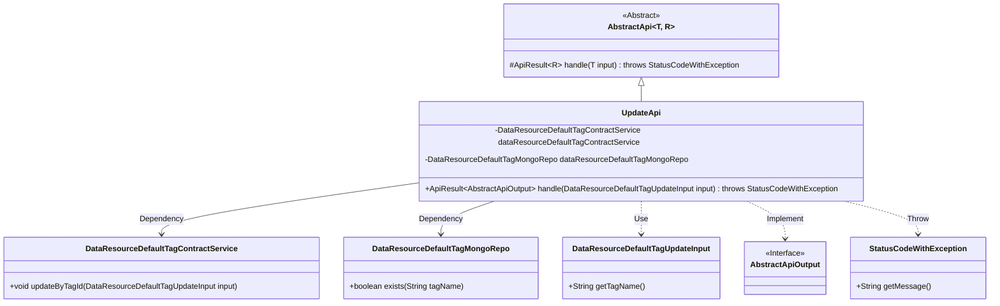
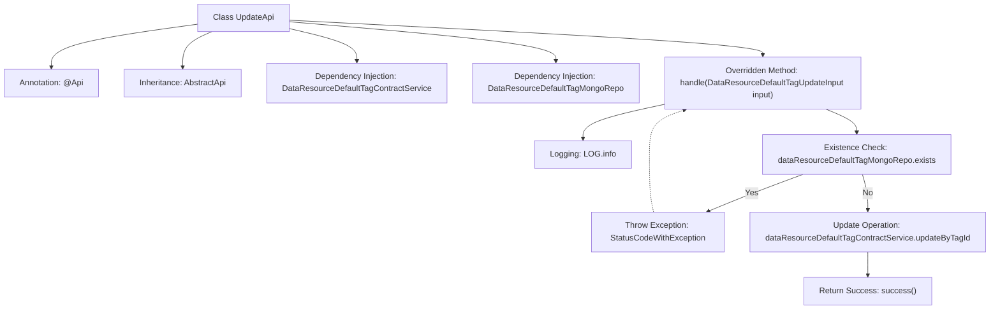

# Basic Information

|      |      |
|------|------|
| Name | UpdateApi |
| Language | .java |
| Code Path | WeFe/manager/manager-service/src/main/java/com/welab/wefe/manager/service/api/defaulttag/UpdateApi.java |
| Package Name | com.welab.wefe.manager.service.api.defaulttag |
| Dependencies | ['com.welab.wefe.common.StatusCode', 'com.welab.wefe.common.data.mongodb.repo.DataResourceDefaultTagMongoRepo', 'com.welab.wefe.common.exception.StatusCodeWithException', 'com.welab.wefe.common.web.api.base.AbstractApi', 'com.welab.wefe.common.web.api.base.Api', 'com.welab.wefe.common.web.dto.AbstractApiOutput', 'com.welab.wefe.common.web.dto.ApiResult', 'com.welab.wefe.manager.service.dto.tag.DataResourceDefaultTagUpdateInput', 'com.welab.wefe.manager.service.service.DataResourceDefaultTagContractService', 'org.springframework.beans.factory.annotation.Autowired'] |
| Brief Description | Update the API class for default tags, check if the tag exists before calling the service to update, handle exceptions, and return the result. |

# Description

The code defines a class named `UpdateApi` for handling default tag update requests. The class path is `data_resource/default_tag/update`, which inherits from `AbstractApi`, with `DataResourceDefaultTagUpdateInput` as the input type and `AbstractApiOutput` as the output. The business logic is implemented by injecting the `DataResourceDefaultTagContractService` and `DataResourceDefaultTagMongoRepo` services. Key functionalities include checking if the tag exists—throwing an exception if it does—otherwise invoking the service to update the tag. Exception handling captures `StatusCodeWithException` and rethrows it as a system error. Upon successful execution, it returns a success result.

# Class Summary

| Name   | Type  | Description |
|-------|------|-------------|
| UpdateApi | class | Update the API class for default tags, check tag existence before calling the service to update, and return a system error in case of exceptions. |

## Class UpdateApi

|      |      |
|------|------|
| Access Modifier | @Api(path = "data_resource/default_tag/update", name = "default_tag_update");public |
| Type | class |
| Name | UpdateApi |
| Description | Update the API class for default tags, check tag existence before calling the service to update, and return a system error in case of exceptions. |

### UML Class Diagram

This code demonstrates an UpdateApi implementation class for updating data resource default tags, which inherits from the generic abstract class AbstractApi. The class diagram clearly illustrates UpdateApi's relationships with surrounding components: it autowires two service classes (DataResourceDefaultTagContractService and DataResourceDefaultTagMongoRepo), processes DataResourceDefaultTagUpdateInput parameters, and returns results of the AbstractApiOutput interface type. The structure includes tag existence verification logic and exception handling mechanisms, embodying a typical Spring Boot service layer design pattern.

### Internal Method Call Graph

This flowchart illustrates the core processing flow of the UpdateApi class: First, the API path is defined via annotation, inheriting from an abstract parent class and injecting two service dependencies. The core method handle() initially checks whether the tag exists—throwing an exception if it does, otherwise performing an update operation before returning success. The diagram clearly shows conditional branching and exception handling paths, demonstrating the complete call chain of data validation and business logic.

### Field List

| Name  | Type  | Description |
|-------|-------|------|
| dataResourceDefaultTagContractService | DataResourceDefaultTagContractService | Automatically inject default tag contract service instances. |
| dataResourceDefaultTagMongoRepo | DataResourceDefaultTagMongoRepo | Using @Autowired to automatically inject an instance of DataResourceDefaultTagMongoRepo. |

### Method List

| Name  | Type  | Description |
|-------|-------|------|
| handle | ApiResult<AbstractApiOutput> | Process the default tag update for data resources, check the existence of the tag, and report an error if it exists; otherwise, update the tag. Throw a system error in case of exceptions. |

