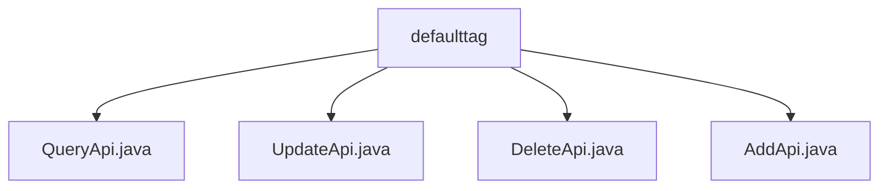

# Basic Information

|      |      |
|------|------|
| Name | defaulttag |
| Language | .java |
| Code Path | WeFe/manager/manager-service/src/main/java/com/welab/wefe/manager/service/api/defaulttag |
| Package Name | docs.manager.manager-service.src.main.java.com.welab.wefe.manager.service.api.defaulttag |
| Brief Description | The QueryApi class is used to query default tag data, with the path data_resource/default_tag/query. It inherits from AbstractApi, queries via MongoDB, and transforms the results. The UpdateApi class handles tag update requests, with the path data_resource/default_tag/update, and performs updates after verifying tag existence. The DeleteApi class processes tag deletion requests by invoking a service to remove the specified tag. The AddApi class manages tag addition requests, creating new tags after checking for their existence. |

# Description

## Overview  
This module provides CRUD operation APIs for default tags, including query, update, delete, and add functionalities, with data management implemented through MongoDB storage and ContractService. The interface specifications uniformly inherit from AbstractApi, using specific DTOs (e.g., DataResourceDefaultTagAddInput/JObject) for input and output, and all paths are prefixed with "data_resource/default_tag". Key data structures include the DataResourceType enum and conversion objects like ApiDataResourceDefaultTagQueryOutput. External dependencies include the MongoRepo persistence layer and ContractService business service. For example, the query API handles type conversion via convertDataResourceType, resembling a data mapper pattern.  

## Core Business Scenarios  
The module supports full lifecycle management of tags: queries filter MongoDB results by DataResourceType; add, delete, and update operations validate and synchronize data through ContractService, akin to a transaction script pattern. Typical workflows include checking tag uniqueness before addition and verifying existence before updates/deletions, with exceptions uniformly converted to system error codes. Integration examples include tag management interfaces invoking AddApi to create tags or ETL services using QueryApi to retrieve default tags. All APIs require no login, making them suitable for automated integration between internal systems.

### Package Internal Structure View

This flowchart illustrates four API files under the defaulttag directory: QueryApi, UpdateApi, DeleteApi, and AddApi. These files reside at the same hierarchical level, directly within the defaulttag folder without any deeper nested structure. Each file represents an independent API functional module designed to handle different operation requests for default tags.

# File List

| Name   | Type  | Description |
|-------|------|-------------|
| [QueryApi.java](QueryApi.md) | file | Query API class, retrieves the default tag list of data resources via MongoDB, supports filtering by type and returns results in JSON format. The input includes resource type parameters, with type conversion performed during processing. |
| [UpdateApi.java](UpdateApi.md) | file | Update the API class for default tags, check if the tag exists before calling the service to update, handle exceptions, and return the result. |
| [DeleteApi.java](DeleteApi.md) | file | The DeleteApi class handles requests to delete default tags by invoking the deleteByTagId method of the dataResourceDefaultTagContractService, catching exceptions, and returning success or error statuses. |
| [AddApi.java](AddApi.md) | file | This is a Java class named AddApi, designed for adding default tags. It checks whether a tag exists; if not, it creates a new tag, and if the tag already exists, it throws an exception. It uses MongoDB for data storage and validation. |

