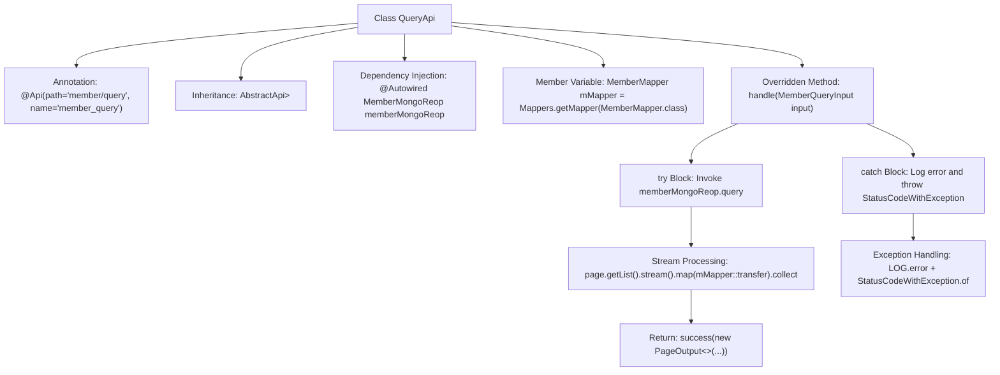

# Basic Information

|      |      |
|------|------|
| Name | QueryApi |
| Language | .java |
| Code Path | WeFe/manager/manager-service/src/main/java/com/welab/wefe/manager/service/api/member/QueryApi.java |
| Package Name | com.welab.wefe.manager.service.api.member |
| Dependencies | ['com.welab.wefe.common.StatusCode', 'com.welab.wefe.common.data.mongodb.dto.PageOutput', 'com.welab.wefe.common.data.mongodb.entity.union.Member', 'com.welab.wefe.common.data.mongodb.repo.MemberMongoReop', 'com.welab.wefe.common.exception.StatusCodeWithException', 'com.welab.wefe.common.web.api.base.AbstractApi', 'com.welab.wefe.common.web.api.base.Api', 'com.welab.wefe.common.web.dto.ApiResult', 'com.welab.wefe.manager.service.dto.member.MemberQueryInput', 'com.welab.wefe.manager.service.dto.member.MemberQueryOutput', 'com.welab.wefe.manager.service.mapper.MemberMapper', 'org.mapstruct.factory.Mappers', 'org.springframework.beans.factory.annotation.Autowired', 'java.util.List', 'java.util.stream.Collectors'] |
| Brief Description | The QueryApi class handles paginated queries for member information, invokes memberMongoRepo to retrieve data, converts the results via MemberMapper, returns paginated data upon success, and logs errors while throwing system exceptions in case of failures. |

# Description

This is a Java class named QueryApi, designed for paginated querying of member information. It extends AbstractApi, processes MemberQueryInput as input, and returns a PageOutput<MemberQueryOutput> result. The class injects MemberMongoReop for database operations and utilizes MemberMapper for object conversion. The core logic resides in the handle method: it calls memberMongoReop.query to perform paginated queries, converts the results into a MemberQueryOutput list, and finally returns a successful result containing pagination details. If an exception occurs, it logs the error and throws a system error status code.

# Class Summary

| Name   | Type  | Description |
|-------|------|-------------|
| QueryApi | class | The QueryApi class handles paginated queries for member information, invokes memberMongoRepo to retrieve data, converts the results via MemberMapper, and returns paginated output or error messages. |


## Class QueryApi

|      |      |
|------|------|
| Access Modifier | @Api(path = "member/query", name = "member_query");public |
| Type | class |
| Name | QueryApi |
| Description | The QueryApi class handles paginated queries for member information, invokes memberMongoRepo to retrieve data, converts the results via MemberMapper, and returns paginated output or error messages. |


### UML Class Diagram

```mermaid
classDiagram
    class QueryApi {
        -MemberMongoReop memberMongoReop
        -MemberMapper mMapper
        +handle(MemberQueryInput input) ApiResult~PageOutput~MemberQueryOutput~~
    }
    class AbstractApi~T, R~ {
        <<Abstract>>
        +handle(T input) ApiResult~R~
    }
    class MemberQueryInput {
        +Integer getPageIndex()
        +Integer getPageSize()
        +String getId()
        +String getName()
        +Boolean getHidden()
        +Boolean getFreezed()
        +Boolean getLostContact()
        +Integer getStatus()
    }
    class PageOutput~T~ {
        +Integer pageIndex
        +Integer total
        +Integer pageSize
        +Integer totalPage
        +List~T~ list
    }
    class MemberQueryOutput
    class MemberMongoReop {
        +query(..) PageOutput~Member~
    }
    class MemberMapper {
        +transfer(Member) MemberQueryOutput
    }
    class Member
    class ApiResult~T~
    class StatusCodeWithException

    QueryApi --|> AbstractApi~MemberQueryInput, PageOutput~MemberQueryOutput~~ : Inheritance
    QueryApi --> MemberMongoReop : Dependency
    QueryApi --> MemberMapper : Dependency
    MemberMapper --> Member : Dependency
    MemberMapper --> MemberQueryOutput : Dependency
    MemberMongoReop --> Member : Dependency
    MemberMongoReop --> PageOutput~Member~ : Dependency
    AbstractApi ..> ApiResult : Dependency
    AbstractApi ..> StatusCodeWithException : Dependency
```

This code demonstrates the implementation of a QueryApi class for retrieving member information, which inherits from the generic abstract class AbstractApi. Its core functionality involves paginated querying of member data from MongoDB via MemberMongoReop, followed by conversion of Member entities to MemberQueryOutputDTO through MemberMapper. The class diagram clearly illustrates dependency relationships between components, including the data access layer, DTO conversion layer, and exception handling mechanism, reflecting a well-structured layered architecture design. The key workflow encompasses paginated queries, data transformation, and result encapsulation while handling exceptional cases.


### Internal Method Call Graph



This flowchart illustrates the core structure and workflow of the QueryApi class. The class implements paginated query functionality by inheriting from AbstractApi. The main processing flow includes querying data via MongoDB repository, transforming entities using MapStruct, and constructing paginated return results. During exceptions, it logs errors and returns system error status codes, demonstrating a complete request handling chain and error handling mechanism.

### Field List

| Name  | Type  | Description |
|-------|-------|------|
| mMapper = Mappers.getMapper(MemberMapper.class) | MemberMapper | Using MapStruct's Mappers to obtain an instance of the MemberMapper interface implementation class. |
| memberMongoReop | MemberMongoReop | Automatically inject the MemberMongoReop member repository instance. |

### Method List

| Name  | Type  | Description |
|-------|-------|------|
| handle | ApiResult<PageOutput<MemberQueryOutput>> | This method handles paginated querying of member information by calling memberMongoReop.query to retrieve data, converting it, and returning the paginated results. In case of exceptions, it logs the error and throws a system error. |


