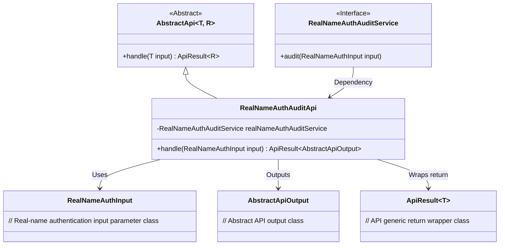
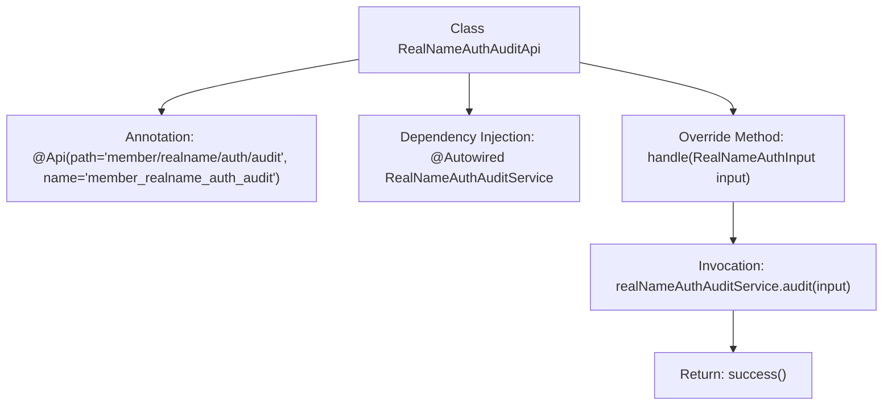

# Basic Information

|      |      |
|------|------|
| Name | RealNameAuthAuditApi |
| Language | .java |
| Code Path | WeFe/manager/manager-service/src/main/java/com/welab/wefe/manager/service/api/member/RealNameAuthAuditApi.java |
| Package Name | com.welab.wefe.manager.service.api.member |
| Dependencies | ['org.springframework.beans.factory.annotation.Autowired', 'com.welab.wefe.common.exception.StatusCodeWithException', 'com.welab.wefe.common.web.api.base.AbstractApi', 'com.welab.wefe.common.web.api.base.Api', 'com.welab.wefe.common.web.dto.AbstractApiOutput', 'com.welab.wefe.common.web.dto.ApiResult', 'com.welab.wefe.manager.service.dto.member.RealNameAuthInput', 'com.welab.wefe.manager.service.service.RealNameAuthAuditService'] |
| Brief Description | Real-name authentication review API class, handles member real-name authentication review requests, invokes the review service, and returns results. |

# Description

This is an API class named RealNameAuthAuditApi, with the path member/realname/auth/audit, designed to handle member real-name authentication audits. It inherits from the AbstractApi base class, with generic parameters specifying the input type RealNameAuthInput and the output type AbstractApiOutput. The class injects the RealNameAuthAuditService and overrides the handle method to invoke the service's audit method for completing the audit logic, returning a successful result upon a successful audit. The entire class focuses on implementing the core functionality of real-name authentication audits.

# Class Summary

| Name   | Type  | Description |
|-------|------|-------------|
| RealNameAuthAuditApi | class | This is a real-name authentication review API class with the path "member/realname/auth/audit", which inherits from AbstractApi and uses RealNameAuthAuditService to process review requests, returning successful results. |

## Class RealNameAuthAuditApi

|      |      |
|------|------|
| Access Modifier | @Api(path = "member/realname/auth/audit", name = "member_realname_auth_audit");public |
| Type | class |
| Name | RealNameAuthAuditApi |
| Description | This is a real-name authentication review API class with the path "member/realname/auth/audit", which inherits from AbstractApi and uses RealNameAuthAuditService to process review requests, returning successful results. |

### UML Class Diagram

Class diagram description: This diagram illustrates the class structure of the real-name authentication audit API, where RealNameAuthAuditApi inherits from the generic abstract class AbstractApi and relies on the RealNameAuthAuditService interface to implement audit logic. The input uses RealNameAuthInput parameters, and the output is wrapped as ApiResult<AbstractApiOutput>. The overall design follows the template method pattern, standardizing the processing flow through the abstract class while delegating concrete implementation to subclasses.

### Internal Method Call Graph

This code demonstrates a real-name authentication audit API class that inherits from the AbstractApi base class, with the interface path and name defined via the @Api annotation. The core workflow involves the handle method invoking the audit service of realNameAuthAuditService to perform the audit operation, ultimately returning a success result. The class structure is clear, utilizing Spring dependency injection for service invocation, which aligns with the fundamental design patterns of the API layer.

### Field List

| Name  | Type  | Description |
|-------|-------|------|
| realNameAuthAuditService | RealNameAuthAuditService | Using @Autowired to automatically inject an instance of RealNameAuthAuditService. |

### Method List

| Name  | Type  | Description |
|-------|-------|------|
| handle | ApiResult<AbstractApiOutput> | Rewrite the handle method to invoke the realNameAuthAuditService for auditing the input parameters, and return an ApiResult upon successful completion. |

