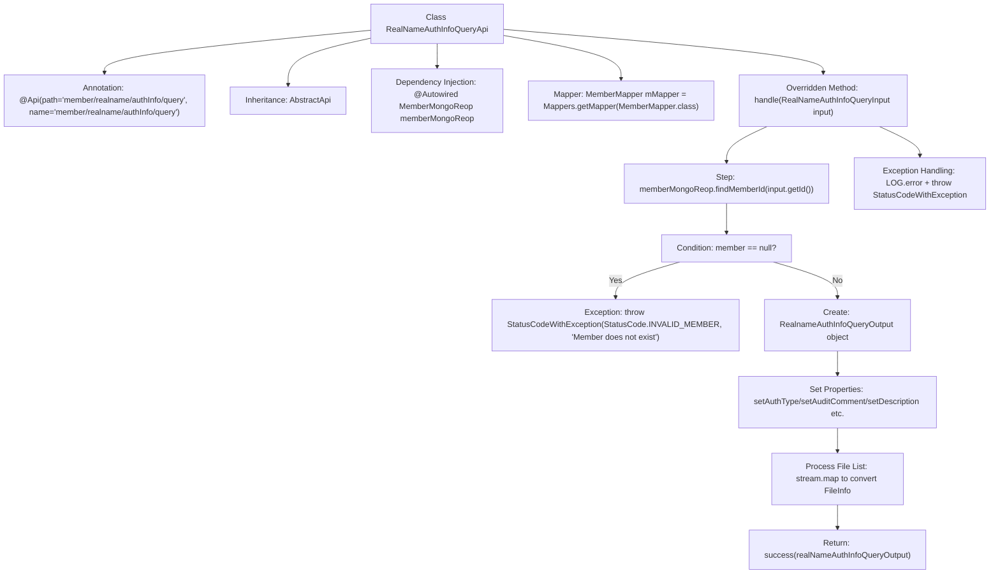

# Basic Information

|      |      |
|------|------|
| Name | RealNameAuthInfoQueryApi |
| Language | .java |
| Code Path | WeFe/manager/manager-service/src/main/java/com/welab/wefe/manager/service/api/member/RealNameAuthInfoQueryApi.java |
| Package Name | com.welab.wefe.manager.service.api.member |
| Dependencies | ['com.welab.wefe.common.StatusCode', 'com.welab.wefe.common.data.mongodb.dto.member.RealnameAuthInfoQueryOutput', 'com.welab.wefe.common.data.mongodb.entity.union.Member', 'com.welab.wefe.common.data.mongodb.entity.union.ext.RealnameAuthFileInfo', 'com.welab.wefe.common.data.mongodb.repo.MemberMongoReop', 'com.welab.wefe.common.exception.StatusCodeWithException', 'com.welab.wefe.common.web.api.base.AbstractApi', 'com.welab.wefe.common.web.api.base.Api', 'com.welab.wefe.common.web.dto.ApiResult', 'com.welab.wefe.manager.service.dto.member.RealNameAuthInfoQueryInput', 'com.welab.wefe.manager.service.mapper.MemberMapper', 'org.mapstruct.factory.Mappers', 'org.springframework.beans.factory.annotation.Autowired', 'java.util.ArrayList', 'java.util.List', 'java.util.stream.Collectors'] |
| Brief Description | The RealNameAuthInfoQueryApi is used to query a member's real-name authentication information, including the authentication type, review status, certificate content, and file details. If the member does not exist, an exception will be thrown. |

# Description

The code defines an API class named `RealNameAuthInfoQueryApi`, which is used to query member real-name authentication information. It inherits from `AbstractApi`, accepts `RealNameAuthInfoQueryInput` as input, and returns `RealnameAuthInfoQueryOutput` as output. Key functionalities include: querying member information from MongoDB using the member ID, throwing an exception if the member does not exist; extracting real-name authentication-related fields (such as authentication type, review comments, status, etc.) and certificate information (such as certificate content, serial number, status, etc.) from the member's extended information; processing the real-name authentication file information list and converting it into an output-format file information list; logging error messages and returning a system error if an exception occurs.

# Class Summary

| Name   | Type  | Description |
|-------|------|-------------|
| RealNameAuthInfoQueryApi | class | API for querying member real-name authentication information. It retrieves data from MongoDB using the member ID and returns details such as authentication type, review status, certificates, and file lists. Error prompts are thrown in case of exceptions. |


## Class RealNameAuthInfoQueryApi

|      |      |
|------|------|
| Access Modifier | @Api(path = "member/realname/authInfo/query", name = "member/realname/authInfo/query");public |
| Type | class |
| Name | RealNameAuthInfoQueryApi |
| Description | API for querying member real-name authentication information. It retrieves data from MongoDB using the member ID and returns details such as authentication type, review status, certificates, and file lists. Error prompts are thrown in case of exceptions. |


### UML Class Diagram

```mermaid
classDiagram
    class AbstractApi~T, R~ {
        <<Abstract>>
        +handle(T input) ApiResult~R~
    }

    class RealNameAuthInfoQueryApi {
        -MemberMongoReop memberMongoReop
        -MemberMapper mMapper
        +handle(RealNameAuthInfoQueryInput input) ApiResult~RealnameAuthInfoQueryOutput~
    }

    class RealNameAuthInfoQueryInput {
        +String id
    }

    class RealnameAuthInfoQueryOutput {
        +String authType
        +String auditComment
        +String description
        +String principalName
        +String realNameAuthStatus
        +String certPemContent
        +String certRequestContent
        +String certRequestId
        +String certSerialNumber
        +String certStatus
        +Boolean memberGatewayTlsEnable
        +List~FileInfo~ fileInfoList
        +class FileInfo {
            +String filename
            +String fileId
        }
    }

    class Member {
        +ExtJson extJson
    }

    class ExtJson {
        +String authType
        +String auditComment
        +String description
        +String principalName
        +String realNameAuthStatus
        +String certPemContent
        +String certRequestContent
        +String certRequestId
        +String certSerialNumber
        +String certStatus
        +Boolean memberGatewayTlsEnable
        +List~RealnameAuthFileInfo~ realnameAuthFileInfoList
    }

    class RealnameAuthFileInfo {
        +String filename
        +String fileId
    }

    class MemberMongoReop {
        +findMemberId(String id) Member
    }

    class MemberMapper {
        <<Mapper>>
    }

    AbstractApi~T, R~ <|-- RealNameAuthInfoQueryApi
    RealNameAuthInfoQueryApi --> MemberMongoReop : Dependency
    RealNameAuthInfoQueryApi --> MemberMapper : Dependency
    RealNameAuthInfoQueryApi --> RealNameAuthInfoQueryInput : Processes Input
    RealNameAuthInfoQueryApi --> RealnameAuthInfoQueryOutput : Generates Output
    Member --> ExtJson : Contains
    ExtJson --> RealnameAuthFileInfo : Contains
    RealnameAuthInfoQueryOutput --> RealnameAuthInfoQueryOutput.FileInfo : Contains
```

This code demonstrates the implementation of a real-name authentication information query API, which inherits from the generic abstract class AbstractApi. The RealNameAuthInfoQueryApi queries member information through MemberMongoReop, uses MemberMapper for object conversion, processes the RealNameAuthInfoQueryInput parameters, and ultimately returns a RealnameAuthInfoQueryOutput result containing authentication status, certificate information, and a file list. The entire process includes exception handling and logging, involving interactions between multiple data entity classes.


### Internal Method Call Graph



This flowchart illustrates the core processing logic of the RealNameAuthInfoQueryApi class. The class implements real-name authentication information query functionality by inheriting AbstractApi. The main process includes: querying member information by ID, verifying member existence, constructing an output object and populating authentication-related data (including certificate information and file list processing), and finally returning results or exceptions. The entire process demonstrates a complete processing chain involving MongoDB data access, DTO property mapping, collection stream processing, and exception status code encapsulation.

### Field List

| Name  | Type  | Description |
|-------|-------|------|
| memberMongoReop | MemberMongoReop | Using @Autowired to automatically inject the MemberMongoReop member variable. |
| mMapper = Mappers.getMapper(MemberMapper.class) | MemberMapper | Using MapStruct's Mappers to obtain an instance of the MemberMapper interface implementation class. |

### Method List

| Name  | Type  | Description |
|-------|-------|------|
| handle | ApiResult<RealnameAuthInfoQueryOutput> | The method processes real-name authentication information queries, verifies the existence of members, and extracts data such as authentication types and review comments, including certificate content and file information lists. It returns the result upon success, logs errors, and throws system exceptions in case of failures. |


