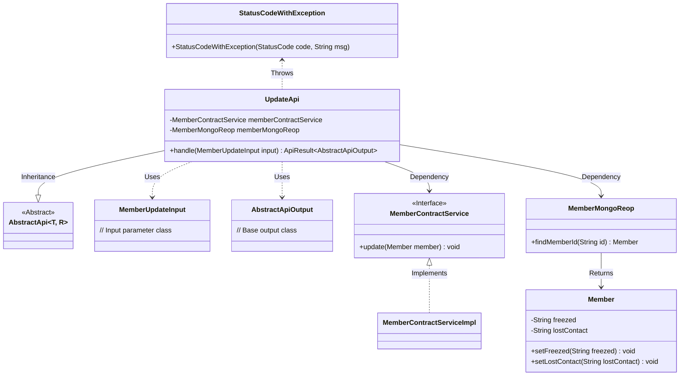
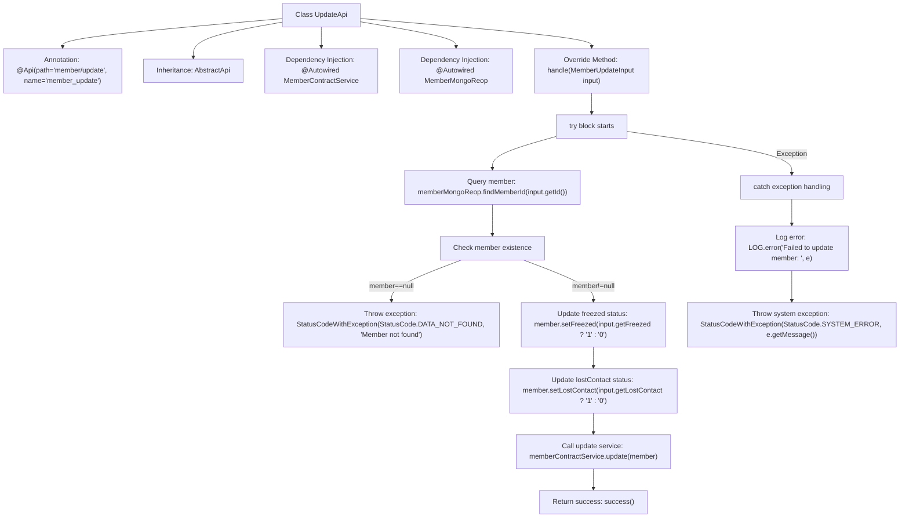

# Basic Information

|      |      |
|------|------|
| Name | UpdateApi |
| Language | .java |
| Code Path | WeFe/manager/manager-service/src/main/java/com/welab/wefe/manager/service/api/member/UpdateApi.java |
| Package Name | com.welab.wefe.manager.service.api.member |
| Dependencies | ['com.welab.wefe.common.StatusCode', 'com.welab.wefe.common.data.mongodb.entity.union.Member', 'com.welab.wefe.common.data.mongodb.repo.MemberMongoReop', 'com.welab.wefe.common.exception.StatusCodeWithException', 'com.welab.wefe.common.web.api.base.AbstractApi', 'com.welab.wefe.common.web.api.base.Api', 'com.welab.wefe.common.web.dto.AbstractApiOutput', 'com.welab.wefe.common.web.dto.ApiResult', 'com.welab.wefe.manager.service.dto.member.MemberUpdateInput', 'com.welab.wefe.manager.service.service.MemberContractService', 'org.springframework.beans.factory.annotation.Autowired'] |
| Brief Description | Member Update API, which locates a member by ID and updates their frozen and inactive status, handling exceptions by returning corresponding status codes. |

# Description

The code defines a class named UpdateApi, which is used to handle member information update requests. The class path is member/update, and it relies on the MemberContractService and MemberMongoReop services. The main logic involves searching for and updating member information based on the input parameter MemberUpdateInput, supporting updates to the freezed and lostContact status fields. If the member does not exist, a DATA_NOT_FOUND exception is thrown, and a SYSTEM_ERROR exception is thrown in case of system errors. Upon successful execution, it returns an abstract API output result.

# Class Summary

| Name   | Type  | Description |
|-------|------|-------------|
| UpdateApi | class | Member Update API class, handles member information updates. Locates members by ID, updates frozen and lost contact statuses, and invokes the service layer for saving. Returns error status codes in case of exceptions. |

## Class UpdateApi

|      |      |
|------|------|
| Access Modifier | @Api(path = "member/update", name = "member_update");public |
| Type | class |
| Name | UpdateApi |
| Description | Member Update API class, handles member information updates. Locates members by ID, updates frozen and lost contact statuses, and invokes the service layer for saving. Returns error status codes in case of exceptions. |

### UML Class Diagram

Class diagram description: This diagram illustrates that the UpdateApi class inherits from the generic abstract class AbstractApi, and depends on the MemberContractService interface and MemberMongoReop class for member data operations. MemberUpdateInput serves as the input parameter, while AbstractApiOutput acts as the base output class. The Member class contains status fields, and StatusCodeWithException is used for exception handling. The overall structure demonstrates the data flow and exception handling mechanism within the API processing workflow.

### Internal Method Call Graph

This code flowchart illustrates the complete processing flow of the UpdateApi class. The class is a member update service with API annotation, inheriting from the AbstractApi base class. The main process includes: querying member information via memberMongoReop, performing null checks, updating member status fields (freezed and lostContact) based on input parameters, and finally executing the update operation through memberContractService. The entire process incorporates an exception handling mechanism that logs errors and throws corresponding status code exceptions when issues occur. Upon successful execution, it returns a successful ApiResult object.

### Field List

| Name  | Type  | Description |
|-------|-------|------|
| memberContractService | MemberContractService | Using @Autowired to automatically inject an instance of MemberContractService. |
| memberMongoReop | MemberMongoReop | The code snippet uses the @Autowired annotation to automatically inject a private member variable named memberMongoReop of type MemberMongoReop. |

### Method List

| Name  | Type  | Description |
|-------|-------|------|
| handle | ApiResult<AbstractApiOutput> | Processing member update requests, checking if the member exists, updating frozen and inactive statuses, capturing exceptions, and returning results. |

