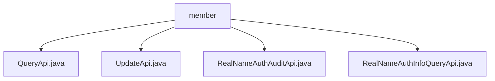

# Basic Information

|      |      |
|------|------|
| Name | member |
| Language | .java |
| Code Path | WeFe/manager/manager-service/src/main/java/com/welab/wefe/manager/service/api/member |
| Package Name | docs.manager.manager-service.src.main.java.com.welab.wefe.manager.service.api.member |
| Brief Description | The QueryApi handles member pagination queries, the UpdateApi updates member information, the RealNameAuthAuditApi processes real-name authentication reviews, and the RealNameAuthInfoQueryApi retrieves real-name authentication information. All inherit from AbstractApi and include database operations and exception handling. |

# Description

## Overview  
The core responsibilities of this module include member information management and real-name authentication services, encompassing functionalities such as paginated queries, status updates, and real-name authentication reviews. The interface specifications adhere to a unified pattern: inheriting from the AbstractApi base class, accepting specific Input parameters, and returning standard Output, with system error codes thrown in case of exceptions. Key data structures involve MemberQueryOutput, MemberUpdateInput, and RealnameAuthInfoQueryOutput, among others. External dependencies include MemberMongoReop (MongoDB operations), MemberContractService (contract services), and RealNameAuthAuditService (audit services). For example, QueryApi transforms query results via MemberMapper, while UpdateApi supports updating the freezed status field.  

## Key Business Scenarios  
The module primarily handles the full lifecycle management of members, akin to core services in a CRM system. Business processes include: paginated queries of member lists (QueryApi), updating member statuses (UpdateApi), real-name authentication reviews (RealNameAuthAuditApi), and authentication information queries (RealNameAuthInfoQueryApi). The interaction model follows a RESTful style, such as RealNameAuthAuditApi invoking audit services via the handle method. Typical application scenarios include backend operations in member management systems, with API types covering query-based (e.g., QueryApi) and modification-based (e.g., UpdateApi) operations. Integration examples include extracting data from MongoDB and transforming the output format.

### Package Internal Structure View

This flowchart illustrates the API file structure within the member directory of the manager-service project. The root node is the member folder, which contains four Java interface files: QueryApi, UpdateApi, RealNameAuthAuditApi, and RealNameAuthInfoQueryApi. These files are directly subordinate to the member directory level without any deeper nesting relationships.

# File List

| Name   | Type  | Description |
|-------|------|-------------|
| [QueryApi.java](QueryApi.md) | file | The QueryApi class handles paginated queries for member information, invokes memberMongoRepo to retrieve data, converts the results via MemberMapper, returns paginated data upon success, and logs exceptions before throwing a system error. |
| [UpdateApi.java](UpdateApi.md) | file | Member Update API, which locates a member by ID and updates their frozen and inactive status, handling exceptions by returning corresponding status codes. |
| [RealNameAuthAuditApi.java](RealNameAuthAuditApi.md) | file | Real-name authentication review API class, handles member real-name authentication review requests, invokes the review service, and returns results. |
| [RealNameAuthInfoQueryApi.java](RealNameAuthInfoQueryApi.md) | file | The RealNameAuthInfoQueryApi is used to query a member's real-name authentication information, including the authentication type, review status, certificate content, and file details. An exception will be thrown if the member does not exist. |

